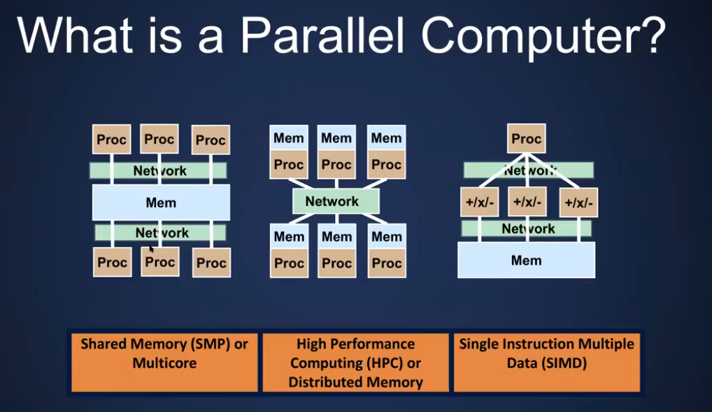
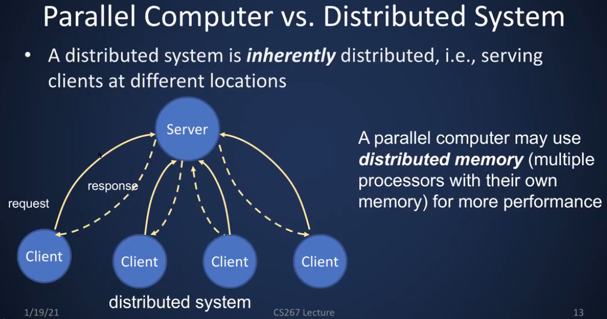

A parallel computer is about how things are connected together 
the network that connects the parallel computers together and they can be 
connected in a number of different ways we're going to take separate processrors
and connect them together to make a parallel computer

It's all about the need for speed
It's about trying to solve a problem faster by using more than one processor
that is by using parallelism and parallel computers.

Parallel Computing: Using multiple processors in parallel to solve problems more quickly
than with a single processor

- Shared Memory(SMP) or Multicore

A shared memory multiprocessor (SMP*) by connecting multiple processors to a single memory system.

A multiprocessor contains multiple processors(cores) on a single chip.

Technically, SMP stands for "Symmetric Multi-Processor"

- High Performance Computing(HPC) or distributed memory

A distrubuted memory multiprocessor has processors with their own memories connected by a high speed network

Also called a cluster

A High Performance Computing(HPC) system contains 100s or 1000s of such processors(nodes)

- Single Instruction Multiple Data(SIMD)

A single Processor multiple data(SIMD) computer has multiple processors(or functional units) that perform the same operation on multiple data elements at once.

Most single processors have SIMD units with ~2-8 way parallelism

Graphics processing units(GPUs) use this as well.

Concurrency vs. Parallelism
Concurrency: multiple tasks are logically active at one time.
Parallelism: multiple tasks are actwually active at one time.

