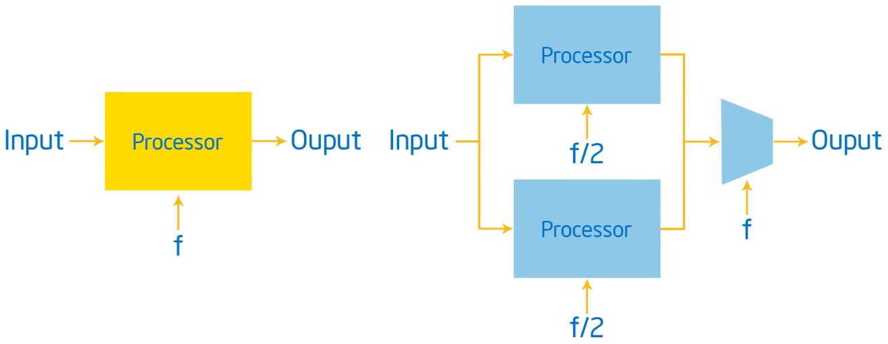
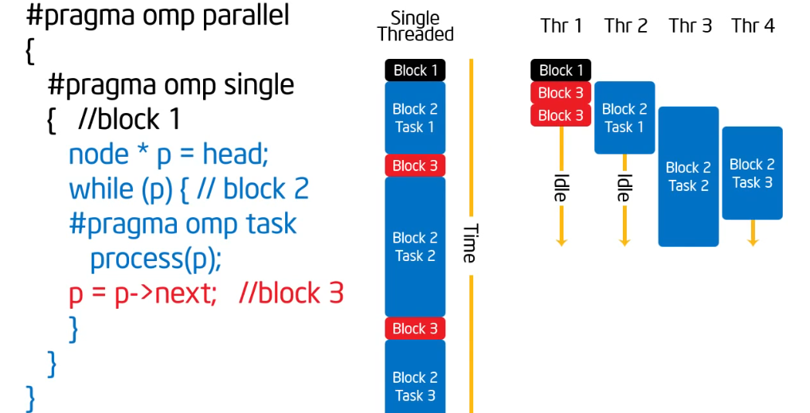
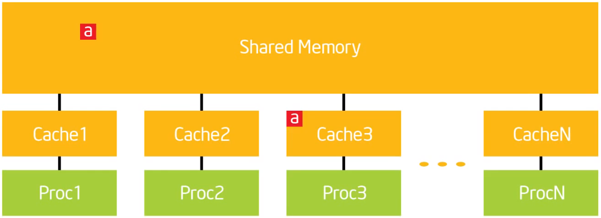

这是一门非常优秀的OpenMP入门教程，讲解人也曾参与过OpenMP的开发。

# 1. 概述
课程是`简洁的lectures` + `简短的execises`的方式，讲究边学边练边掌握。

课程由五大模块组成，每个模块由一系列单元和讨论组成：
- `Getting Started with OpenMP`
- `The Core Features of OpenMP`
- `Working with OpenMP`
- `Advanced OpenMP Topics`
- `Recapitulation`

总共`27`个lecture。


# 2. 并行编程介绍-1

摩尔定律说集成电路上可容纳的晶体管数量大约每18个月便会增加一倍。芯片上更多的晶体管数量带来了更优秀的性能，作者认为以前程序的性能来自于芯片硬件。你可以随心所欲的写你的软件，不用考虑性能，把性能留给了芯片硬件。更先进(晶体管数量更多)的芯片，更优秀的性能。

但是有一点不得不考虑，那就是功耗。根据Intel的研究，功耗和性能有这样一个拟合关系`power = perf^1.74`。

{: width="1086" height="542"}


| 单核架构             | 多核架构                  |
|---------------------|:---------------------------------:|
|Capacitance = C <br> Voltage = V <br>Frequency = F <br>Power = CV^2F | Capacitance = 2.2C <br> Voltage = 0.6V <br>Frequency = 0.5F <br>Power = 0.396CV^2F | 

对比可以看出多核架构使我们能够以更低的频率完成相同的工作，同时节省大量的功耗。


# 3. 并行编程介绍-2

## 并发 vs. 并行

| Concurrency             | Parallelism                  |
|---------------------|:---------------------------------:|
| A condition of a system in which multiple tasks are **logically** active at one time.| A condition of a system in which multiple tasks are **actually** active at one time. | 

|Concurrent Applications   |Parallel Applications|
|--------------------------|---------------------|
|An application for which computations logically execute simultaneously due to the semantics of the application. <br> The problem is fundamentally concurrent. | An application for which the computations actually execute simutanenously in oder to compute a problem in less time. <br> The problem doesn't inherently require concurrency...you can state it sequenttially.|

## OpenMP
- An API for writing multithreaded applications.
- A set of compiler directives and library routines for parallel applications programmers.
- Greatlt simplifies writing multi-threaded(MT) programs in Fortran, C and C++.

### OpenMP Solutuion Stack

{: width="1086" height="542"}

### OpenMP Core syntax
- Most of the constructs in OpenMP are compiler directives.
- `#pragma omp construct [clause [clause]...]`
- `#pragma omp parallel num_threads(4)`
- `#include <omp.h>`
- Most OpenMP constructs apply to a "Structured Block".
- "Structured Block": A block of one or more statements with one point of entry at the top and one point of exit at the bottom.


# 4. 使用OpenMP编译(Hello World)

```bash
gcc -fopenmp foo.c

export OMP_NUM_THREADS=4

./a.out
```
## Exercise 1
Verify that your OMP environment works, write a multithreaded program that prints "Hello World".


# 5. 讨论1-Hello World和线程如何工作的

```c
#include <stdio.h>
#include <omp.h>

int main()
{
  #pragma omp parallel
  {
    int ID = omp_get_thread_num();
    printf("hello(%d)", ID);
    printf(" world(%d) \n", ID);
    return 0;
  }
}
```
`#pragma omp parallel` asks for the default num of threads.
`omp_get_thread_num()` gets a unique identifier for each thread. range [0,N].

## 共享内存计算机
Any computer composed of multiple processing elements that share an address space. There are two classes:
### 对称多处理器(SMP)
A shared address space with "equal-time" access for each processor, and the OS treats every processor the same way.

### 非统一地址空间多处理器(NUMA)
Different memory regions have different access costs...think of memory segmented into "Near" and "Far" momory.

## OpenMP概览
- OpenMP is a multi-threading, shared address model.
- Threads communicate by sharing variables.
- Unintended sharing of data causes race conditions.
- Race conditions: when the program's outcome changes as the threads are scheduled differently.
- To control race conditioins, use synchronization to protect data conflicts.
- Synchronization is expensive.


# 6. 创建线程(`Pi`程序)

## fork-join并行

{: width="542" height="242"}

上图中蓝色背景的部分就称为**并行域**， 里面是**a team of threads**.
总体就是在某个时刻fork若干个线程, 在另外某个时刻join到一起。

下面是一个简单的例子
{: width="542" height="242"}

## Exercise 2
把下面这个串行版本的计算`Pi`值的程序改成并行版本
```c
void calc_pi_serial()
{
    long num_steps = 0x20000000;
    double sum = 0.0;
    double step = 1.0 / (double)num_steps;

    double start = omp_get_wtime( );    
    for (long i = 0; i < num_steps; i++) {
        double x = (i + 0.5) * step;
        sum += 4.0 / (1.0 + x * x);
    }    
    double pi = sum * step;
    
    printf("pi: %.16g in %.16g secs\n", pi, omp_get_wtime() - start);
    // will print "pi: 3.141592653589428 in 5.664520263002487 secs"
}
```


# 7. 讨论 2-简单的`Pi`程序及为什么性能如此差

```c
#define NUM_THREADS 2

void calc_pi_omp_v1()
{
    long num_steps = 0x20000000;
    double sum[NUM_THREADS] = { 0.0 };
    double step = 1.0 / (double)num_steps;
    int nthreads;
    double start = omp_get_wtime( );    
    
    omp_set_num_threads(NUM_THREADS);
    #pragma omp parallel
    {
        int id = omp_get_thread_num();
        int nthrds = omp_get_num_threads();
        if (id == 0) { // master thread
            nthreads = nthrds;
        }
        for (long i = id; i < num_steps; i += nthrds) {
            double x = (i + 0.5) * step;
            sum[id] += 4.0 / (1.0 + x * x);
        }  
    }
    double pi = 0;
    for (int i = 0; i < nthreads; i++) {
        pi += sum[i]*step;
    }
    
    printf("pi: %.16g in %.16g secs\n", pi, omp_get_wtime() - start);
}
```
上述并行版本可以得到正确的结果，但是当NUM_THREADS的值配置的更大的时候，耗时反而增加了。
原因是**salse sharing**.

## False Sharing
If independent data elements happen to sit on the same cache line, each update will cause the cache lines to "slosh back and forth" between threads.

{: width="542" height="242"}

```c
#define NUM_THREADS 4
#define PAD 8 // assume 64 byte L1 cache line size
void calc_pi_omp_v1()
{
    long num_steps = 0x20000000;
    double sum[NUM_THREADS][PAD] = { 0.0 };
    double step = 1.0 / (double)num_steps;
    int nthreads;
    double start = omp_get_wtime( );    
    
    omp_set_num_threads(NUM_THREADS);
    #pragma omp parallel
    {
        int id = omp_get_thread_num();
        int nthrds = omp_get_num_threads();
        if (id == 0) {
            nthreads = nthrds;
        }
        for (long i = id; i < num_steps; i += nthrds) {
            double x = (i + 0.5) * step;
            sum[id][0] += 4.0 / (1.0 + x * x);
        }  
    }
    double pi = 0;
    for (int i = 0; i < nthreads; i++) {
        pi += sum[i][0]*step;
    }
    
    printf("pi: %.16g in %.16g secs\n", pi, omp_get_wtime() - start);
}
```
上述解决方案中通过增加[PAD]这一维，来保证sum[nthreads]中连续的元素存在于不同的cacheline上。


# 8. 同步(再看`Pi`程序)

- OpenMP is multi-threading, shared address model.
- Unintended sharing of data causes race conditions.
- To control race conditions, use synchronization to protect data confilcts.
- Change how data is accessed to minimize the need for synchronization.


## 同步
### 高层同步:
- Critical(Mutual exclusion)
- Atomic
- Barrier
- Ordered

### 底层同步:
- Flush
- Locks(both simple and nested)

## `critical` 原语
在某一时刻，只有1个线程会执行critical section，不会有多个线程同时执行.

```cpp
float res;

#pragma omp parallel
{
  float B; int id, nthrds;
  id = omp_get_thread_num();
  nthrds = omp_get_num_threads();
  for (int i = id, i < niters; i += nthrds) {
    B = big_job(i);
#pragma omp critical
    res += consume(B);
  }
}
```

## `atomic`原语
The statements inside the atomic must be one of the following forms:
```
x binop = expr
   x++
   ++x
   x--
   --x

x is an lvalue of scalar type and binop is a non-overloaded built in operator.
```
```cpp
#pragma omp parallel
{
    double tmp, B;
    B = DOIT();
    tmp = big_ugly(B);

#pragma omp atomic
    X += tmp;
}
```

## Exercise 3
修改Exercise 2中的代码，来解决由于sum数组引入的false sharing问题。


# 9. 讨论3-同步的开销和消除False Sharing

在7的解决方案中通，过增加[PAD]这一维，来保证sum[nthreads]中连续的元素存在于不同的cache line上，从而消除了false sharing。但是cache line的size在不同机器上可能不一样，7的解决方案就不具有可移植性，并且不够优雅。

```cpp
void calc_pi_omp_v2()
{
    long num_steps = 0x20000000;
    double step = 1.0 / (double)num_steps;
    int nthreads;
    double start = omp_get_wtime( );    
    double pi = 0.0;
    omp_set_num_threads(NUM_THREADS);
    #pragma omp parallel
    {
        // sum需要是线程私有的，不能放在并行域外，否则结果不正确，切耗时更长
        double sum;  
        long i;
        int id = omp_get_thread_num();
        int nthrds = omp_get_num_threads();
        if (id == 0) {
            nthreads = nthrds;
        }
        for (i = id, sum = 0.0; i < num_steps; i += nthrds) {
            double x = (i + 0.5) * step;
            sum += 4.0 / (1.0 + x * x);
        }  
    #pragma omp critical
        pi += sum * step;      
    /*// 下面这3行的写法跟上面2行的效果类似
      sum *= step;
    #pragma omp atomic
      pi += sum;  
    */  
    }
    
    printf("pi: %.16g in %.16g secs\n", pi, omp_get_wtime() - start);
}
```


# 10. 并行化循环(让`Pi`程序简单)-1

## Worksharing
- Loop Construct
- Sections/Section Construct
- Single Construct
- Task Construct

## Loop Worksharing Construct
### The Schedule Clause
The Schedule Clause affects how loop iterations are mapped onto threads.

- schedule(static [, chunk]): Iteration space divided into blocks of chunk size, blocks are assigned to threads in a round-robin fasion. If chunk is not specified: #threads blocks.
- schedule(dynamic [, chunk]): Iteration space divided into blocks of chunk(not specified: 1) size, blocks are scheduled to threads in the order in which threads finish previous blocks.
- schedule(guided [, chunk]):Similar to dynamic, but block size starts with implementation-defined value, then is decreased exponentially down to chunk.
- schedule(runtime): Schedule and chunk size taken from the OMP_SCHEDULE environment variable(or the runtime library)
- schedule(auto) schedule is left up to the runtime to choose(does not have to be any of the above)

#### When to use the schedule clause
- static

    Pre-determined and predictable by the programmer. Least work at runtime, Scheduling done at compile time.

- dynamic

    Unpredictable, highly variable work per iteration. Most work at runtime. Complex scheduling logic used at runtime.


# 11. 并行化循环(让`Pi`程序简单)-2

- 找到compute-intensive的for循环
- 让每个迭代独立以保证循环可以以任何顺序正确的执行

比如下面这段代码片段，`A[i]`的值依赖于`j`的值，`j`的值又依赖于上一次`j`的值。这样就导致循环无法并行起来。

```cpp
int i, j, A[MAX];
j = 5;
for (i = 0; i < MAX; i++) {
    j += 2;
    A[i] = big(j);
}
```

将`j`的计算改造一下，就可以使得当前迭代不再依赖于上一次迭代，就可以并行起来。如下所示：

```cpp
int i, j, A[MAX];
#pragma omp parallel for
for (i = 0; i < MAX; i++) {
    int j = 5 + 2 * (i + 1);
    A[i] = big(j);
}
```

## `reduction`原语

In a reduction-operation the operator is applied to all variables in the list. The variables have to be shared.
- `reduction(operator:list)`
- The result is provided in the associated reduction variable.

- A local copy of each list variable is made and initialized depending on the "op".

- Updates occur on the local copy.

- local copies are reduced into a single value and combined with the original global value.

- Possible reduction operators with initialization value:
`+ (0), * (1), - (0), & (~0), ^ (0), | (0), && (1), || (0), min (largest number), max (least number)`

{: width="1086" height="542"}


# 12. 讨论4-`Pi`程序总结

```cpp
void calc_pi_reduction()
{
    static long num_steps = 0x20000000;
    double step;
    double sum = 0.0;
    step = 1.0 / (double)num_steps;

    double start = omp_get_wtime( );    
#pragma omp parallel
#pragma omp for reduction(+:sum)
    for (long i = 0; i < num_steps; i++) {
        double x = (i + 0.5) * step;
        sum += 4.0 / (1.0 + x * x);
    }    
    double pi = sum * step;

    double end = omp_get_wtime( );
    
    printf("pi: %.16g in %.16g secs\n", pi, end - start);
}
```


# 13. Barriers...和更多Constructs

## `barrier`原语

Threads wait until all the threads of the current Team have reached the barrier.

All worksharing constructs contain an implict barrier at the end.

```cpp
#pragma omp parallel
{
  int id = omp_get_thread_num();
  A[id] = big_cal1(id);
#pragma omp barrier
  B[id] = big_cal2(ia, A);
}
```


# 14. OpenMP中的锁

### Lock Routines

- `omp_init_lock()`
- `omp_set_lock()`
- `omp_uset_lock()`
- `omp_destroy_lock()`
- `omp_test_lock()`

```cpp
#pragma omp parallel for
for(i=0; i < NBUCKETS;i++) {
    omp_init_lock(&hist_locks[i]);
    hist[i] = 0;
}

#pragma omp parallel for
for(i = 0; i < NVALS; i++) {
    ival = sample(arr[i]);
    omp_set_lock(&hist_locks[ival]);
      hist[ival]++;
    omp_unset_lock(&hist_locks[ival]);
}

#pragma omp parallel for
for(i=0; i < NBUCKETS;i++) {
    omp_destroy_lock(&hist_locks[i]);
}
```

# 15. OpenMP的运行时库方法

Runtime Library Routines

- `omp_set_num_threads()`
- `omp_get_num_threads()`，在并行域外调用这个接口，返回值是1
- `omp_get_thread_num()`
- `omp_get_max_threads()`
- `omp_in_parallel()`
- `omp_set_dynamic()`
- `omp_get_dynamic()`
- `omp_num_procs()`

# 16. OpenMP的环境变量

- `OMP_NUM_THREADS`
- `OMP_STACKSIZE`
- `OMP_WAIT_POLICY`，(ACTIVE or PASSIVE)
- `OMP_PROC_BIND`，（TRUE or FALSE）


# 17. 数据作用域

由于OpenMP是基于共享内存的编程模型，所以大部分变量的属性默认是shared，比如static变量、文件作用域的变量。但是并不是一切都是shared，并行域里调用的函数的栈变量是private，语句块里的自动变量是private。基本原则是：Heap is shared, stack is private.

```cpp
double A[10];
int main() {
    int index[10];
    #pragma omp parallel
      work(index);
    printf("%d\n", index[0]);    
}

extern double A[10];
void work(int* index) {
    double temp[10];
    static int count;
    ...
}
/*
  A, index, count 是shared
  temp是private
*/
```

## Changing Storage Attributes

- shared
- private
    ```cpp
    void wrong() {
        int tmp = 0;
    #pragma omp parallel for private(tmp) //tmp的私有副本是未初始化的
        for(int j = 0; j < 1000; j++) {
            tmp += j;
        }
        printf("%d\n", tmp); // 会打印全局tmp的值0
    }
    ```
- firstprivate
    ```cpp
    int incr = 0;
    // incr的私有副本会用全局incr的值0作为初始值，for循环结束后，私有副本会消失
    #pragma omp parallel for firstprivate(incr) 
    for(i=0; i <=MAX; i++) {
        if ((i % 2) == 0) incr++;
        A[i]=incr;
    }
    ```
- lastprivate
    ```cpp
    void sq2(int n, double *lastterm)
    {
        double x; int i;
        // 最后一次循环（i=N-1）得到的x的值会传给全局x，进而赋给lastterm指针指向的对象
        #pragma omp parallel for lastprivate(x) 
        for(i = 0; i < N; i++) {
            x = a[i]*a[i] + b[i]*b[i];
            b[i] = sqrt(x);
        }
    
        *lastterm = x;
    }
    ```
- default(private/shared/none)

### Scoping in OpenMP: Dividing variables in shared and private:
- private-list and shared-list on Parallel Region.
- private-list and shared-list on Worksharing constructs.
- General default is shared for Parallel Region, firstprivate for Task.
- Loop control variables on for-constructs are private.
- Non-static variables local to Parallel Regions are private.
- private: A new uninitialuized instance is created for the task or each thread executing the construct.
    - firstprivate: Initialization with the value before encountering the construct
    - lastprivate: Value of last loop iteration is written back to Master
- Static variables are shared.

### Privatization of Global/Static Variables
#### Global/Static variables can be privatized with the `threadprivate` directive
- One instance is created for each thread
    - before the first parallel region is encountered.
    - instance exists until the program ends
    - does not work (well) with nested parallel region.
- Based on thread-local storage(TLS)
```cpp
static i;
#pragma omp threadprivate(i)
```
**NOTE: Try to avoid the use of threadprivate ans static variables**


# 18. 讨论5-调试OpenMP程序

下面是错误版本。

```cpp
#include "omp.h"
#include <cstdio>

#define NPOINTS 1000
#define MXITR 1000
struct d_complex {
    double r;
    double i;
};

struct d_complex c;
int numoutside = 0;

void testpoint()
{
    struct d_complex z;
    int iter;
    double temp;
    
    z = c;
    for(iter=0; iter<MXITR; iter++) {
        temp = (z.r*z.r)-(z.i*z.i)+c.r;
        z.i=z.r*z.i*2+c.i;
        z.r=temp;
        if((z.r*z.r+z.i*z.i) > 4.0) {
            numoutside++;
            break;
        }
    }
}

void MandelBrotArea()
{    
    int i, j;
    double area, error, eps = 1.0e-5;
#pragma omp parallel for default(shared) private(c, eps)
    for (i = 0; i < NPOINTS; i++) {
        for (j = 0; j < NPOINTS; j++) {
            c.r = -2.0 + 2.5*(double)(i) / (double)NPOINTS + eps;
            c.i = 1.125*(double)(j) / (double)NPOINTS + eps;
            testpoint();
        }
    }
    
    area = 2.0*2.5*1.125 * (double)(NPOINTS*NPOINTS-numoutside) / (double)(NPOINTS*NPOINTS);
    error=area/(double)NPOINTS;
    printf("error: %d\n", error);
}

int main(void) {
    MandelBrotArea();
    return 0;
}
```

将default设置为none，可以用来调试。

```diff
- #pragma omp parallel for default(shared) private(c, eps)
+ #pragma omp parallel for default(none) private(c, eps)
```

再进行编译的时候就会error信息：

```shell
mandelbrot_wrong.cc: In function ‘void MandelBrotArea()’:
mandelbrot_wrong.cc:38:16: error: ‘j’ not specified in enclosing ‘parallel’
         for (j = 0; j < NPOINTS; j++) {
              ~~^~~
mandelbrot_wrong.cc:36:9: error: enclosing ‘parallel’
 #pragma omp parallel for default(none) private(c, eps)
         ^~~
```

下面是正确的版本。

```cpp
#define NPOINTS 1000
#define MXITR 1000
struct d_complex {
    double r;
    double i;
};

struct d_complex c;
int numoutside = 0;

void testpoint(struct d_complex c)
{
    struct d_complex z;
    int iter;
    double temp;
    
    z = c;
    for(iter=0; iter<MXITR; iter++) {
        temp = (z.r*z.r)-(z.i*z.i)+c.r;
        z.i=z.r*z.i*2+c.i;
        z.r=temp;
        if((z.r*z.r+z.i*z.i) > 4.0) {
        #pragma omp atomic
            numoutside++;
            break;
        }
    }
}

void MandelBrotArea()
{    
    int i, j;
    double area, error, eps = 1.0e-5;
#pragma omp parallel for default(shared) private(c, j) firstprivate(eps)
    for (i = 0; i < NPOINTS; i++) {
        for (j = 0; j < NPOINTS; j++) {
            c.r = -2.0 + 2.5*(double)(i) / (double)NPOINTS + eps;
            c.i = 1.125*(double)(j) / (double)NPOINTS + eps;
            testpoint(c);
        }
    }
    
    area = 2.0*2.5*1.125 * (double)(NPOINTS*NPOINTS-numoutside) / (double)(NPOINTS*NPOINTS);
    error=area/(double)NPOINTS;
    printf("error: %d\n", error);
}
```


下面是两个版本之间的差异

```diff
diff --git a/mandelbrot_wrong.cc b/mandelbrot.cc
index 833155f..e6aadd1 100644
--- a/mandelbrot_wrong.cc
+++ b/mandelbrot.cc
@@ -11,7 +11,7 @@ struct d_complex {
 struct d_complex c;
 int numoutside = 0;
 
-void testpoint()
+void testpoint(struct d_complex c)
 {
     struct d_complex z;
     int iter;
@@ -23,6 +23,7 @@ void testpoint()
         z.i=z.r*z.i*2+c.i;
         z.r=temp;
         if((z.r*z.r+z.i*z.i) > 4.0) {
+        #pragma omp atomic
             numoutside++;
             break;
         }
@@ -33,12 +34,12 @@ void MandelBrotArea()
 {    
     int i, j;
     double area, error, eps = 1.0e-5;
-#pragma omp parallel for default(shared) private(c, eps)
+#pragma omp parallel for default(shared) private(c, j) firstprivate(eps)
     for (i = 0; i < NPOINTS; i++) {
         for (j = 0; j < NPOINTS; j++) {
             c.r = -2.0 + 2.5*(double)(i) / (double)NPOINTS + eps;
             c.i = 1.125*(double)(j) / (double)NPOINTS + eps;
-            testpoint();
+            testpoint(c);
         }
     }
```


改动最少的计算`pi`的版本:

```cpp
void calc_pi_reduction()
{
    static long num_steps = 0x20000000;
    double step;
    double sum = 0.0;
    step = 1.0 / (double)num_steps;

    double start = omp_get_wtime( );    
#pragma omp parallel
#pragma omp for reduction(+:sum)
    for (long i = 0; i < num_steps; i++) {
        double x = (i + 0.5) * step;
        sum += 4.0 / (1.0 + x * x);
    }    
    double pi = sum * step;

    double end = omp_get_wtime( );
    printf("pi: %.16g in %.16g secs\n", pi, end - start);
}
```


# 19. 技能训练:链表和OpenMP

到目前为止，介绍了

- To create a team of threads: `#pragma omp parallel`
- To share work between threads
  - `#pragma omp for`
  - `#pragma omp single`
- To prevent conflicts(data races)
  - `#pragma omp critical`
  - `#pragma omp atomic`
  - `#pragma omp barrier`
  - `#pragma omp master`
- Data environment clauses
  - `private(variable_list)`
  - `firstprivate(variable_list)`
  - `lastprivate(variable_list)`
  - `reduction(op:variable_list)`


考虑如何将下面的链表遍历代码并行化，

```cpp
p = head;
while(p) {
    process(p);
    p = p->next;
}
```


# 20. 讨论6-遍历链表的不同方法

Ugly solution

```cpp
while(p) {
    p = p->next;
    count++;
}
p = head;
for (int i = 0; i < count; i++) {
    parr[i] = p;
    p = p->next;
}

#pragma omp parallel
{
    #pragma omp for schedule(static, 1)
    for (int i = 0; i < count; i++) {
        process(parr[i]);
    }
}
```


# 21. Tasks(Linked List the Easy Way)

Tasks are independent units of work.

```cpp
#pragma omp task [clause[[,] clause]...]
{structured-block}
```

Tasks are composed of:

- code to execute
- data environment
- internal control variables(ICV)

The runtime system decides when tasks are executed.

例子：

```cpp
#pragma omp parallel
{
    #pragma omp task //每个线程创建一个任务foo()
    foo();
    #pragma omp barrier
    #pragma omp single // 只有一个线程创建任务bar()
    {
        #pragma omp task
        bar();
    }
}
```


{: width="1086" height="542"}

## `taskwait` directive
- It's a stand-alone directive
    ```cpp
    #pragma omp taskwait
    ```
- wait in the completion of child tasks of the current task; just direct children, not all descendant tasks; includes an implicit task scheduling point(TSP)

{: width="1086" height="542"}

## `if` clause
### The `if` clause of a task construct
- allows to optimize task creation/execution
- reduces parallelism but also reduces the pressure in the runtime's task pool.
- for "very" fine grain tasks you may need to do your own `if`
    ```cpp
    #pragma omp task if (expression)
    ```
- If the expression of the `if` clause evaluates to false
    - the encountering task is suspended
    - the new task is executed immediately
    - the parent task resumes when the task finishes

- This is known as undeferred task
{: width="1086" height="542"}

{: width="1086" height="542"}

## Tasking Overheads
### Typical overheads in task-based programs are:
- Task Creation: populate task data structure, add task to task queue
- Task execution: retrieve a task from the queue(may including work stealing)

### If tasks become too fine-grained, overhead becomes noticeable
- Execution spends a higher relative amount of time in the runtime
- Task execution contributing to runtime becomes significantly smaller

### A rough rule of thumb to avoid(visiable) tasking overhead
- OpenMP tasks: 80-100k instructions executed per task
- TBB tasks: 30-50k instructions executed per task
- Other programming models may have another ideal granularity

## Tasks vs Threads
### Threads do not compose well
- Example: multi-threaded plugin in a multi-threaded application
- Composition usually leads to oversubscription and load imbalance

### Task models are inherently composable
- A pool of threads executes all created tasks
- Tasks from different modules can freely mix

### Task models make complex algorithms easier to parallelize
- Programmers can think in concurrent pieces of work
- Mapping of concurrent execution to threads handled elsewhere
- Task creation can bu irregular(e.g., recursion, graph traversal)

## Sometimes you are better off with threads
### Some scenarios are more amenable for traditional threads
- Granularity too coarse for tasking
- Isolation of autonomous agents

### Static allocation of parallel work is typically easier with threads
- Controlling allocation of work to cache hierarchly

### Graphical User Interface(event thread + worker threads)

### Request/response processing, e.g.,
- Web Server
- Database servers

# Tasking and Scoping
## Data scoping in tasks
### Some rules from Parallel Regions apply
- Automatic Storage(local) variables are private
- Static and global variables are shared

### Tasking: variables are firstprivate unless shared in the enclosing context
- Only shared attribute is inherited
- Exception: Orphaned Task variables are firstprivate by default

### Example
```cpp
int a = 1;
void foo() {
    int b = 2, c = 3;
    #pragma omp parallel private(b)
    {
        int d = 4;
        #pragma omp task
        {
            int e = 5;

            // scope of a: shared,         value of a: 1
            // scope of b: firstprivate,   value of b: 0 or undefined
            // scope of c: shared,         value of c: 3
            // scope of d: firstprivate,   value of d: 4
            // scope of e: private,        value of e: 5
        }
    }
}
```

{: width="1086" height="542"}

### Orphaned  Task Variables
- Arguments passed by reference are `firstprivate` by default in orphaned task generating constructs, example:
{: width="1086" height="542"}


# 22. 讨论7-理解Tasks

用task实现遍历链表

```cpp
#pragma omp parallel
{
    #pragma omp single
    {
        node* p = head;
        while (p) {
        #pragma omp task firstprivate(p);
            process(p);
        p = p->next;
        }
    }
}
```

{: width="1086" height="542"}


# 23. 可怕的东西:内存模型,Atomics,Flush(Pairwise同步)

{: width="1086" height="542"}

**sequential consistency**

在一个多核处理器中，操作(R/W/S)是sequential consistency的，如果：

- 对于每个核，它们保持这代码中的顺序
- 其他每个处理器看到它们的总体顺序是相同的

OpenMP defines consistency as a variant of weak consistency.

Can not reorder `S` ops with `R` or `W` ops on the same thread.

Weak consistency guarantees `S>>W`, `S>>R`, `R>>S`, `W>>S`, `S>>S`


### Flush

Defines a sequence point at which a thread is guaranteed to see a consistent view of memory with respect to the `flush set`.

The flush set is:

- A list of variables when the  `flush(list)` construct is used
- `All thread visiable variables` for a flush construct without an argument list

The action of flush is to guarantee that:

- All R/W ops that overlap the flush set and occur prior to the flush complete before the flush executes.
- All R/W ops that overlap the flush set and occur after the flush don't execute until after the flush executes.
- Flushes with overlapping flush sets can not be reordered.

A flush operation is implied by OpenMP synchronizations, e.g.

- At entry/exit of parallel regions
- At implicit and explicit barriers
- At entry/exit of critical regions


# 24. 讨论8-Pairwise同步的陷阱


# 25. 线程私有数据和如何支持库(`Pi` again)


# 26. 讨论 9-随机数生成器


# 27. 概括