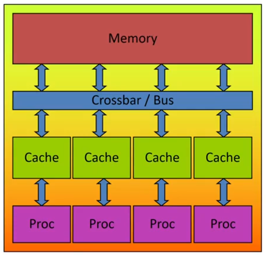
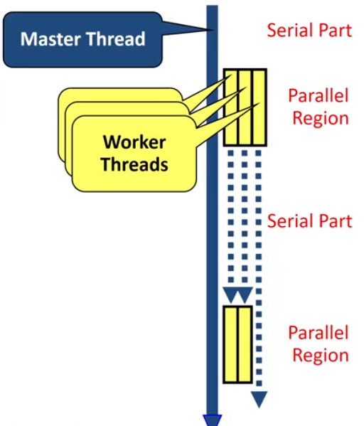

# Intro
OpenMP是一种用于共享内存并行系统的多线程程序设计方案，支持C/C++/Fortran.

OpenMP由三部分组成
- 编译器指令(compiler directives)
- 运行时库程序(runtime routines)
- 环境变量(environment variables)

# OpenMP's machine model



### OpenMP: Shared-Memory Parallel Programming Model

### All processors/cores access a shared main memory.

### Parallelization in OpemMP employs multiple threads.


# OpenMP's memory model


### All threads have access to the same, globally shared memory.

### Data in private memory is only accessible by the thread owning the memory.

### No other thread sees the changes in private memory.

### Data Transfer is through shared memory and 100% transparent to the application.


# OpenMP's Execution model


### OpenMP programs starts with just one thread: The Master Thread. It's used as an Initial Thread.

### Worker threads are spawned at Paralllel Region, together with the Master they form the team of threads.

### In between Parallel Regions the Worker Threads are put to sleep. The OpenMP Runtime takes care of all thead management work.

### Concept: fork-join
Allows for an incremental parallelization.


# Parallel Region and Structured Blocks

### The parallelism has to be expressed explictly
```cpp
#pragma omp parallel
{
    ...
    structured block
    ...
}
```

### structured block
- exactly one entry point at the top
- exactly one exit point at the bottom
- Branching in or out is not allowed
- terminating the program is allowed(abort/exit)

### specification if num of threads
- Environment variable: 
    ```bash
    export OMP_NUM_THREADS=...
    ```

- via num_threads clause

    add `num_threads` to the parallel construct    