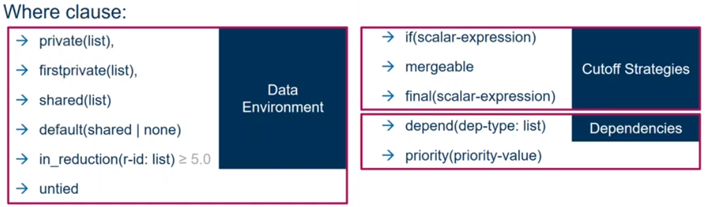
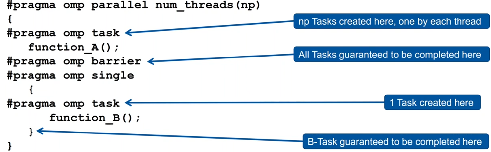
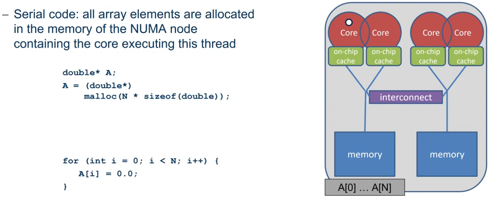

# Intro
OpenMP是共享内存体系结构上的一个基于**多线程**的**并行**编程模型，适用于SMP共享内存多处理系统和多核处理器体系结构。支持C/C++/Fortran.


##Shared Memory Computer
Any computer composed of multiple processing elements that share an address space. There are two classes:
### Symmetric Multiprocessor(SMP)
A shared address space with "equal-time" access for each processor, and the OS treats every processor the same way.

### Non Uniform Address Space Multiprocessor(NUMA)
Different memory regions have different access costs...think of memory segmented into "Near" and "Far" momory.


OpenMP由三部分组成
- 编译器指令(compiler directives)
- 运行时库程序(runtime routines)
- 环境变量(environment variables)

# OpenMP's machine model


### OpenMP: Shared-Memory Parallel Programming Model

### All processors/cores access a shared main memory.

### Parallelization in OpemMP employs multiple threads.


# OpenMP's memory model


### All threads have access to the same, globally shared memory.

### Data in private memory is only accessible by the thread owning the memory.

### No other thread sees the changes in private memory.

### Data Transfer is through shared memory and 100% transparent to the application.


# OpenMP's Execution model


### OpenMP programs starts with just one thread: The Master Thread. It's used as an Initial Thread.

### Worker threads are spawned at Paralllel Region, together with the Master they form the team of threads.

### In between Parallel Regions the Worker Threads are put to sleep. The OpenMP Runtime takes care of all thead management work.

### Concept: fork-join model
The fundamental model behind OpenMP. It Allows for an incremental parallelization.


# Parallel Region and Structured Blocks

### The parallelism has to be expressed explictly
```cpp
#pragma omp parallel
{
    ...
    structured block
    ...
}
```

### structured block
- exactly one entry point at the top
- exactly one exit point at the bottom
- Branching in or out is not allowed
- terminating the program is allowed(abort/exit)

### specification if num of threads
- Environment variable: 
    ```bash
    export OMP_NUM_THREADS=...
    ```

- via num_threads clause

    add `num_threads` to the parallel construct


# `Worksharing`
- Loop construct
- Sections/Section construct
- Single Construct
- Task Construct

### If only the `parallel` construct is used, each thread executes the structured block.

### Program speedup: `Worksharing`

### OpenMP's most common `Worksharing` construct: for
```cpp
int i;

// Sequential code
for (i = 0; i < N; ++i) {
    a[i] = b[i] + c[i];
}

// OpenMP parallel region
#pragma omp parallel
{
    int id, i, Nthrds, istart, iend;
    id = omp_get_thread_num();
    Nthrds = omp_get_num_threads();
    istart = id * N / Nthrds;
    iend = (id+1) * N / Nthrds;
    if (id == Nthrds - 1) {
        iend = N;
    }

    for (i = istart; i < iend; ++i) {
        a[i] = b[i] + c[i];
    }
}

// OpenMp parallel region and 
// a worksharing for construct
#pragma omp parallel
#pragma omp for
for (i = 0; i < N; ++i) {
    a[i] = b[i] + c[i];
}
```
#### distrubution of loop iterations over all threads in a Team.

#### Scheduling of the distrubution can be influenced.

### Loops often account for most of a program's runtime.


### influencing the for loop scheduling

#### for-construct: OpenMP allows to influence how the iterations are scheduled among the threads of the team, via the schedule clause.
- schedule(static [, chunk]): Iteration space divided into blocks of chunk size, blocks are assigned to threads in a round-robin fasion. If chunk is not specified: #threads blocks.
- schedule(dynamic [, chunk]): Iteration space divided into blocks of chunk(not specified: 1) size, blocks are scheduled to threads in the order in which threads finish previous blocks.
- schedule(guided [, chunk]):Similar to dynamic, but block size starts with implementation-defined value, then is decreased exponentially down to chunk.
- schedule(runtime): Schedule and chunk size taken from the OMP_SCHEDULE environment variable(or the runtime library)
- schedule(auto) schedule is left up to the runtime to choose(does not have to be any of the above)

#### When to use the schedule clause
- static

    Pre-determined and predictable by the programmer. Least work at runtime, Scheduling done at compile time.

- dynamic

    Unpredictable, highly variable work per iteration. Most work at runtime. Complex scheduling logic used at runtime.

Default on most implementation is shcedule(static).


### Critical Region
A Critical Region is executed by all threads, but by only one thread simultaneously(Mutual Exclusion)
```cpp
int i, s= 0;
#pragma omp parallel for
for (i = 0; i < 100; ++i) {
    #pragma omp critical
    { s = s + a[i]; }
}
```

### The Barrier Construct

Threads wait until all the threads of the current Team have reached the barrier.
```cpp
#pragma omp barrier
```
All worksharing constructs contain an implict barrier at the end.

### The Single Construct
```cpp
#pragma omp single [clause]
... structured block ...
```
- The single construct specifies that the enclosed structured block is executed by only one thread of them.(It's up to the runtime which thread that is)

- Useful for:
    - I/O
    - Memory allocation and deallocation, etc.

### The master Construct

```cpp
#pragma omp master[clause]
... structured block ...
```

- The master construct specifies that the enclosed structured block is executed only by the master thread of team.

- Note: The master construct is no worksharing construct ans does not contain an implicit barrier at the end.


# Data Scoping

## Scoping Rules

### Managing the Data Environment is the challenge of OpenMP.

### Scoping in OpenMP: Dividing variables in shared and private:
- private-list and shared-list on Parallel Region.
- private-list and shared-list on Worksharing constructs.
- General default is shared for Parallel Region, firstprivate for Task.
- Loop control variables on for-constructs are private.
- Non-static variables local to Parallel Regions are private.
- private: A new uninitialuized instance is created for the task or each thread executing the construct.
    - firstprivate: Initialization with the value before encountering the construct
    - lastprivate: Value of last loop iteration is written back to Master
- Static variables are shared.

### Privatization of Global/Static Variables
#### Global/Static variables can be privatized with the `threadprivate` directive
- One instance is created for each thread
    - before the first parallel region is encountered.
    - instance exists until the program ends
    - does not work (well) with nested parallel region.
- Based on thread-local storage(TLS)
```cpp
static i;
#pragma omp threadprivate(i)
```
**NOTE: Try to avoid the use of threadprivate ans static variables**


## The Reduction Clause
### In a reduction-operation the operator is applied to all variables in the list. The variables have to be shared.
- `reduction(operator:list)`
- The result is provided in the associated reduction variable.
```cpp
void calc_pi_reduction()
{
    static long num_steps = 0x20000000;
    double step;
    double sum = 0.0;
    step = 1.0 / (double)num_steps;

    double start = omp_get_wtime( );    
#pragma omp parallel
#pragma omp for reduction(+:sum)
    for (long i = 0; i < num_steps; i++) {
        double x = (i + 0.5) * step;
        sum += 4.0 / (1.0 + x * x);
    }    
    double pi = sum * step;

    double end = omp_get_wtime( );
    
    printf("pi: %.16g in %.16g secs\n", pi, end - start);
}
```
- A local copy of each list variable is made and initialized depending on the "op".

- Updates occur on the local copy.

- local copies are reduced into a single value and combined with the original global value.

- Possible reduction operators with initialization value:
`+ (0), * (1), - (0), & (~0), ^ (0), | (0), && (1), || (0), min (largest number), max (least number)`


# False Sharing

## Caches

### CPU is fast
- Order of 3.0 GHz
### Caches
- Fast, but expensive
- small, order of MB

### Memory is low
- Order of 0.3 GHz
- Large, order of GB

### Thus, a good utilization if caches is crutial for good performance of HPC applications!

## Data in Caches
### when data is used, it is copied into caches.
### The hardware always copies chunks into the cache, so called cache-lines.

### This is useful, when:
- the data isc used frequently(temporal locality)
- consecutive data is used which is on the same cache-line(spatial locality)


## False Sharing
### False Sharing occurs when
- different threads use elements of the same cache-line
- one of the threads writes to the cache-line
each update will cause the cache lines to "slosh back and forth" between threads.

### As a result, the cache line is moved between the threads, although there is no real data dependency.

### Note: False sharing is a performance problem, not a correctness issue.


```cpp
double s_priv[nthreads];
#pragma omp parallel num_threads(nthreads)
{
    int t = omp_get_thread_num();
    #pragame omp for
    for (int i = 0; i < 99; ++i) {
        s_priv[t] += a[i];
    }
} // end parallel

for (i = 0; i < nthreads; ++i) {
    s += s_priv[i];
}
```

### No performance benefit for more threads!
- Reason: false sharing of s_priv
- Solution: padding, so that only one variable per cache line is used.


```cpp
/* Fasle sharing avoided */
// *8是为了保证不同线程不访问同一cacheline
double s_priv[nthreads * 8];
#pragma omp parallel num_threads(nthreads)
{
    int t = omp_get_thread_num();
    #pragame omp for
    for (int i = 0; i < 99; ++i) {
        s_priv[t * 8] += a[i];
    }
} // end parallel

for (i = 0; i < nthreads; ++i) {
    s += s_priv[i * 8];
}
```


## Race Condition
threads communicate by sharing variables, unintended sharing of data causes race conditions.

### Data Race: a typical OpenMP programming error, when:
- two or more threads access the same memory location, and
- at least one of the accessed is a write, and
- the accesses are not protected by locks or critical regions, and
- the accesses are not synchronized, e.g. by a barrier.

### Non-deterministic occurrence: e.g. the sequence of the execution of parallel loop iteratins is non-deterministic and may change from run to run.

### In many cases private clauses, barriers or critical regions are missing.

### Data races are hard to find using a traditional debugger.
- Use tools like Intel Inspector XE ThreadSanitizer, Archer.
    


```cpp
/* Example of Calc Pi */
double f(dpuble x) {
    return (4.0 / (1.0 + x * x));
}

double CalcPi(int n)
{
    const double fH = 1.0 / (double) n;
    double fSum = 0.0;
    double fX;
    int i;

#pragma omp parallel for private(fX, i, fSum)
    for (i = 0; i < n; i++) {
        fX = fH * ((double)i + 0.5);
        fSum += f(fX);
    }
    return fH * fSum;
}
```

# Tasking
## The task construct
### Deferring (or not) a unit of work(executable for any member of the team), always attached to a structured block.
```cpp
#pragma omp task [clause[[,] clause]...]
{structured-block}
```


## `taskwait` directive
- It's a stand-alone directive
    ```cpp
    #pragma omp taskwait
    ```
- wait in the completion of child tasks of the current task; just direct children, not all descendant tasks; includes an implicit task scheduling point(TSP)


## `if` clause
### The `if` clause of a task construct
- allows to optimize task creation/execution
- reduces parallelism but also reduces the pressure in the runtime's task pool.
- for "very" fine grain tasks you may need to do your own `if`
    ```cpp
    #pragma omp task if (expression)
    ```
- If the expression of the `if` clause evaluates to false
    - the encountering task is suspended
    - the new task is executed immediately
    - the parent task resumes when the task finishes

- This is known as undeferred task


## Tasking Overheads
### Typical overheads in task-based programs are:
- Task Creation: populate task data structure, add task to task queue
- Task execution: retrieve a task from the queue(may including work stealing)

### If tasks become too fine-grained, overhead becomes noticeable
- Execution spends a higher relative amount of time in the runtime
- Task execution contributing to runtime becomes significantly smaller

### A rough rule of thumb to avoid(visiable) tasking overhead
- OpenMP tasks: 80-100k instructions executed per task
- TBB tasks: 30-50k instructions executed per task
- Other programming models may have another ideal granularity

## Tasks vs Threads
### Threads do not compose well
- Example: multi-threaded plugin in a multi-threaded application
- Composition usually leads to oversubscription and load imbalance

### Task models are inherently composable
- A pool of threads executes all created tasks
- Tasks from different modules can freely mix

### Task models make complex algorithms easier to parallelize
- Programmers can think in concurrent pieces of work
- Mapping of concurrent execution to threads handled elsewhere
- Task creation can bu irregular(e.g., recursion, graph traversal)

## Sometimes you are better off with threads
### Some scenarios are more amenable for traditional threads
- Granularity too coarse for tasking
- Isolation of autonomous agents

### Static allocation of parallel work is typically easier with threads
- Controlling allocation of work to cache hierarchly

### Graphical User Interface(event thread + worker threads)

### Request/response processing, e.g.,
- Web Server
- Database servers

# Tasking and Scoping
## Data scoping in tasks
### Some rules from Parallel Regions apply
- Automatic Storage(local) variables are private
- Static and global variables are shared

### Tasking: variables are firstprivate unless shared in the enclosing context
- Only shared attribute is inherited
- Exception: Orphaned Task variables are firstprivate by default

### Example
```cpp
int a = 1;
void foo() {
    int b = 2, c = 3;
    #pragma omp parallel private(b)
    {
        int d = 4;
        #pragma omp task
        {
            int e = 5;

            // scope of a: shared,         value of a: 1
            // scope of b: firstprivate,   value of b: 0 or undefined
            // scope of c: shared,         value of c: 3
            // scope of d: firstprivate,   value of d: 4
            // scope of e: private,        value of e: 5
        }
    }
}
```


### Orphaned  Task Variables
- Arguments passed by reference are `firstprivate` by default in orphaned task generating constructs, example:


# Task Synchronization
High level synchronization:
- Critical
- Atomic
- Barrier
- Ordered

Low level Synchronization:
- Flush
- Locks(both simple and nested)

## `atomic` directive
The statements inside the atomic must be one of the following forms:
```
x binop = expr
   x++
   ++x
   x--
   --x

x is an lvalue of scalar type and binop is a non-overloaded built in operator.
```
```cpp
#pragma omp parallel
{
    double tmp, B;
    B = DOIT();
    tmp = big_ugly(B);

#pragma omp atomic
    X += tmp;
}
```

## The `barrier` directive
### All tasks created by any thread of the current `Team` are guaranteed to be completed at barrier exit.

## `taskwait` directive
### A stand-alone directive
```cpp
#pragma omp taskwait
```
### wait on the completion of child tasks of the current task; just direct children, not all descendant task; includes an implicit task scheduling point(TSP)


## `taskgroup` directive
### attached to a structured block; completion of all descendants of the current task; TSP at the end
```cpp
#pragma omp taskgroup [clause[[,] clause]...]
{structured-block}
```
### where clause(could only be): reduction(reduction-identifier:list-items)


## Task Synchronization explained


# Loops with Tasks
## The taskloop Construct
### Task generating construct: decompose a loop into chunks, create a task for each loop chunk
```cpp
#pragma omp taskloop [clause[[,] clause]...]
{structured-for-loops}
```
clause is one of: 


## Taskloop decomposition approaches

### if none of previous clauses is present, the number of chunks and the number of iterations per chunk is implementation defined.
### Additional considerations:
- The order of the creation of the loop tasks is unspecified
- Taskloop creates an implicit taskgroup region; `nogroup` -> no implicit taskgroup region is created.

# Task scheduling
## Default: Tasks are `tied` to the thread that first executes them -> not neccessarily the creator.
### Scheduling Constraints:
- Only the thread a task is tied to can execute it
- A task can only be suspended at task scheduling points: task creation, task finish, taskwait, barrier, taskyield
- If task is not suspended in a barrier, executing thread can only switch to a direct descendant of all tasks tied to hte thread.

### Tasks created with the `utied` clause are never tied
- Resume at task scheduling points possibly by different thread
- But: More freedom to the implementation, e.g., load balancing.

## Unsafe use of `untied` Tasks
### problem: because untied tasks may migrate between threads at any point, thread-centric constructs can yield unexpected results.

### Remember when using `untied` tasks:
- Avoid `threadprivate` variable
- Avoid any use of thread-ids(e.g., `omp_get_thread_num()`)
- Be careful with `critical region` and locks

### Simple Solution
- Create a tied task region with `#pragma omp task if (0)`

## The taskyield Directive
### The taskyield directive specifies that the current task can be suspended in favor of execution of a different- task.
- Hint to the runtime for optimization and/or deadlock prevention.
```cpp
#pragma omp taskyield
```


# Tasks and Dependencies
Task dependencies constrain execution order and times for tasks


# NUMA
Non-Uniform Memory Architecture



## Get info on the system topology
Before you design a strategy for thread binding, you should have a basic understanding of the system topology. Please use one of the following options on a target machine

### Intel MPI's cpuinfo tool
- module switch openmpi intelmpi
- cpuinfo
- Delivers information about the number of sockets(=packages) and the mapping pf processor ids used by the operating system to cpu cores.

### hwloc's tool
- lstopo(command line: `hwloc-ls`)
- Display a graphical representation of the system topology, seperated into NUMA nodes, along with the mapping of processor ids used by the operating system to cpu cores and additional info on caches.

## Decide for Binding Strategy
Select the right binding strategy depends not only on the topology, but also on the characteristics of your application.

### putting threads far apart, i.e. on different sockets
- May improve the aggregated memory bandwidth available to your application
- May improve the combined cache size available to your application
- May decrease performance of synchronization constructs

### putting threads close together, i.e. on two adjacent cores which possibly shared some caches
- May improve performance of synchronization constructs
- May decrease the available memory bandwidth and cache size

## OpenMP 4.0: Places + Binding Policies(1/2)
### Define OpenMP Places
- Set of OpenMP threads running on one or more processors
- can be defined by the user, i.e. `OMP_PLACES=cores`

### Define a set of OpenMP Thread Affinity Policies
- SPREAD: spread OpenMP threads evenly among the places
- CLOSE: pack OpenMP threads near master thread
- MASTER: collocate OpenMP thread with master thread

### Goals
- user has a way to specify where to execute OpenMP threads for
- locality between OpenMP threads/less false sharing/memory bandwidth

### Abstract names for `OMP_PLACES`:
- threads: each place corresponds to a single hardware thread on the target machine.
- cores: each place corresponds to a single core (having one or more hardware threads) on the target machine.
- sockets: each place corresponds to a single socket(consisting of one or more cores) on the target machine.
- ll_caches(5.1): each place corresponds to a set of cores that share the last level cache.
- numa_domains(5.1): each place corresponds to a set of cores for which their closest memory is: the same memory; and at a similar distance from the cores.

## OpenMP 4.0: Places + Binding Policies(2/2)


# Reference
- [OpenMP_in_Small_Bites](https://hpc-wiki.info/hpc/OpenMP_in_Small_Bites)