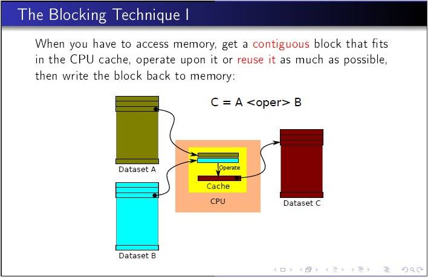

# Tiling

在深度学习网络中，`Conv`, `MatMul`等操作都会降维为矩阵乘`(GEMM)`进行计算，业界的深度学习计算库如`oneDNN`、`cuDNN`等都对`GEMM`计算做了很多优化，其中最常见且通用的手段就是对于内存层级的`tiling`。`Tiling`的目的主要是为了满足芯片**片上存储**及**计算流水线**的需求，以最大化**计算并行性**和**数据局部性**，从而发挥硬件的**极致性能**。


AI芯片内buffer size有限，参与一次AI CORE运算的输入输出数据量均是受限的，因此要做`tiling`，对大矩阵进行拆分，分块进行运算。

举例：

- 矩阵A大小：M=256, K=192
- 矩阵B大小：K=192, N=192
- Tiling方法：m=64, k=64, n=64。在M方向循环4次，K方向循环3次，N方向循环3次。每次计算结果(64*64)存在buffer中。


# [Using the Blocking Technique](https://www.intel.com/content/www/us/en/develop/documentation/iocl-tec-opg/top/coding-for-the-intel-architecture-processors/using-the-blocking-technique.html)

An important class of algorithmic changes involves changing the access pattern so that working set fits in cache. By organizing data memory accesses, you can load the cache with a small subset of a much larger data set. The idea is then to work on this block of data in cache. By using/reusing this data in cache we reduce the need to go to memory (memory bandwidth pressure).

**Blocking is an optimization technique that can help to avoid memory bandwidth bottlenecks**. Blocking enables you to exploit the inherent data reuse available in the application by **ensuring that the data remains in cache across multiple uses**. You can use the blocking technique on one-, two- or three-dimension spatial data structures. Some iterative applications can benefit from blocking over multiple iterations, which is called temporal blocking, and further mitigate bandwidth bottlenecks, which requires merging some kernels. In terms of code change, **blocking typically involves loop splitting**. In most application codes, **blocking is best performed by parameterization and tuning of the block-factors**.

For instance, the code snippet below shows an example of blocking with two loops (`i1` and `i2`) iterating over entire data set. The original code streams through the entire set in the inner loop, and must load the `data[i2]` value from memory in each iteration. Assuming `NUM` is large, and compute is not arithmetic intensive, we have no reuse in cache so this application is memory-bandwidth bound.

The original code without applying the blocking technique appears as follows:

```c++
for (i1 = 0; i1 < NUM; i1++) {
    for (i2=0; i2 < NUM; i2++) {
        OUT[i1] += compute(data[i1], data[i2]);  
    }
}
```

The blocked code below is obtained by splitting the `i2` loop into an outer loop iterating over bodies in multiple of `BLOCK`, and an inner `i22` loop, iterating over elements within the block; and interleaving the `i1` and `i2` loops. This code reuses a set of `BLOCK` `i2` values across multiple iterations of the `i1` loop. In case you choose `BLOCK` so that it makes the set of values fit in the L2 cache, the memory traffic is reduced by a factor of the `BLOCK`.

The modified code with use of one-dimensional blocking appears as follows:

```c++
for (i2 = 0; i2 < NUM; i2 += BLOCK) {
    for (i1=0; i1 < NUM; i1 ++) {
        for (i22=0; i22 < BLOCK; i22 ++) {
            OUT[i1] += compute(data[i1], data[i2 + i22]);
        }
    }
}
```


{: width="1086" height="542"}


{: width="1086" height="542"}


[lz4: 性能很好的压缩算法](https://blog.csdn.net/erlib/article/details/8917184)
