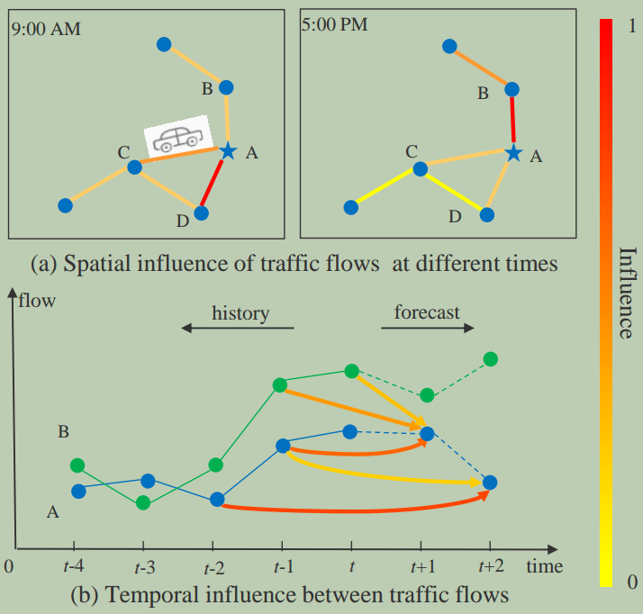
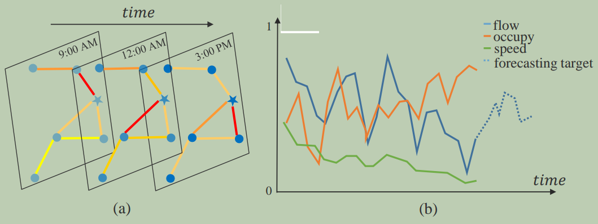
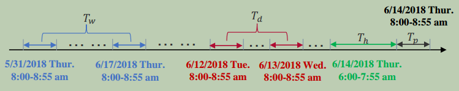
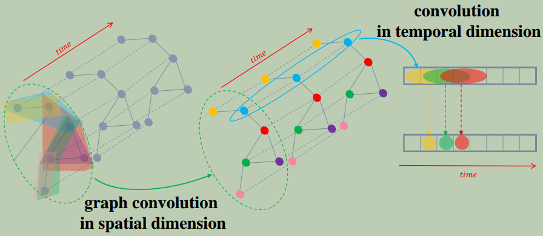
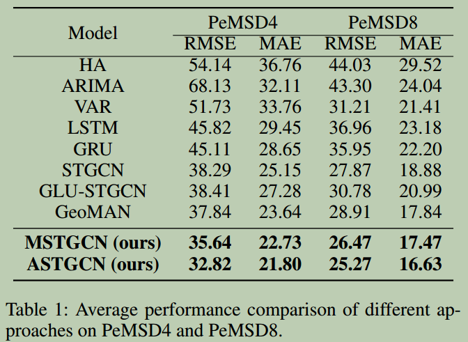

> [Attention Based Spatial-Temporal Graph Convolutional Networks for Traffic Flow Forecasting](https://ojs.aaai.org/index.php/AAAI/article/view/3881)

# 摘要

**交通流预测**是交通领域研究者和实践者面临的一个关键问题。然而由于交通流的**高度非线性**和**复杂的模式**，交通流问题非常具有挑战性。

现有的大多数交通流预测方法缺乏对交通数据的**动态时空相关性**的建模能力，因此无法产生令人满意的预测结果。

本文提出了一种新的**基于注意力机制的时空图卷积网络模型**(`ASTGCN`)来解决交通流预测问题。

`ASTGCN`主要由三个独立部分组成，分别模拟交通流的**三个时间特性**：最近、每日和每周的依赖。

更具体地说，每个组件包含两个主要部分：

- **时空注意力机制**，用于有效捕获交通数据中的**动态时空相关性**；
- **时空卷积**，**图卷积**来捕获**空间模式**和常用**标准卷积**来描述**时间特征**。

对三个分量的输出**加权融合**成最终的预测结果。

在`Caltrans`性能测量系统的两个真实数据集上的实验表明，所提出的`ASTGCN`模型优于最先进的基线。

# 引言

近年来，许多国家都致力于大力发展智能交通系统(`ITS`)以实现高效的交通管理。交通预测是`ITS`不可或缺的一部分，尤其是在流量大、速度快的高速公路上。由于高速相对封闭，一旦发生拥堵，将严重影响通行能力。**交通流**是反映高速状态的基本测量指标。如果能够提前准确预测，交管部门将能够更合理地引导车辆，提高高速网的运行效率。

公路交通流预测是一个典型的**时空数据预测问题**。交通数据在固定时间和连续空间中的固定位置上被记录。显然，在相邻位置和时间点进行的观测不是独立的，而是动态关联的。因此，解决这些问题的关键是有效地提取数据的时空相关性。

图`1`展示了交通流的时空相关性(可以是车速、车道占用率等)。两点之间的粗线表示其相互影响的强度。线的颜色越深，影响越大。在空间维度.

​												                                          图1: 交通流的时空相关性图表

图`1(a)`中，可以发现不同位置对`A`的影响不同，甚至同一位置对`A`的影响也随着时间的推移而不同。

图`1(b)`中，在时间维度里不同位置的历史观测对`A`未来不同时间的交通状态有不同的影响。

总之，高速网交通数据中的相关性在空间维度和时间维度上都表现出强烈的动态性。如何探索非线性和复杂的时空数据，以发现其内在的时空模式，并作出准确的交通流预测是一个非常具有挑战性的问题。

幸运的是，随着运输业的发展，许多摄像机、传感器和其他信息采集设备已经部署在高速公路上。每个设备都放置在特定的空间位置，不断产生交通的时间序列数据。这些设备积累了大量丰富的带地理信息的交通时间序列数据，为交通预测提供了坚实的数据基础。许多研究者已经做出了很多努力来解决这些问题。

早期，时间序列分析模型用于交通预测问题。然而，在实际应用中，他们很难处理不稳定和非线性的数据。

后来，传统机器学习方法用来建模更复杂的数据，但它们仍然难以同时考虑高维交通数据的时空相关性。此外，这种方法的预测效果很大程度上依赖于特征工程，这通常需要相应领域专家的大量经验。

近年来，许多研究人员使用深度学习方法来处理高维时空数据，例如，卷积神经网络被用来有效地提取网格化数据的空间特征；图卷积神经网络用于描述图结构数据的空间相关性。然而，这些方法仍然无法同时建模交通数据的时空特征和动态相关性。

为了应对上述挑战，我们提出了一种新的深度学习模型：基于注意力机制的时空图卷积网络`ASTGCN`，用于集中预测交通网络上每个位置的交通流。该模型可以直接在原始的基于图的交通网络上处理交通数据，有效地捕捉动态时空特征。

## 主要贡献

- 提出了一种**时空注意力机制**来学习交通数据的动态时空相关性。
  - **空间注意力机制**用于捕捉不同**位置**之间的**动态空间相关性**。
  - **时间注意力机制**用于捕捉不同**时间**之间的**动态时间相关性**。

- 设计了一种**时空卷积模块**，用于建模交通数据的**时空相关性**。它包括
  - **图卷积**用于从原始的基于图的交通网络结构中捕获**空间特征**。
  - **时间维度卷积**用于描述临近时间片的依赖关系。

- 基于真实公路交通数据集进行了大量实验，验证了与现有基线相比，我们的模型实现了最佳预测效果。

# 相关工作

## 交通预测

经过多年的不断研究和实践，交通预测的研究取得了许多成果。

用于交通预测的统计模型包括`HA`、`ARIMA`、`VAR`等。这些方法要求数据满足某些假设，但交通数据太复杂，无法满足这些假设，因此在实践中通常表现不佳。

机器学习方法，如`KNN`和`SVM`可以建模更复杂的数据，但它们需要仔细的特征工程。

由于深度学习在语音识别和图像处理等许多领域取得了突破，越来越多的研究人员将深度学习应用于时空数据预测。张等人设计了一个基于残差卷积单元的`ST-ResNet`模型来预测人群流量。姚等人提出了一种通过整合`CNN和`长短时记忆`LSTM`来联合建模空间和时间依赖性来预测流量的方法。姚等人进一步提出了一种用于出租车需求预测的时空动态网络，该网络可以动态学习位置之间的相似性。虽然这些模型可以提取交通数据的时空特征，但其局限性在于输入必须是标准的二维或三维网格数据。

## 图数据上的卷积

传统卷积可以有效地提取数据的局部特征，但它只能应用于标准网格数据。最近，图卷积将传统卷积推广到图结构的数据。图卷积方法的两个主流是空间方法和谱方法。

空间方法直接对图的节点及其邻居执行卷积滤波。因此，这种方法的核心是选择节点的邻域。`Niepert`、`Ahmed`和`Kutzkov`提出了一种启发式线性方法来选择每个中心节点的邻域，在社交网络任务中取得了良好的效果。李等人将图卷积引入到人类行为识别任务中。本文提出了几种划分策略，将每个节点的邻域划分为不同的子集，并确保每个节点的子集数量相等。

谱方法，其中通过谱分析考虑图卷积的局部性。`Bruna`等人提出了一种基于**图拉普拉斯**的通用图卷积框架，然后`Defferard`、`Bresson`和`Vandergheynst`通过使用**切比雪夫多项式**近似实现特征值分解来优化该方法。`Yu`、`Yin`和`Zhu`提出了一种基于该方法的交通预测门控图卷积网络，但该模型没有考虑交通数据的动态时空相关性。

## 注意力机制

近年来，注意力机制已广泛应用于各种任务，如自然语言处理、图像字幕和语音识别。**注意力机制的目标是从所有输入中选择对当前任务相对关键的信息**。徐等人在图像描述任务中提出了两种注意机制，并采用可视化方法直观地展示了注意机制的效果。为了对图的节点进行分类，`Velickovic`等人通过神经网络利用自注意力层来处理图结构数据，并取得了最先进的效果。为了预测时间序列，梁等人提出了一种多级注意力网络，以自适应调整多个地理位置的传感器的时间序列之间的相关性。然而，由于需要为每个时间序列训练单独的模型，因此在实践中非常耗时。

基于上述研究，考虑交通网络的图结构和交通数据的动态时空模式，我们同时采用图卷积和注意力机制对网络结构的交通数据进行建模。

# 基本定义和引理

## 交通网络

本研究中，我们将交通网络定义为无向图 $G=(V,E,\pmb{A})$，如图`2(a)`所示，其中 $V$ 是 $|V|=N$ 个节点的有限集；$E$ 是一组边，表示节点之间的连接；$\pmb{A} \in \mathbb{R}^{N\times N}$表示图 $G$ 的邻接矩阵。交通网络 $G$ 上的每个节点以相同采样频率检测出 $F$ 个测量值（如速度、流量、时间占有率等），即每个节点在每个时间片上生成长度为 $F$ 的特征向量，如图`2(b)`中的实线所示。

{: width="1086" height="542"}

图2: `(a)` 交通数据的时空结构，每个时间段的数据形成一个图; `(b)` 一个节点上检测到三个测量值，预测目标未来交通流。这里所有测量值均归一化为$[0,1]$。

## 交通流预测

假设交通网络 $G$ 中每个节点上记录的第 $f$ 个时间序列是交通流序列，并且$f \in (1,...,F)$。

我们使用 $x_{t}^{c,i} \in \mathbb{R}$ 表示节点 $i$ 在时间 $t$ 的第 $c$ 个特征值，$\mathbf{x}_{t}^{i} \in \mathbb{R}^{F}$ 表示节点 $i$ 在时间 $t$ 的所有特征值。

$$X_{t}=(\mathbf{x}_{t}^{1},\mathbf{x}_{t}^{2},...,\mathbf{x}_{t}^{N})^{T} \in \mathbb{R}^{N \times F}$$表示 $t$ 时刻的所有节点的所有特征值。

$$\mathbf{X}=(\mathbf{X}_{1},\mathbf{X}_{2},...,\mathbf{X}_{\tau})^{T} \in \mathbb{R} ^{N \times F \times \tau}$$ 表示 $\tau$ 时间切片上所有节点的所有特征值。

此外，我们设置 $y_{t}^{i}=x_{t}^{f,i} \in \mathbb{R}$ 表示节点 $i$ 在未来时间 $t$ 的交通流。

### 问题

给定过去 $\tau$ 个时间片内交通网络上所有节点的历史测量值 $\pmb{X}$ ，预测未来 $T_{p}$ 个时间片整个交通网络所有节点的未来交通流序列 $\pmb{Y}=(\pmb{y}^{1},\pmb{y}^{2},...,\pmb{y}^{N})^{T} \in \mathbb{R}^{N×T_{p}}$，其中 $\pmb{y}^{i}=(y_{τ+1}^{i},y_{τ+2}^{i},…,y_{τ+T_{p}}^{i}) \in \mathbb{R}^{T_{p}}$ 表示从 $τ+1$ 时刻开始，节点 $i$ 的未来交通流。

# ASTGCN

图3为本文提出的`ASTGCN`模型的总体框架。由三个相同结构的独立部分组成，分别用于建模历史数据的**最近**、**日周期**和**周周期**依赖关系。

{: width="1086" height="542"}

​                          图3: `ASTGCN`的框架。`SAtt`:空间注意力; `TAtt`:: 时间注意力; `GCN`: 图卷积; `FC`: 全连接; `ST block`：时空块。

假设采样频率为每天 $q$ 次。假设当前时间为 $t_{0}$，预测窗口的大小为 $T_{p}$. 

{: width="1086" height="542"}

​									图4: 构建时间序列段输入的示例（假设预测窗口大小为1小时，$T_{h}$、$T_{d}$ 和 $T_{w}$ 是 $T_{p}$ 的两倍）

如图4所示，我们沿时间轴截取长度为 $T_{h}$、$T_{d}$和 $T_{w}$的三个时间序列段，分别作为最近、每日和每周周期分量的输入，其中 $T_{h}$、$T_{d}$和 $T_{w}$都是 $T_{p}$的整数倍。关于三个时间序列段的详细信息如下：

- `recent`-段

  $$\mathbf{X}_{h}=(\mathbf{X}_{t_{0}−T_{h}+1},\mathbf{X}_{t_{0}−T_{h}+2},...,\mathbf{X}_{t_{0}}) \in \mathbb{R}^{N \times F \times T_{h}}$$

  一段与预测时间序列直接相邻的历史时间序列，如图4的绿色部分所示。直观上，交通拥堵的形成和扩散是渐进的。因此，刚过去的交通流必然会对未来的交通流产生影响。

- 日-周期段

  $$\mathbf{X}_{d}=(\mathbf{X}_{t_{0}−(T_{d}/T_{p})*q+1},...,\mathbf{X}_{t_{0}−(T_{d}/T_{p})*q+T_{p}}, \mathbf{X}_{t_{0}−(T_{d}/T_{p}-1)*q+1},...,\mathbf{X}_{t_{0}−(T_{d}/T_{p}-1)*q+T_{p}},...,\mathbf{X}_{t_{0}-q+1},...,\mathbf{X}_{t_{0}-q+T_{p}}) \in \mathbb{R}^{N \times F \times T_{d}}$$

  由过去几天与预测期处于同一时间段的路段组成，如图4的红色部分所示。由于人们的日常生活规律，交通数据可能会显示重复模式，例如每天早上的高峰。日周期分量的目的是对交通数据的日周期性进行建模。

- 周-周期段

  $$\mathbf{X}_{w}=(\mathbf{X}_{t_{0}−7*(T_{d}/T_{p})*q+1},...,\mathbf{X}_{t_{0}−7*(T_{d}/T_{p})*q+T_{p}}, \mathbf{X}_{t_{0}−7*(T_{d}/T_{p}-1)*q+1},...,\mathbf{X}_{t_{0}−7*(T_{d}/T_{p}-1)*q+T_{p}},...,\mathbf{X}_{t_{0}-7*q+1},...,\mathbf{X}_{t_{0}-7*q+T_{p}}) \in \mathbb{R}^{N \times F \times T_{w}}$$

  由过去几周的路段组成，这些路段具有与预测期相同的周属性和时间间隔，如图4的蓝色部分所示。通常，周一的交通模式与历史上的周一交通模式有一定的相似性，但可能与周末的交通模式有很大的不同。因此，周周期分量旨在捕捉交通数据中的周周期特征。

这三个部分有相同的网络结构，每部分由多个时空块和一个全连接层组成。在每个时空块中都有一个时空注意力模块和一个时空卷积模块。为了优化训练效率，每个组件中采用了**残差连接**`residual learning framework`。最后，基于参数矩阵进一步合并三个分量的输出，以获得最终的预测结果。整体网络结构经过精心设计以描述交通流的动态时空相关性。

## 时空注意力

在我们的模型中提出了一种新的时空注意力机制，用于捕捉交通网络上的动态时空相关性(如图1所示)。它包含空间注意力和时间注意力。

### 空间注意力

在空间维度上，不同地点的交通条件相互影响，且影响是高度动态的。这里我们使用注意力机制来自适应地捕捉空间维度中节点间的动态相关性。以最近组件中的空间注意力为例：

$$
\pmb{S}=\pmb{V}_{s} \cdot \sigma((\pmb{X}_{h}^{(r-1)}\pmb{W}_{1})\pmb{W}_{2}(\pmb{W}_{3}\pmb{X}_{h}^{(r-1)})^{T} + \pmb{b}_{s})
$$

$$
\pmb{S}_{i,j}^{\pmb{'}}=\frac{exp(\pmb{S}_{i,j})}{\sum_{j=1}^{N}exp(\pmb{s}_{i,j})}
$$

其中，$$\mathbf{X}_{h}^{(r-1)}=(\mathbf{X}_{1},\mathbf{X}_{2},...,\mathbf{X}_{T_{r-1}}) \in \mathbb{R}^{N \times C_{r-1} \times T_{r-1}}$$  是第 $$r$$ 个时空块的输入。

$C_{r-1}$ 是第 $r$ 层中输入数据的通道数。$T_{r-1}$ 是第 $r$ 层中时间维度的长度。

当 $r=1$ 时，$C_{0}=F$ ，$T_{0}=T_{h}$ (recent分量)、$T_{0}=T_{d}$ (日周期分量)、$T_{0}=T_{w}$ (周周期分量)

$$\mathbf{V}_{s}$$, $$\mathbf{b}_{s} \in \mathbb{R}^{N \times N}$$，$$\mathbf{W}_{1} \in \mathbb{R}^{T_{r-1}}$$，$$\mathbf{W}_{2} \in \mathbb{R}^{C_{r-1} \times T_{r-1}}$$，$$\pmb{W}_{3} \in \mathbb{R}^{C_{r-1}}$$ 是可学习的参数，`sigmoid` $\sigma$ 用作激活函数。

注意力矩阵 $\mathbf{S}$ 根据该层的当前输入动态计算。$\mathbf{S}$  中元素 $\mathbf{S}_{i,j}$ 的值在语义上表示节点 $i$ 和节点 $j$ 间的相关性强度。然后使用`softmax`函数确保节点的注意力权重总和为1。在执行图卷积时，我们将联合邻接矩阵 $\mathbf{A}$ 和空间注意矩阵 $$\mathbf{S^{'}} \in \mathbb{R}^{N \times N}$$ 动态调整节点之间的权重。

### 时间注意力

在时间维度上，不同时间段的交通状况间存在相关性，且不同情况下相关性也不同。我们使用注意力机制自适应地赋予数据不同的重要性:

$$
\pmb{E}=\pmb{V}_{e} \cdot \sigma(((\pmb{X}_{h}^{(r-1)})^{T}\pmb{U}_{1})\pmb{U}_{2}(\pmb{U}_{3}\pmb{X}_{h}^{(r-1)})^{T} + \pmb{b}_{e})
$$

$$
\pmb{E}_{i,j}^{\pmb{'}}=\frac{exp(\pmb{E}_{i,j})}{\sum_{j=1}^{T_{r-1}}exp(\pmb{E}_{i,j})}
$$

其中，$$\mathbf{V}_{e}$$, $$\mathbf{b}_{e} \in \mathbb{R}^{T_{r-1} \times T_{r-1}}$$，$$\mathbf{U}_{1} \in \mathbb{R}^{N}$$，$$\mathbf{U}_{2} \in \mathbb{R}^{C_{r-1} \times N}$$，$$\mathbf{U}_{3} \in \mathbb{R}^{C_{r-1}}$$ 是可学习参数。

时间相关矩阵 $E$ 由变化的输入决定。$E$ 中元素 $E_{i,j}$ 的值在语义上表示时间 $i$ 和 $j$ 之间的依赖强度。最后 $E$ 通过`softmax`函数归一化。我们直接将归一化的时间注意力矩阵作用于输入，得到 $$\mathbf{\hat{\mathbf{X}}}_{h}^{r-1}=(\mathbf{\hat{\mathbf{X}}}_{1},\mathbf{\hat{\mathbf{X}}}_{2},...,\mathbf{\hat{\mathbf{X}}}_{T_{r-1}})=(\mathbf{X}_{1},\mathbf{X}_{2},...,\mathbf{X}_{T_{r-1}})\mathbf{E^{'}} \in \mathbb{R}^{N \times C_{r-1} \times T_{r-1}}$$，通过融合相关信息实现动态调整输入。

## 时空卷积

时空注意力模块让网络自动对有价值的信息给予相对更多的关注。注意力机制调整过的输入被送入时空卷积模块，其结构如图5所示。

{: width="1086" height="542"}

​																					图5: ASTGCN中时空卷积模块的结构

本文提出的时空卷积模块包括空间维度的图卷积，其从邻域捕获空间依赖性；以及沿时间维度的卷积，其探索邻近时间的时间依赖性。

### 空间维度的图卷积

图谱论将卷积运算从基于网格的数据推广到图结构数据。本研究中，交通网络本质上是一个图结构，每个节点的特征可视为图上的信号。因此，为了充分利用交通网络的拓扑特性，在每个时间切片上，我们采用基于图谱论的图卷积来直接处理信号，利用交通网络在空间维度上的信号相关性。谱方法将图转换为代数形式，以分析图的拓扑属性，例如图结构中的连通性。

在谱分析中，图由其相应的拉普拉斯矩阵表示。通过分析拉普拉斯矩阵及其特征值，可以得到图的结构的性质。图的拉普拉斯矩阵定义为$\mathbf{L}=\mathbf{D}−\mathbf{A}$、 其归一化形式为 $$\mathbf{L}=\mathbf{I}_{N} - \mathbf{D}^{-\frac{1}{2}} \mathbf{A} \mathbf{D}^{\frac{1}{2}} \in \mathbb{R}^{N \times N}$$ ，其中 $$\mathbf{A}$$ 是邻接矩阵，$$\mathbf{I}_{N}$$ 是单位矩阵，度矩阵 $$\mathbf{D} \in  \mathbb{R}^{N \times N}$$ 是一个对角矩阵，由节点的度 $$\mathbf{D}_{ii}=\sum_{j} \mathbf{A}_{ij}$$ 组成。拉普拉斯矩阵的特征值分解为 $$\mathbf{L}=\mathbf{U} \mathbf{\Lambda} \mathbf{U}^{T}$$，其中  $$\mathbf{\Lambda}=diag([\lambda_{0},...,\lambda_{N-1}]) \in \mathbb{R}^{N \times N}$$ 是对角矩阵，$$\mathbf{U}$$ 是傅立叶基。

以 $t$ 时刻的交通流为例，图上的信号为 $x=\pmb{x}_{t}^{f} \in \mathbb{R}^{N}$，信号的图傅立叶变换定义为 $\hat{x}=\pmb{U}^{T} x$。根据拉普拉斯矩阵的性质，$\pmb{U}$ 是正交矩阵，因此相应的傅立叶逆变换为 $x=\pmb{U} \hat{x}$ 式。图卷积是一种卷积运算，通过使用在傅立叶域中对角化的线性算子来代替经典卷积算子来实现。基于此，图 $G$ 上的信号 $x$ 由核 $g_{\theta}$ 滤波：
$$
g_{\theta} \ \ast_{G} x = g_{\theta}(\pmb{L})x = g_{\theta} (\pmb{U} \pmb{\Lambda} \pmb{U}^{T}) x = \pmb{U}g_{\theta}(\pmb{\Lambda}) \pmb{U}^{T} x
$$
其中，$\ast_{G}$ 表示图卷积运算。由于图信号的卷积运算等价于通过图傅立叶变换转换到频谱域的信号的乘积，因此上述公式可以理解为分别将 $g_{\theta}$ 和 $x$ 做傅立叶变换到频谱域，然后将转换后的结果相乘，再做傅里叶逆变换，得到卷积的最终结果。然而，当图的规模较大时，直接在拉普拉斯矩阵上做特征值分解是费时的。因此，本文采用切比雪夫多项式近似但有效地解决这个问题：
$$
g_{\theta} \ \ast_{G} x = g_{\theta}(\pmb{L})x = \sum_{k=0}^{K-1}\theta_{k}T_{k}(\pmb{\tilde{L}}) x
$$
其中，$\theta \in \mathbb{R}^{K}$ 是多项式系数的向量。$\pmb{\tilde{L}}=\frac{2}{\lambda_{max}} \pmb{L} - \pmb{I_{N}}$，$\lambda_{max}$ 是拉普拉斯矩阵特征值的最大值。

切比雪夫多项式的递归定义是： $T_{k}(x)=2xT_{k-1}(x)-T_{k-2}(x)$，其中，$T_{0}(x)=1$，$T_{1}(x)=x$。

使用切比雪夫多项式的近似展开来求解该公式对应于通过卷积核 $g_{\theta}$ 提取图上每个节点周围 $0$ 到 $K-1$ 阶邻域的信息。

图卷积模块使用`ReLU`作为最终的激活函数，即 $ReLU(g_{\theta} \ast_{G} x)$。

为了动态调整节点间的相关性，对于切比雪夫多项式的每一项，我们将 $T_{k}(\pmb{\tilde{L}})$ 与空间注意矩阵 $\pmb{S}^{'} \in \mathbb{R}^{N \times N}$ 结合起来，然后获得 $T_{k}(\pmb{\tilde{L}}) \odot \pmb{S}^{'}$，其中 $\odot$ 是`Hadamard`乘积。因此，上述图卷积公式变为 $g_{\theta} \ \ast_{G} x = g_{\theta}(\pmb{L})x = \sum_{k=0}^{K-1}\theta_{k} (T_{k}(\pmb{\tilde{L}}) \odot \pmb{S^{'}}) x$.

我们可以将这个定义推广到具有多通道的图信号。例如，在`recent`分量中，输入是 $\pmb{X}_{h}^{(r-1)}=(\pmb{X}_{1},\pmb{X}_{2},...,\pmb{X}_{T_{r-1}}) \in \mathbb{R}^{N \times C_{r-1} \times T_{r-1}}$ ，其中每个节点的特征有 $C_{r-1}$ 个通道。对于每个时间片 $t$，在图 $\hat{\pmb{X}}_{t}$ 上执行 $C_{r}$ 滤波器，我们得到 $g_{\theta} \ast_{G} \hat{\pmb{X}}_{t}$，其中 $\theta=(\theta_{1},\theta_{1},...,\theta_{C_{r}}) \in \mathbb{R}^{K \times C_{r-1} \times C_{r}}$ 是卷积核参数。因此，每个节点都根据自己$0 \sim K-1$ 阶邻域的信息进行更新。

### 时间维度的卷积

在图卷积操作已经在空间维度上捕捉到图上每个节点的邻域信息后，进一步堆叠时间维度上的标准卷积层，以通过在相邻时间切片处合并信息来更新节点的信号，如图5中的右侧部分所示。还以`recent`分量中的第 $r$ 层上的操作为例：
$$
\pmb{X}_{h}^{(r)}=ReLU(\Phi \ast (ReLU(g_{\theta} \ast_{G} \pmb{\hat{\pmb{X}}}_{h}^{(r-1)}))) \in \mathbb{R}^{C_{r} \times N \times T_{r}}
$$
其中，$\ast$ 表示标准卷积运算，$\Phi$ 是时间维度卷积核的参数，激活函数为`ReLU`。

总之，时空卷积模块能够很好地捕捉交通数据的时间和空间特征。时空注意模块和时空卷积模块形成时空块。堆叠多个时空块以进一步提取更大范围的动态时空相关性。最后，添加一个全连接层，以确保每个组件的输出具有与预测目标相同的尺寸和形状。最后一个全连接层使用`ReLU`作为激活函数。

## 多组件融合

在本节中，我们将讨论如何整合这三个组件的输出。以预测周五上午`8:00`整个交通网络的交通流量为例。可以观察到，一些地区的交通流在上午有明显的高峰期，因此日周期和周周期分量的输出更为关键。然而，在其他一些地方没有明显的交通周期模式，因此日周期和周周期成分可能没有什么用。因此，当融合不同组件的输出时，对于每个节点，三个组件的影响权重不同，应该从历史数据中学习。因此，融合后的最终预测结果为：
$$
\pmb{\hat{Y}}=\pmb{W_{h}} \ \odot \pmb{\hat{Y}}_{h} + \pmb{W_{d}} \ \odot \pmb{\hat{Y}}_{d} + \pmb{W_{w}} \ \odot \pmb{\hat{Y}}_{w}
$$
其中，$\odot$ 是`Hadamard`乘积。$\pmb{W}_{h}$、$\pmb{W}_{d}$ 和 $\pmb{W}_{w}$ 是学习参数，反映了三个时空组件对预测目标的影响程度。

# 实验

为了评估模型的效果，我们在两个真实的公路交通数据集上进行了对比实验。

## 数据集

我们在加利福尼亚州的两个公路交通数据集`PeMSD4`和`PeMSD8`上验证我们的模型。数据集由`Caltrans`性能测量系统`PeMS`每`30`秒实时收集一次。流量数据从原始数据聚合为每5分钟一次。该系统在加利福尼亚州主要大都市地区的高速公路上部署了39000多个探测器。数据集中记录了有关传感器站的地理信息。我们的实验中考虑了三种交通测量，包括总流量、平均速度和平均占用率。

### PeMSD4

它是指旧金山湾区的交通数据，包含29条道路上的3848个探测器。该数据集的时间跨度为2018年1月至2月。我们选择前50天的数据作为训练集，剩余数据作为测试集。

### PeMSD8

它是2016年7月至8月圣贝纳迪诺的交通数据，包含8条道路上的1979个探测器。前50天的数据用作训练集，最后12天的数据为测试集。

## 预处理

我们移除了一些冗余探测器，以确保任何相邻探测器之间的距离超过3.5英里。最后，`PeMSD4`中有307个检测器，`PEMSV8`中有170个检测器。交通数据每5分钟聚合一次，因此每个检测器每天包含288个数据点。缺失值由线性插值填充。此外，数据通过零均值归一化 $x^{'}=x-mean(x)$ 使平均值为`0`。

## 设置

我们基于`MXNet1`框架实现了`ASTGCN`模型。根据`Kipf`和`Welling`，我们测试了切比雪夫多项式项数的不同取值 $K \in \lbrace 1, 2, 3 \rbrace$. 随着 $K$ 变大，预测效果略有提高。时间维度上的卷积核大小也是如此。

考虑到计算效率和预测效果的权衡，我们设置 $K=3$，并将沿时间维度的卷积核大小设置为`3`。在我们的模型中，所有图卷积层使用`64`个卷积核。所有时间卷积层使用`64`个卷积核，通过控制时间卷积的步长来调整数据的时间跨度。对于三个路段的长度，我们将其设置为：$T_{h}=24$，$T_{d}=12$，$T_{w}=24$。预测窗口的大小 $T_{p}=12$，也就是说，我们旨在预测未来一小时内的交通流量。

本文将计算值和真实值之间的均方误差`MSE`用作损失函数，并通过反向传播最小化。在训练阶段，批量大小为`64`，学习率为`0.0001`。此外，为了验证本文提出的时空注意机制的影响，我们还设计了一个降级版本的`ASTGCN`，即多分量时空图卷积网络`MSTGCN`，该网络取消了时空注意力。`MSTGCN`的设置与`ASTGCN`相同，只是没有时空注意力。

## 基准

我们将本文的模型与下面的八个基准进行对比：

- `HA`: `Historical Average method`. 我们使用最后`12`个时间切片的平均值来预测下一个值。
- `ARIMA`: `Auto-Regressive Integrated Moving Average`. 自回归综合移动平均值是一种用于预测未来值的时间序列分析方法。
- `VAR`: `Vector Auto-Regressive`. 向量自回归是一种更先进的时间序列模型，可以捕捉所有交通流序列之间的成对关系。
- `LSTM`: `Long Short-Term Memory` 长-短期记忆网络，一种特殊的`RNN`模型。
- `GRU`: `Gated Recurrent Unit` 选通递归单元网络，一种特殊的`RNN`模型。
- `STGCN`: 基于空间方法的时空图卷积模型。
- `GLU-STGCN`: 一种带有选通机制的图卷积网络，专门用于流量预测。
- `GeoMAN`: 一种基于多级注意力的递归神经网络模型，用于地感时间序列预测问题。

均方根误差`RMSE`和平均绝对误差`MAE`被用作评估指标。

## 对比和结果分析

我们将本文的模型与八种基线方法在`PeMSD4`和`PeMSD8`数据集上进行了比较。表1显示了未来一小时交通流预测效果的平均结果。

{: width="1086" height="542"}

从表1可以看出，我们的`ASTGCN`在两个数据集上的所有评估指标都达到了最佳效果。

可以观察到，传统时间序列分析方法的预测结果通常并不理想，这表明这些方法对非线性和复杂交通数据建模的能力有限。

相比之下，基于深度学习的方法通常比传统的时间序列分析方法获得更好的预测结果。其中，同时考虑时间和空间相关性的模型，包括`STGCN`、`GLU-STGCN`和`GeoMAN`以及我们模型的两个版本，优于传统的深度学习模型，如`LSTM`和`GRU`。

此外，`GeoMAN`的效果优于`STGCN`和`GLU-STGCN`，表明`GeoMAN`中应用的多级注意机制在捕获交通数据的动态变化方面是有效的。

我们的`MSTGCN`在没有任何注意力机制的情况下，取得了比以前的最优模型更好的结果，证明了我们的模型在描述公路交通数据的时空特征方面的优势。然后结合时空注意机制，我们的`ASTGCN`进一步减少了预测误差。

图6显示了各种方法的预测效果随着预测间隔增加的变化情况。总的来说，随着预测间隔变长，相应的预测难度越来越大，因此预测误差也会增加。

从图中可以看出，仅考虑时间相关性的方法可以在短期预测中取得良好的结果，例如`HA`、`ARIMA`、`LSTM`和`GRU`。然而，随着预测间隔的增加，其预测精度急剧下降。

相比之下，`VAR`的性能下降比这些方法慢。这主要是因为`VAR`可以同时考虑在长期预测中更重要的时空相关性。然而，当交通网络的规模变得更大，即模型中考虑的时间序列更多时，`VAR`的预测误差增加，如图6所示，其在`PeMSD4`上的效果不如`PeMSD8`。

深度学习方法的误差随着预测间隔的增加而缓慢增加，其整体性能良好。

我们的`ASTGCN`模型几乎始终具有最佳的预测效果。特别是在长期预测中，`ASTGCN`与其他基线之间的差异更为显著，表明将注意力机制与图卷积相结合的策略可以更好地挖掘交通数据的动态时空模式。

为了直观地研究注意力机制在我们的模型中的作用，我们进行了一个案例研究：从`PeMSD8`中选取一个子图，其中包含10个检测器，并显示训练集中检测器之间的平均空间注意力矩阵。如图7右侧所示，在空间注意力矩阵中，第 $i$ 行表示每个检测器和第 $i$ 检测器之间的相关强度。例如，看最后一行，我们可以知道第9个检测器上的交通流与第3个和第8个检测器的交通流密切相关。这是合理的，因为这三个检测器在真实交通网络上的空间很近，如图7左侧所示。因此，我们的模型不仅实现了最佳预测性能，而且显示了可解释性优势。

# 结论

本文提出了一种新的基于注意力机制的时空图卷积模型`ASTGCN`，并成功地应用于交通流预测。该模型将**时空注意力机制**和**时空卷积**相结合，包括空间维度的**图卷积**和时间维度的**标准卷积**，以同时捕获交通数据的**动态时空特征**。

在两个真实数据集上的实验表明，该模型的预测精度优于现有模型。代码发布于https://github.com/wanhuaiyu/ASTGCN.

实际上，公路交通流受到许多外部因素的影响，如天气和社会事件。未来，我们将考虑一些外部影响因素，以进一步提高预测精度。因为`ASTGCN`是一个对于图结构数据的通用时空预测框架，我们还可以将其应用于其他实际应用，例如估计到达时间。

