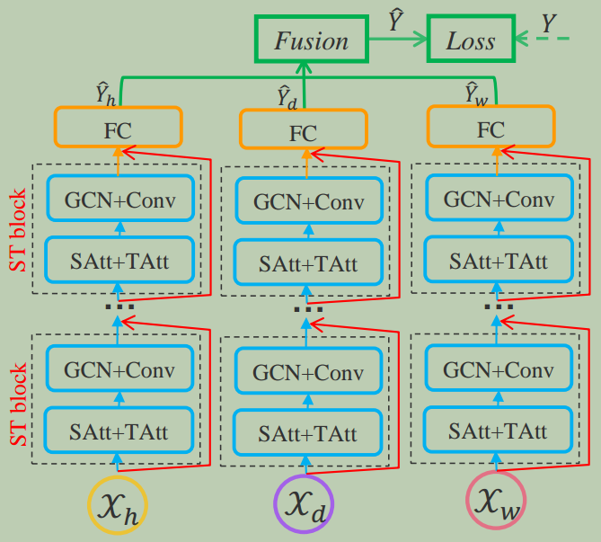

> [Attention Based Spatial-Temporal Graph Convolutional Networks for Traffic Flow Forecasting](https://ojs.aaai.org/index.php/AAAI/article/view/3881)

# 摘要

**交通流预测**是交通领域研究者和实践者面临的一个关键问题。然而由于交通流的**高度非线性**和**复杂的模式**，交通流问题非常具有挑战性。

现有的大多数交通流预测方法缺乏对交通数据的**动态时空相关性**的建模能力，因此无法产生令人满意的预测结果。

本文提出了一种新的**基于注意力的时空图卷积网络模型**(`ASTGCN`)来解决交通流预测问题。

`ASTGCN`主要由三个独立组件组成，分别模拟交通流的**三个时间特性**：最近、日周期和周周期依赖。

更具体地说，每个组件包含两个主要部分：

- **时空注意力机制**，用于有效捕获交通数据中的**动态时空相关性**；
- **时空卷积+图卷积**来捕获**空间模式**和常用**标准卷积**来描述**时间特征**。

三个分量的输出加权融合成最终的预测结果。

在`Caltrans`性能测量系统的两个真实数据集上的实验表明，所提出的`ASTGCN`模型优于最先进的基线。

# 引言

近年来，许多国家都致力于大力发展智能交通系统(`ITS`)以实现高效的交通管理。交通预测是`ITS`不可或缺的一部分，尤其是在流量大、速度快的高速公路上。由于高速相对封闭，一旦发生拥堵，将严重影响通行能力。**交通流**是反映高速状态的基本测量指标。如果能够提前准确预测，交管部门将能够更合理地引导车辆，提高高速网的运行效率。

公路交通流预测是一个典型的**时空数据预测问题**。交通数据在固定时间和连续空间中的固定位置上被记录。显然，在相邻位置和时间点进行的观测不是独立的，而是动态关联的。因此，解决这些问题的关键是有效地提取数据的时空相关性。

图`1`展示了交通流的时空相关性(可以是车速、车道占用率等)。两点之间的粗线表示其相互影响的强度。线的颜色越深，影响越大。在空间维度.

​												                                          图1: 交通流的时空相关性图表

图`1(a)`中，可以发现不同位置对`A`的影响不同，甚至同一位置对`A`的影响也随着时间的推移而不同。

图`1(b)`中，在时间维度里不同位置的历史观测对`A`未来不同时间的交通状态有不同的影响。

总之，高速网交通数据中的相关性在空间维度和时间维度上都表现出强烈的动态性。如何探索非线性和复杂的时空数据，以发现其内在的时空模式，并作出准确的交通流预测是一个非常具有挑战性的问题。

幸运的是，随着运输业的发展，许多摄像机、传感器和其他信息采集设备已经部署在高速公路上。每个设备都放置在特定的空间位置，不断产生交通的时间序列数据。这些设备积累了大量丰富的带地理信息的交通时间序列数据，为交通预测提供了坚实的数据基础。许多研究者已经做出了很多努力来解决这些问题。

早期，时间序列分析模型用于交通预测问题。然而，在实际应用中，他们很难处理不稳定和非线性的数据。

后来，传统机器学习方法用来建模更复杂的数据，但它们仍然难以同时考虑高维交通数据的时空相关性。此外，这种方法的预测效果很大程度上依赖于特征工程，这通常需要相应领域专家的大量经验。

近年来，许多研究人员使用深度学习方法来处理高维时空数据，例如，卷积神经网络被用来有效地提取网格化数据的空间特征；图卷积神经网络用于描述图结构数据的空间相关性。然而，这些方法仍然无法同时建模交通数据的时空特征和动态相关性。

为了应对上述挑战，我们提出了一种新的深度学习模型：基于注意力机制的时空图卷积网络`ASTGCN`，用于集中预测交通网络上每个位置的交通流。该模型可以直接在原始的基于图的交通网络上处理交通数据，有效地捕捉动态时空特征。

## 主要贡献

- 开发了一种时空注意力机制来学习交通数据的动态时空相关性。
  - 空间注意力机制用来模拟不同位置间的复杂空间相关性。
  - 时间注意力用于捕捉不同时间之间的动态时间相关性。

- 设计了一种新的时空卷积模块，用于建模交通数据的时空相关性。它包括
  - 图卷积用于从原始的基于图的交通网络结构中捕获空间特征。
  - 时间维度卷积用于描述临近时间切片依赖关系。

- 基于真实公路交通数据集进行了大量实验，验证了与现有基线相比，我们的模型实现了最佳预测效果。

# 相关工作

## 交通预测

经过多年的不断研究和实践，交通预测的研究取得了许多成果。

用于交通预测的统计模型包括`HA`、`ARIMA`、`VAR`等。这些方法要求数据满足某些假设，但交通数据太复杂，无法满足这些假设，因此在实践中通常表现不佳。

机器学习方法，如`KNN`和`SVM`可以建模更复杂的数据，但它们需要仔细的特征工程。

由于深度学习在语音识别和图像处理等许多领域取得了突破，越来越多的研究人员将深度学习应用于时空数据预测。张等人设计了一个基于残差卷积单元的`ST-ResNet`模型来预测人群流量。姚等人提出了一种通过整合`CNN和`长短时记忆`LSTM`来联合建模空间和时间依赖性来预测流量的方法。姚等人进一步提出了一种用于出租车需求预测的时空动态网络，该网络可以动态学习位置之间的相似性。虽然这些模型可以提取交通数据的时空特征，但其局限性在于输入必须是标准的二维或三维网格数据。

## 图数据上的卷积

传统卷积可以有效地提取数据的局部特征，但它只能应用于标准网格数据。最近，图卷积将传统卷积推广到图结构的数据。图卷积方法的两个主流是空间方法和谱方法。

空间方法直接对图的节点及其邻居执行卷积滤波。因此，这种方法的核心是选择节点的邻域。`Niepert`、`Ahmed`和`Kutzkov`提出了一种启发式线性方法来选择每个中心节点的邻域，在社交网络任务中取得了良好的效果。李等人将图卷积引入到人类行为识别任务中。本文提出了几种划分策略，将每个节点的邻域划分为不同的子集，并确保每个节点的子集数量相等。

谱方法，其中通过谱分析考虑图卷积的局部性。`Bruna`等人提出了一种基于**图拉普拉斯**的通用图卷积框架，然后`Defferard`、`Bresson`和`Vandergheynst`通过使用**切比雪夫多项式**近似实现特征值分解来优化该方法。`Yu`、`Yin`和`Zhu`提出了一种基于该方法的交通预测门控图卷积网络，但该模型没有考虑交通数据的动态时空相关性。

## 注意力机制

近年来，注意力机制已广泛应用于各种任务，如自然语言处理、图像字幕和语音识别。**注意力机制的目标是从所有输入中选择对当前任务相对关键的信息**。徐等人在图像描述任务中提出了两种注意机制，并采用可视化方法直观地展示了注意机制的效果。为了对图的节点进行分类，`Velickovic`等人通过神经网络利用自注意力层来处理图结构数据，并取得了最先进的效果。为了预测时间序列，梁等人提出了一种多级注意力网络，以自适应调整多个地理位置的传感器的时间序列之间的相关性。然而，由于需要为每个时间序列训练单独的模型，因此在实践中非常耗时。

基于上述研究，考虑交通网络的图结构和交通数据的动态时空模式，我们同时采用图卷积和注意力机制对网络结构的交通数据进行建模。

# 基本定义和引理

## 交通网络

本研究中，我们将交通网络定义为无向图 $G=(V,E,\pmb{A})$，如图`2(a)`所示，其中 $V$ 是 $|V|=N$ 个节点的有限集；$E$ 是一组边，表示节点之间的连接；$\pmb{A} \in \reals^{N\times N}$表示图 $G$ 的邻接矩阵。交通网络 $G$ 上的每个节点以相同采样频率检测出 $F$ 个测量值，即每个节点在每个时间片上生成长度为 $F$ 的特征向量，如图`2(b)`中的实线所示。

{: width="1086" height="542"}

图2: (a) 交通数据的时空结构，每个时间段的数据形成一个图; (b)一个节点上检测到三个测量值，预测目标未来交通流。这里所有测量值均归一化为$[0,1]$。

## 交通流预测

假设交通网络 $G$ 中每个节点上记录的第 $f$ 个时间序列是交通流序列，并且$f \in (1,...,F)$。

我们使用 $x_{t}^{c,i} \in \reals$ 表示节点 $i$ 在时间 $t$ 的第 $c$ 个特征值，$\pmb{x}_{t}^{i} \in \reals^{F}$表示节点 $i$ 在时间 $t$ 的所有特征值。

$X_{t}=(\pmb{x}_{t}^{1},\pmb{x}_{t}^{2},...,\pmb{x}_{t}^{N})^{T} \in \R^{N×F}$表示$t$ 时刻的所有节点的所有特征值。$\pmb{\Chi}=(\pmb{X}_{1},\pmb{X}_{2},...,\pmb{X}_{\tau})^{T} \in \reals^{N×F×\tau}$表示 $\tau$ 时间切片上所有节点的所有特征值。

此外，我们设置$y_{t}^{i}=x_{t}^{f,i} \in \reals$表示节点 $i$ 在未来时间 $t$ 的交通流。

### 问题

给定在过去 $\tau$ 时间切片内交通网络上所有节点的各种历史测量值$\pmb{\Chi}$ ，预测下一个 $T_{p}$ 时间切片上整个交通网络上所有节点的未来交通流序列 $\pmb{Y}=(\pmb{y}^{1},\pmb{y}^{2},...,\pmb{y}^{N})^{T} \in \reals^{N×T_{p}}$，其中$\pmb{y}^{i}=(y_{τ+1}^{i},y_{τ+2}^{i},…,y_{τ+T_{p}}^{i}) \in \reals^{T_{p}}$ 表示来自 $τ+1$ 时刻节点 $i$ 的未来交通流。

# ASTGCN

图3为本文提出的`ASTGCN`模型的总体框架。由三个相同结构的独立组件组成，分别用于建模历史数据的**最近**、**日周期**和**周周期**依赖关系。

{: width="1086" height="542"}

​                          图3: `ASTGCN`的框架。`SAtt`:空间注意力; `TAtt`:: 时间注意力; GCN: 图卷积; FC: 全连接; ST block：时空块。

假设采样频率为每天 $q$ 次。假设当前时间为 $t_{0}$，预测窗口的大小为 $T_{p}$. 

{: width="1086" height="542"}

​									图4: 构建时间序列段输入的示例（假设预测窗口大小为1小时，$T_{h}$、$T_{d}$ 和 $T_{w}$ 是 $T_{p}$ 的两倍）

如图4所示，我们沿时间轴截取长度为 $T_{h}$、$T_{d}$和 $T_{w}$的三个时间序列段，分别作为最近、每日和每周周期分量的输入，其中 $T_{h}$、$T_{d}$和 $T_{w}$都是 $T_{p}$的整数倍。关于三个时间序列段的详细信息如下：

- `recent`-段

  $\pmb{X}_{h}=(\pmb{X}_{t_{0}−T_{h}+1},\pmb{X}_{t_{0}−T_{h}+2},...,\pmb{X}_{t_{0}}) \in \R^{N \times F \times T_{h}}$

  一段与预测时间序列直接相邻的历史时间序列，如图4的绿色部分所示。直观上，交通拥堵的形成和扩散是渐进的。因此，刚过去的交通流必然会对未来的交通流产生影响。

- 日-周期段

  

- 周-周期段

## 时空注意力

### 空间注意力

### 时间注意力

## 时空卷积

### 空间维度的图卷积

### 时间维度的卷积

## 多组件融合

# 实验

## 数据集

## 预处理

## 设置

## 基准

## 对比和结果分析

# 结论

本文提出了一种新的基于注意力机制的时空图卷积模型`ASTGCN`，并成功地应用于交通流预测。该模型将**时空注意力机制**和**时空卷积**相结合，包括空间维度的**图卷积**和时间维度的**标准卷积**，以同时捕获交通数据的**动态时空特征**。在两个真实数据集上的实验表明，该模型的预测精度优于现有模型。代码发布于https://github.com/wanhuaiyu/ASTGCN.

实际上，公路交通流受到许多外部因素的影响，如天气和社会事件。未来，我们将考虑一些外部影响因素，以进一步提高预测精度。因为`ASTGCN`是一个对于图结构数据的通用时空预测框架，我们还可以将其应用于其他实际应用，例如估计到达时间。
