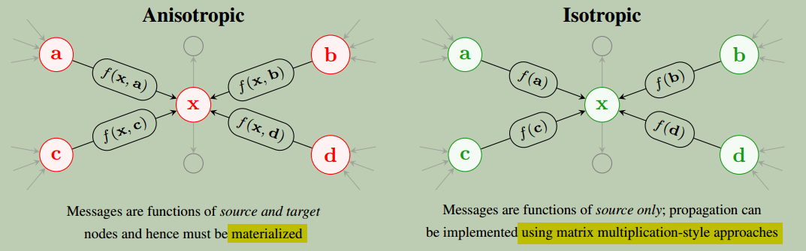
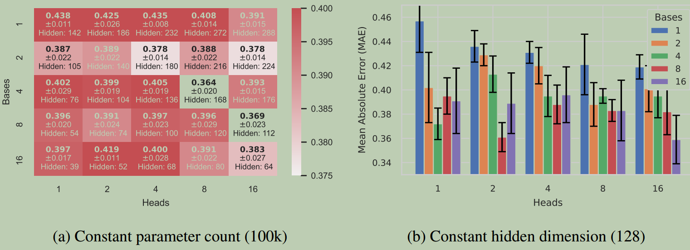

> The Efficient Graph Convolution from the ["Adaptive Filters and Aggregator Fusion for Efficient Graph Convolutions"](https://arxiv.org/abs/2104.01481) paper.

# 摘要

`GNN`社区的常识表明：**各向异性**模型(模型中节点间发送的消息是源节点和目标节点的函数)用来实现最先进的性能。目前的`benchmarks`表明，这类模型的性能优于类似的**各向同性**模型(模型中消息仅是源节点的函数)。

在本文中，我们提供了挑战这一常识的实践证据：提出了一种各向同性`GNN`，高效图卷积( `EGC`)，它通过使用**空间自适应滤波器**` spatially-varying adaptive filters`，表现始终优于类似的各向异性模型，包括流行的`GAT`或`PNA`架构。

我们的工作除了向`GNN`社区提出了重要的问题外，还包括对效率的重大实际影响。`EGC`具有更高的模型精度，更低的内存消耗和延迟，以及适合加速器实现的特性，同时也是现有架构即插即用的替代品。

作为各向同性模型，它的复杂度与图中的顶点数成正比，即 $$\mathcal{O}(V)$$，相反，各向异性的杂度与图中的边数成正比，即 $$\mathcal{O}(E)$$。

我们证明了`EGC在`6个大型和不同的基准数据集上表现优于现有方法。[我们实验的代码和预训练模型](https://github.com/shyam196/egc)。

# 引言

图神经网络(`GNN`)已成为一种有效的在任意结构的数据上建立模型的方法。例如，它们已被成功应用于计算机视觉任务：`GNN`可在点云数据上提供高性能，并用于跨图像的特征匹配。最近的工作还表明，`GNN`可应用于物理模拟。代码分析是`GNN`获得成功的另一个应用领域。

近年来，研究界对构建更具表达力、性能更好的图像处理模型给予了极大关注。对`GNN`模型进行基准测试的努力，如开放图基准测试(`Open Graph Benchmark`)的工作，试图更严格地量化不同架构的相对性能。

一个常见的结论是，各向异性模型（其中节点之间发送的消息是源节点和目标节点的函数）是性能最好的模型。相比之下，各向同性模型（其中消息仅是源节点的函数）的精度较低，即使它们比可比较的各向异性模型具有效率优势。直觉上，这个结论是令人满意的：各向异性模型本质上更具表达力，因此我们期望它们在大多数情况下表现更好。我们的工作提供了一种各向同性模型，称为高效图卷积(`EGC`)，其性能优于类似的各向异性方法，包括流行的`GAT`和`PNA`架构，从而对这种智慧提出了令人惊讶的挑战。

{: width="1086" height="542"}图`1`：许多`GNN`架构(例如`GAT`、`PNA`)中包含复杂的消息功能以提高准确性(左)。这是有问题的，因为我们必须具体化消息，导致 $$\mathcal{O}(E)$$ 内存消耗和操作数来计算消息；这些数据流模式也很难在硬件级别进行优化。这项工作表明，我们可以使用简单的消息函数，只需要 $$\mathcal{O}(V)$$ 内存消耗(右)，并提高现有`GNN`的性能。

除了为社区提供了实证结果外，我们的工作还对效率的实际影响具有重要意义，如上面图1所示。由于`EGC`是一种各向同性模型，实现了高精度，我们可以利用各向同性模型提供的效率优势，而无需在模型精度上妥协。我们已经看到了近年来由于最先进的模型利用各向异性机制来提高精度，使得`GNN`架构复杂度增加到 $$\mathcal{O}(E)$$。

`EGC`将复杂性降低到 $$\mathcal{O}(V)$$，提供了实质性的收益，尽管具体的收益取决于模型作用的图的拓扑结构。读者应该注意，我们的方法也可与其他方法相结合，以提高`GNN`的效率。例如，常见的软硬件协同设计技术（包括量化和剪枝）可与这项工作相结合，这项工作提出了一种通过改进底层架构设计来提高模型效率的正交方法。我们还注意到，我们的方法可以与图采样技术相结合，以进一步提高在具有数百万或数十亿节点的图上进行训练时的可伸缩性。

## 贡献

- 我们提出了一种新的`GNN`架构，高效图卷积`EGC`，并为其提供了空间和谱解释。
- 我们在6个大型图数据集上对我们的架构进行了严格的评估，涵盖了转换和归纳用例，并证明了`EGC`始终比强基线取得更好的结果。
- 我们提供了几项消融研究，以激发我们模型中超参数的选择。
- 我们证明，与竞争方法相比，我们的模型同时实现了更好的参数效率、延迟和内存消耗。[我们实验的代码和预训练模型](https://github.com/shyam196/egc). 在出版时，`EGC`被贡献至了`PyTorch Geometric`库。

# 背景

## 深度学习的软硬件协同设计

引言中已经描述了几种常用的软硬件协同设计方法：量化、修剪和细致的架构设计都是`CNN`和`Transformers`的常见方法。除了能够从通用处理器（如`CPU`和`GPU`）获得更好的性能外，这些技术对于最大化专用加速器的回报也是必不可少的；虽然随着时间的推移，由于`CMOS`技术的改进，性能可能会提高，但进一步的改进在算法层面上没有创新。作为神经网络架构设计师，我们不能简单地依靠硬件的改进来使我们的建议在实际部署中可行。

## 图神经网络

许多`GNN`架构被视为`CNN`架构在非规则域的推广：在`CNN`中，每个节点的表示都是基于局部邻域，使用整图共享的参数来构建的。`GNN`不同，因为我们无法对邻域的大小或顺序进行假设。用于定义`GNN`的一个常见框架是消息传递神经网络`MPNN`范式。

假设图 $$G=(V,E)$$ 有**节点特征**矩阵 $$\mathbf{X} \in \mathbb{R}^{N\times F}$$、**邻接**矩阵 $$\mathbf{A} \in \mathbb{R}^{N\times N}$$和可选的$D$维**边特征**矩阵 $$\mathbf{E} \in \mathbb{R}^{E\times D}$$。我们定义一个函数 $$\phi$$，用于计算从节点 $$u$$ 到节点 $$v$$ 的消息，这是一个可微且具有排列不变性`permutation-invariant `(是指特征之间没有空间位置关系)的**聚合器 $$\oplus$$**, 和一个**更新函数 $$\gamma$$ **来计算 $$l+1$$ 层的表示

 $$\mathbf{h}_{l+1}^{(i)} = \gamma(\mathbf{h}_{l}^{(i)}, \oplus_{j \in \mathcal{N}(i)}[\phi(\mathbf{h}_{l}^{(i)}, \mathbf{h}_{l}^{(j)}, \mathbf{e}_{ij})])$$.

{: width="1086" height="542"}        	表1: 参数归一化模型在5个数据集上的运行结果(平均值±标准偏差)。聚合器的选择和详细信息及进一步的实验细节可在补充材料中找到。结果标记为`∗`表示在11 GB `1080Ti`和`2080Ti` GPU上出现内存不足。`EGC`在其中4项任务中获得最佳性能，并始终保持较大的优势。

表1中提供了基准架构的传播规则，附录中的表5提供了更多详细信息。

| 方法        | 传播规则                                                     | 内存             | 备注                                                         |
| ----------- | ------------------------------------------------------------ | ---------------- | ------------------------------------------------------------ |
| `GCN`       | $\mathbf{y}^{(i)}=\mathbf{\Theta} \sum_{j \in \mathcal{N}(i)\cup\{i\}} \frac{1}{\sqrt{deg(i)deg(j)}} \mathbf{x}^{(i)}$ | $\mathcal{O}(V)$ | 带自环的无向图的形式化定义；motivated by graph signal processing. |
| `GIN`       | $\mathbf{y}^{(i)}=f_{\Theta}[(1+\epsilon)\mathbf{x}^{(i)}+\sum_{j \in \mathcal{N}(i)}\mathbf{x}^{(j)}]$ | $\mathcal{O}(V)$ | $f$ 可学习函数, 通常参数化为一个`MLP`或线性层 ; $\epsilon$ 可以是固定值或可学习的. |
| `GraphSAGE` | $\mathbf{y}^{(i)}=\mathbf{\Theta_{1}}\mathbf{x}^{(i)}+ \bigoplus_{j \in \mathcal{N}(i)}\mathbf{\Theta_{2}}\mathbf{x}^{(j)}$ | $\mathcal{O}(V)$ | $\bigoplus$ 通常参数化为`mean` 或`max`                       |
| `GAT`       | $\mathbf{y}^{(i)}=\alpha_{i,i}\mathbf{\Theta}\mathbf{x}^{(i)}+\sum_{j \in \mathcal{N}(i)}\alpha_{i,j}\mathbf{\Theta}\mathbf{x}^{j}$ | $\mathcal{O}(E)$ | 注意力系数 $\alpha_{i,j}=\frac{exp\big(LeakyReLU\big(\mathbf{a}^{\top}[\mathbf{\Theta}\mathbf{x}^{(i)}||\mathbf{\Theta}\mathbf{x}^{(j)}]\big)\big)}{\sum_{k \in \mathcal{N}(i)\cup\{i\}}exp\big(LeakyReLU\big(\mathbf{a}^{\top}[\mathbf{\Theta}\mathbf{x}^{(i)}||\mathbf{\Theta}\mathbf{x}^{(k)}]\big)\big)}$  Common to define multiple attention heads and concatenate. |
| `GATv2`     | $\mathbf{y}^{(i)}=\alpha_{i,i}\mathbf{\Theta}\mathbf{x}^{(i)}+\sum_{j \in \mathcal{N}(i)}\alpha_{i,j}\mathbf{\Theta}\mathbf{x}^{j}$ | $\mathcal{O}(E)$ | 与`GAT`类似，但重新定义了 $\alpha_{i,j}$ 来提高表达力$\alpha_{i,j}=\frac{exp\big(\mathbf{a}^{\top}LeakyReLU(\mathbf{\Theta}[\mathbf{x}_{i}||\mathbf{x}_{j}])\big)}{ \sum_{k \in \mathcal{N}(i)\cup\{i\}} exp\big(\mathbf{a}^{\top}LeakyReLU(\mathbf{\Theta}[\mathbf{x}_{i}||\mathbf{x}_{k})\big)}$ |
| `MPNN`      | $\mathbf{y}^{(i)}=U(\mathbf{x}^{(i)},\bigoplus_{j \in \mathcal{N}(i)}M(\mathbf{x}^{(i)},\mathbf{x}^{(j)},\mathbf{e}_{i,j}))$ | $\mathcal{O}(E)$ | $U,M$ typically defined as linear layers acting on concatenated features; $\bigoplus$ may be any valid aggregator, typically `sum` or `max`. |
| `PNA`       | $\mathbf{y}^{(i)}=U(\mathbf{x}^{(i)},\bigoplus_{j \in \mathcal{N}(i)}M(\mathbf{x}^{(i)},\mathbf{x}^{(j)},\mathbf{e}_{i,j}))$ | $\mathcal{O}(E)$ | 与`MPNN`类似, 但 $\bigoplus$ 定义为使用4个聚合器(`mean`, `standard deviation`, `max`, `min`)，按节点度的3个不同函数进行缩放，默认情况下产生12种不同的聚合器 |

表5：与我们的工作做比较的通用`GNN`架构的传播规则，使用节点公式。我们根据流行的体系结构和最近比较先进的方案`PNA`进行评估。

### `GNN`的相对表达能力

研究界的共识是，各向同性`GNN`比各向异性`GNN`表达能力差；从经验上看，这得到了基准的充分支持。`Brody`等人证明，`GAT`模型可以比各向同性模型更严格地表达。`Bronstein`等人还讨论了不同类别`GNN`层的相对表达能力，并认为卷积（也称为各向同性）模型非常适合利用输入图中的同态的问题。他们进一步认为，注意力或全消息传递模型适合处理异嗜性问题，但他们承认这些架构的资源消耗和可训练性可能会令人望而却步，尤其是在全消息传递的情况下。

### 扩展和部署`GNN`

虽然`GNN`在一系列领域取得了成功，但在扩展和部署方面仍存在挑战。图采样是对内存存储不下的大型图或模型进行缩放训练的一种方法。不是在整图上训练，而是在采样子图上运行每个迭代；采样方法根据是按节点、按层或按子图进行采样会有所不同。

另外，`GNN`分布式训练系统已经被提出，以将训练扩展到单个加速器的极限之外。一些工作提出了设计用于适应缩放的架构：图像增强`MLP`，例如`SIGN`被明确设计为浅层架构，因为所有图像操作都是作为预处理步骤完成的。

其他工作包括应用神经架构搜索`NAS`来安排现有`GNN`层，或为`GNN`构建量化技术。最后，最近的一项工作表明，对`GNN`使用内存高效的可逆残差使我们能够训练比以前更深更大的`GNN`模型，从而提高最先进的精度。

### 为什么现有方法不够

值得注意的是，这些方法中有许多都有很大的局限性，我们希望用我们的工作来解决。当应用于许多涉及模型泛化到看不见图的问题时，采样方法通常无效——这是`GNN`的常见用法。我们评估了各种采样方法，并观察到即使是对内存或延迟几乎没有好处的适度采样水平，也会导致模型性能显著下降。此外，这些方法不会加速底层`GNN`，因此它们可能不会对推断延迟提供任何总体好处。也没有证据表明我们知道，当推广到看不见的图时，图增强的`MLP`能够充分发挥作用；事实上，它们在理论上不如标准`GNN`表达。我们还调查了这一设置，发现这些方法与最先进的方法相比，没有提供具有竞争力的准确性。附录`B`提供了实验细节和结果，以及对现有工作局限性的进一步讨论。

总之，我们在高效`GNN`架构设计方面的工作引起了社区的兴趣，原因有两个：

- 它提出了关于常见假设的问题，以及我们如何设计和评估`GNN`模型；我们的工作可能使我们能进一步扩展模型，从而提高准确性。
- 此外，对于需要泛化到看不见的图形的任务，如代码分析或点云处理，我们减少了内存消耗和延迟，从而使我们能够将模型部署到比以前更加资源受限的设备上。我们注意到，有效的架构设计可以有效地与其他方法相结合，包括采样、量化和剪枝。

# 我们的架构

在本节中，我们描述了我们的方法，并将理论分析推迟到下一节。我们提出了两个版本：

- 使用**单个聚合器**的`EGC-S`(S for Single)
- 合并**多个聚合器**的`EGC-M`(M for Multi)

我们的方法如图`2`所示:

{: width="1086" height="542"}      	           图2: `EGC-S`层的可视化表示。在该可视化中，我们有$3$个基本过滤器（即$B=3$)，它们使用每个节点权重$w$进行组合。

## 架构描述

对于某一层，使用 $B$ 个`basis weight` $$\mathbf{\Theta}_{b} \in \mathbb{R}^{F^{'} \times F}$$，其中 $F$ 表示输入维度和 $$F^{'}$$ 表示输出维度。

通过计算每个节点的组合权重系数 $$\mathbf{w}^{(i)} \in \mathbb{R}^{B}$$ 来计算节点  $$i$$ 的输出，并使用不同的`basis weight` $$\mathbf{\Theta}_{b}$$ 来对每个聚合的结果加权。

节点 $$i$$ 的输出通过3个步骤来计算：

- we perform the aggregation with each set of basis weights $$\mathbf{\Theta}_{b}$$

- 计算每个节点 $i$ 的权重系数 $$\mathbf{w}^{(i)}=\mathbf{\Phi}\mathbf{x}^{(i)} + \mathbf{b} \in \mathbb{R}^{B}$$,  $$\pmb{\Phi} \in \mathbb{R}^{B \times F}$$ 和 $$\pmb{b} \in \mathbb{R}^{B}$$ 分别是用于计算组合权重系数的权重和偏置。

- 节点 $i$ 的层输出是聚合输出的加权组合：
  
  
  $$
  \mathbf{y}^{(i)} = \sum_{b=1}^{B} w_{b}^{(i)} \sum_{j \in \mathcal{N}(i)} \alpha(i,j) \mathbf{\Theta}_{b} \mathbf{x}^{(j)}
  $$
  
  
  其中，$$\alpha(i,j)$$ 是节点 $$i$$ 和 $$j$$ 的某个函数，$$\mathcal{N}(i)$$ 表示节点 $$i$$ 的输入邻居。

`GAT`开创的一种提高表征能力的方法是使用两个节点的学习函数来表示 $$\alpha$$。虽然这可以实现邻居的各向异性处理，并提高性能，但由于需要显式物化消息，必然会导致 $$\mathcal{O}(E)$$ 的内存消耗，并使加速器的硬件实现复杂化。如果我们为 $$\alpha$$ 选择的表示不是节点的函数，例如$$\alpha=1$$ 来复现`GIN`使用的加法聚合器或 $$\alpha=\sqrt{deg(i)deg(j)}$$ 来复现`GCN`使用的对称归一化，那么我们可以使用稀疏矩阵乘法`SpMM`来实现消息传播阶段，并避免显式物化每个消息，即使是对于向后传递。在这项工作中，除非另有说明，否则我们假设 $$\alpha(i,j)$$ 是`GCN`使用的对称归一化；我们使用这种规范化，因为它可以在各种任务中提供强大的结果；第`4.2`节提供了更正式的理由。

### 添加`Heads`作为正则化项

我们可以通过添加`head`来扩展我们的层，如在`GAT`或`Transformer`等架构中使用的。这些`head`共享基本权重，但每个`head`应用不同的加权系数。我们发现，当`head`数 $H$ 大于 $B$ 时，添加此自由度有助于正则化，因为不鼓励基专门化（见第`5.3`节），而无需将额外的损失项集成到优化中，因此不需要更改下游用户的代码。为了规范化输出维度，我们将基权重矩阵维度更改为 $$\frac{F^{'}}{H} \times F$$。使用$$\|$$作为级联算子，并显式使用对称规范化，我们获得了`EGC-S`层：

$$
\mathbf{y}^{(i)} =={\LARGE \lVert}_{h=1}^{H} \sum_{b=1}^{B} w_{h,b}^{(i)} \sum_{j \in \mathcal{N}(i)\cup \{i\}} \frac{1}{\sqrt{deg(i)deg(j)}} \mathbf{\Theta}_{b} \mathbf{x}^{(j)}
$$

`EGC`通过组合基矩阵来工作。该思想在`R-GCN`中提出，用于处理多种边类型。在本工作中，我们正在解决与这些工作不同的问题：我们感兴趣的是设计高效的架构，而不是处理边信息的新方法。

## 提升表达能力

`Corso`等人最近的工作表明，仅使用一个聚合器是次优的，相反，最好将几个不同的聚合器组合在一起。在公式`3`中，我们对层仅使用对称归一化。为了提高性能，我们建议对$\mathbf{\Theta}_{b} \mathbf{x}^{(j)}$计算的表示应用不同的聚合器。聚合器的选择可以包括求和聚合器的不同变体，例如均值或未加权加法，与上一节中提出的对称归一化相反。或者，我们可以使用不基于总和的聚合器，例如`stddev`、`min`或`max`。也可以使用`Beaini`等人提出的定向聚合器，但这种增强与这项工作是正交的。如果我们有一组聚合器 $$\mathcal{A}$$，我们可以扩展公式`3`以获得`EGC-M`层：

$$
\mathbf{y}^{(i)} ={\LARGE \lVert}_{h=1}^{H} \sum_{\oplus \in \mathcal{A}} \sum_{b=1}^{B} w_{h,\oplus,b}^{(i)} \bigoplus_{j \in \mathcal{N}(i)\cup \{i\}} \mathbf{\Theta}_{b} \mathbf{x}^{(j)}
$$

其中 $$\oplus$$ 是一个聚合器。有了这个公式，我们将重用与之前计算的相同的消息，但我们将同时对其应用几个聚合函数。

### 聚合器融合

似乎添加更多聚合器会导致延迟和内存消耗呈线性增长。然而实际上并非如此。首先，由于稀疏操作在实践中通常是内存受限的，我们可以对已经从内存中到达的数据应用额外的聚合器，而延迟损失很小。`EGC`还可在推理时有效地内联节点加权操作，从而导致相对较小的内存消耗开销。等效优化更难成功应用于`PNA`，因为在所有结果串联和应用转换之前，每个节点在聚合期间必须执行更多的操作，这是由应用于每个聚合的缩放函数引起的。更多详细信息，包括评测和延迟测量，请参阅附录`D`。

# 解释和收益

本节将解释我们的设计选择，以及为什么它们更适合硬件。我们强调，我们的方法并不直接对应注意力。

## 空域解释：节点权重矩阵

在我们的方法中，每个节点具有自己的权重矩阵。我们可以通过将 $$\mathbf{\Theta}_{b}$$ 从内和项中分解出来重新排列公式`2`得出这一点：

$$
\mathbf{y}^{(i)} = {\LARGE \lVert}_{h=1}^{H}  \underbrace{\mathbf{\Theta}_{h}^{(i)}}_{\text{Varying per Node}} \quad \underbrace{\Bigg( \sum_{j \in \mathcal{N}(i)\cup \{i\}} \frac{1}{\sqrt{deg(i)deg(j)}}  \mathbf{x}^{(j)} \Bigg)}_{\text{Computable via SpMM}}
$$

相反，`GAT`共享权重，并通过计算每条消息的权重将复杂性推到消息计算阶段。`MPNN`和`PNA`通过显式计算每条消息进一步增加了复杂性——由于`dense`操作大致按照 $$\frac{|E|}{|V|}$$ 级别增加，从而导致大量延迟开销。具体而言，我们有：

$$\mathbf{y}_{\text{GAT}}^{(i)} = {\LARGE \lVert}_{h=1}^{H}  \underbrace{\mathbf{\Theta}}_{\text{Shared Weights}} \quad \underbrace{\Bigg( \sum_{j \in \mathcal{N}(i)\cup \{i\}} \alpha_{h,i,j} \mathbf{x}^{(j)} \Bigg)}_{\text{Computable via SpMM}}$$

$$\mathbf{y}_{\text{PNA}}^{(i)} = U(\mathbf{x}^{(i)}, \ \bigoplus_{j \in \mathcal{N(i)}} \underbrace{M(\mathbf{x}^{(i)},\mathbf{x}^{(j)})}_{\text{Explicit Message}  \text{Calculation}}) $$

从效率的角度来看，我们观察到，使用`SpMM`方法具有更好的特性，因为它只需要 $\mathcal{O}(V)$ 内存消耗。使用`SpMM`不需要显式实现消息。我们注意到，在`GAT`中虽然可以使用`SpMM`传递消息，但无法避免在训练期间存储权重，因为反向传播需要，从而导致 $\mathcal{O}(E)$ 内存消耗。我们还注意到，对于某些架构，在推理阶段可能可以融合消息传递和聚合步骤，但这对硬件加速器来说是一个复杂的模式。

### 与注意力机制关系

我们的方法与注意力机制没有直接关系，注意力依赖于成对相似机制，因此在使用常见公式时会产生 $\mathcal{O}(E)$ 成本。吴等人提出的基于注意力的`Transformers`的替代方案与我们的技术更接近，但依赖于每个时间步长权重矩阵的显式预测。这种方法对于图是不可行的，因为邻域大小不是恒定的。

## 谱域解释：局部谱滤波

我们还可以通过图信号处理理论来解释`EGC-S`。许多现代图神经网络建立在这种观察之上： 欧氏空间上的卷积运算在推广到图域时具有强烈的归纳影响，它关注域的结构，并通过作为空间中的局部操作来保持特征的局部性。我们的方法可以看作是为图域构建自适应滤波器。当信号或噪声的特性随时间或空间变化时，自适应滤波器是常用的方法；例如，它们通常用于自适应噪声抵消。我们的方法可以看作是通过线性组合具有空间可变系数的可学习滤波器组来构造自适应滤波器。

图卷积运算通常在谱域上定义为使用带 $$θ$$ 参数的滤波器 $$g_{\theta}$$ 对具有 $$N$$ 个节点的图的输入信号 $$\mathbf{x} \in \mathbb{R}^{N}$$ 进行滤波。这需要使用傅里叶变换在谱域和空域间进行转换。与欧几里德域一样，图域上的傅里叶变换被定义为拉普拉斯算子正交特征基的基分解，对于具有邻接矩阵  $$\mathbf{A} \in \mathbb{R}^{N \times N}$$ 的图，该基分解被定义为 $$\mathbf{L} = \mathbf{D} − \mathbf{A}$$、 其中 $\mathbf{D}$ 是 $$D_{ii} = \sum_{j=1}^{N}A_{ij}$$ 的度矩阵。信号$$\mathbf{x} \in \mathbb{R}^{N}$$的傅里叶变换为 $$\mathcal{F}(\mathbf{x}) = \mathbf{U}^{\top} \mathbf{x}$$，其中 $$\mathbf{L} = \mathbf{U} \mathbf{\Lambda} \mathbf{U}^{\top}$$，具有正交特征向量矩阵 $$\mathbf{U} \in \mathbb{R}^{N \times N}$$ 和对角特征值矩阵$$\mathbf{\Lambda} \in \mathbb{R}^{N \times N}$$。

信号 $\mathbf{x}$ 经过 $$g_{\theta}$$ 滤波后的结果是 $$\mathbf{y} = g_{θ}(\mathbf{L}) \mathbf{x} = \mathbf{U} g_{θ} (\mathbf{\Lambda}) \mathbf{U}^{\top} \mathbf{x}$$，其中如果 $g_{\theta}$ 存在泰勒展开，则第二个等号成立。

我们的方法相当于学习多个滤波器并计算这些滤波器的线性组合，其权重取决于每个节点的局部属性。因此，该模型允许为每个节点应用多个滤波器，使我们能够获得空间变化的频率响应，同时计算复杂度远低于 $\mathcal{O}(E)$。使用线性组合的滤波器，滤波后的信号变为 $$\mathbf{y} = \sum_{b=1}^{B} \mathbf{w}_{b} \odot g_{\theta_{b}} (\mathbf{L}) \mathbf{x}$$，其中 $\mathbf{w}_{b} \in \mathbb{R}^{N}$ 是图中 $N$ 个节点中每个节点的滤波器 $b$ 的权重。

如果我们使用`Kipf&Welling`使用的一阶切比雪夫多项式对滤波器进行参数化，则滤波信号的最终表达式为 $$\mathbf{Y} = \sum_{b=1}^{B} \mathbf{w}_{b} \odot (\tilde{\mathbf{D}}^{-\frac{1}{2}} \tilde{\mathbf{A}} \tilde{\mathbf{D}}^{-\frac{1}{2}})$$，

其中 $\tilde{\mathbf{A}} = \mathbf{A} + \mathbf{I}_{N}$ 是带自环的邻接矩阵，$\tilde{\mathbf{D}}$ 是前面定义过的 $\tilde{\mathbf{A}}$ 的度矩阵。这解释了我们在式(2)中选择的对称归一化聚合器。

程等人提出了一种局部滤波方法。然而，他们的方法不能推广到看不见的拓扑，也不能扩展到大型图，因为它需要学习几个系数大小为 $N×N$ 的滤波器矩阵 $\mathbf{S}_{k}$ 。我们的方法不受这些约束。

# 验证

## 说明

我们主要在5个数据集上评估我们的方法，这些数据集取自`GNN`基准测试的最新工作。我们使用`Dwivedi`等人的`ZINC`和`CIFAR-10 Superpixels`，以及`Open Graph Benchmark`中的`Arxiv`、`MolHIV`和`Code`。

这些数据集涵盖了广泛的领域，涵盖了**转换**和**归纳**任务，并且比通常`GNN`工程中使用的数据集更大。我们使用这些论文指定的评估指标和分割。基准架构的选择反映了流行的通用选择，以及最先进的`PNA`和`GATv2`架构。

为了提供公平的比较，我们在实验中标准化了所有参数计数、架构和优化器。所有实验均使用`Adam`进行。有关我们如何确保公平评估的更多详细信息，请参见附录。

实验中我们没有使用**边特征**，因为对于大多数基准架构，没有标准的方法来合并它们。我们不使用抽样，如第2.2节所述，抽样对4个数据集无效；对于剩余的数据集`Arxiv`，我们认为引入额外变量不符合科学目的。这也适用于`GraphSAGE`，它不使用常用的邻域采样。所有实验都进行了10次。

## 主要结果

我们在5项任务中的结果如表1所示。我们注意到以下观察结果：

- `EGC-S`与各向异性方法相当。尽管我们的资源效率很高，但我们在所有基准上都优于`GAT(v1)`和`MPNN-Sum`。最明显的例外是`CIFAR` 和`Code`数据集上的`MPNN-Max`，其中`Max`聚合器提供了更强的归纳偏差。我们观察到`GATv2`改进了`GAT`，但没有明显优于`EGC`。
- `EGC-M`优于`PNA`。添加多个聚合器函数在`EGC`上获得的效果提升超过在`PNA`上的。我们假设，我们对`PNA`的效果提升与`PNA`对多度缩放变换的依赖有关。虽然这种方法可以增强体系结构的代表性，但我们认为它可能导致过度适应训练集的趋势。
- `EGC`表现强势且不会耗尽内存。我们观察到，在数据集`Arxiv`上，`EGC`是仅有的三种没有耗尽`Nvidia 1080/2080Ti` GPU的VRAM（具有11 GB VRAM）的架构之一：我们必须使用具有48 GB VRAM的`RTX 8000 GPU`来运行这些实验。`PNA`是我们在精确度方面最具竞争力的技术，它也耗尽了代码基准测试的内存。表4提供了详细的内存消耗数据。

总体而言，`EGC`在5个主要数据集中的4个上获得了最佳性能；在剩下的数据集`MolHIV`上，`EGC`是第二好的架构。这代表了一项有意义的成果：我们的架构不需要在性能和精度之间做出选择。

## 附加研究

### 如何选择`Heads`和`Bases`？

为了了解Heads($H$)和Bases($B$)之间的权衡，我们使用`EGC-S`对`ZINC`进行了`ablation`研究，如图3所示。

{: width="1086" height="542"}	图3：`heads`数量$H$和`bases`数量$B$的研究。在`ZINC`数据集上运行`EGC-S`的研究。度量标准是`MAE`(平均值±标准偏差)：越低越好。我们研究保持总数参数量不变，调整隐藏层数。每个实验单独微调。设置$B>H$不一定会提高效果，因为存在过拟合的风险，使用较小的隐藏层数来保持恒定的参数量。

这些参数之间的关系非常重要。有几个方面需要考虑：

- 增加 $H$ 和 $B$ 意味着我们花费更多的参数预算来创建组合，这减少了隐藏层数，如图3所示。如果我们使用多个聚合器，情况会更糟：我们的组合维度必须是 $HB|\mathcal{A}|$。
- 增加 $B$ 意味着我们必须大幅减少隐藏层大小，因为它相当于于增加更多大小为 $\frac{F_{'}}{H} \times F$ 的权重。
- 增加 $H$ 允许我们增加隐藏层大小，这是因为每个基权重都变小了。我们在图3中看到，将 $B$ 增加到超过 $H$ 不会产生显著的性能改进：我们推测`bases begin specializing for individual heads`；通过共享，有一种正则化效应，如`Schlichtkrull`等人所观察到的。这种正则化有助于稳定优化器，我们观察到较小的 $B$ 的试验方差也较低。

我们建议 $B=H$ 或 $B=\frac{H}{2}$。我们发现 $H=8$ 对`EGC-S`有效；对于`EGC-M`，这个配置会使得在组合权重上花费了更多的参数，我们建议设置 $H=4$。表1中始终适用此约定；附录和规范中提供了完整的详细信息。

### 是否应激活组合权重($w$)？

任何激活函数都会缩小每个节点权重 $\Theta_{h}^{(i)}$ 所处的空间，因此我们预计它会损害性能，表2中证实了这一点。激活 $w$ 可以提高训练稳定性，但我们在实验中没有发现这是一个问题。另一个问题是，不同的聚合器会导致输出具有不同的平均值和方差，因此需要通过不同的因子进行缩放，以进行组合。

| Activation                         | EGC-S                                             | EGC-M                                             |
| ---------------------------------- | :------------------------------------------------ | ------------------------------------------------- |
| Identity                           | 0.364 ± 0.020                                     | 0.281 ± 0.007                                     |
| Hardtanh  Sigmoid  Softmax | 0.435 ± 0.010 0.366 ± 0.008 0.404 ± 0.010 | 0.293 ± 0.013 0.303 ± 0.016 0.307 ± 0.013 |

​															表2：激活组合权重 $w$ 会损害性能。在`ZINC`上运行，越低越好。

### EGC在大规模异构图中的应用

我们在异构数据集`OGB-MAG`上评估了`EGC`，该数据集包含2M个节点和21M条边。在图的同构版本上，我们的性能超过基线1.5-2%；我们对对称归一化(`EGC-S`)和聚合器`mean`进行了实验，以证明`EGC`的机制是有效的，无论哪个聚合器为数据集提供了更强的`inductive bias`。我们的架构可以扩展以处理不同的边类型，从而产生`R-EGC`架构，其性能比`R-GCN`提高了0.9%。如下表所示：

| Methed                   | Test Accuracy % $\uparrow$ |
| ------------------------ | -------------------------- |
| `MLP`                    | 26.92 ± 0.26               |
| `GCN`                    | 30.43 ± 0.25               |
| `GraphSAGE-Mean`         | 31.53 ± 0.15               |
| `EGC-S`                  | 32.13 ± 0.73               |
| `EGC` ($\odot$ = `Mean`) | 33.22 ± 0.50               |
| `R-GCN (Full Batch)`     | 46.29 ± 0.45               |
| `R-EGC (Full Batch)`     | 47.21 ± 0.40               |

我们期望通过采样技术来正则化优化，或使用预训练的`embeddings`，来进一步提高精度；然而，添加这些技术会使比较结果更加困难，因为众所周知，采样技术会对每种体系结构的性能产生不同的影响。

## 内存和时延基准

现在我们评估我们模型的资源效率。对于`CPU`，我们使用`Intel Xeon Gold 5218`，对于`GPU`，我们使用`Nvidia RTX 8000`。

### 聚合器融合

我们评估了`CPU`和`GPU`上几种拓扑结构的聚合器融合。出于篇幅原因，我们将全部细节留给附录D。总之，我们观察到，在标准`SpMM`上使用3个聚合器只会产生14%的额外开销，使我们能够在推理时提高模型性能，而不会产生过多的计算开销。

### 端到端延迟

{: width="1086" height="542"}

我们在表4中提供了参数规范化模型的延迟和内存统计信息。我们需要注意对于训练和推理，$\mathcal{O}(E)$ 的模型的速度是多么的慢，内存操作是多么的密集。读者应该注意到，`MPNN`和`PNA`的推理延迟和内存消耗相对于`EGC`增加了6-7倍，对应于`Arxiv`数据集上的 $\frac{|E|}{|V|}$。与最相近的竞品`PNA`相比，`EGC-M`提供了显著更低的延迟和内存消耗，但确切的好处取决于数据集。扩展结果见附录E，包括以下结果：`Arxiv`上的精度标准化模型，进一步证明了`EGC`的资源效率。

# 讨论及结论

### 我们的结果有多令人惊讶？

我们观察到，设计一个在6个基准上与最先进的各向异性`GNN`模型竞争的各向同性`GNN`模型是可能的。这一结果与`GNN`社区的普遍看法相矛盾。然而，我们的结果可能被视为`ML`社区中可见模式的一部分：`NLP`和`CV`社区都看到了表明`Transformer`提供的各向异性不是必须的，这与我们的观察结果一致。

值得一问的是，鉴于我们观察到的结果与理论上已经证明的性质相矛盾，我们为什么要观察这些结果。我们相信有多种原因，但最重要的是，大多数真实世界的数据集不需要这些更具表达力的模型提供的理论能力来获得良好的结果。特别是，许多真实世界的数据集是同质的：因此，像`EGC`这样的简单方法可以实现这一点高性能。这意味着社区应考虑向标准基准添加更复杂的数据集，例如`Lim`等人和`Velickoviˇc`等人中提出的数据集。

我们提出的`EGC`可以作为现有`GNN`层的替代品，与优秀的基准相比，它在6个基准数据集上实现了更好的结果，同时大大降低了资源消耗。我们的工作为研究界提出了重要问题，同时在资源消耗方面提供了重大的实际好处。我们相信我们工作的下一步是合并边缘特征，例如通过`line graphs`或拓扑消息传递。

# 附录A：进一步实验细节

## 确保公平

我们扩展了我们的实验方案，特别侧重于描述我们采取的措施，以确保我们报告的结果不会不公平地偏向`EGC`。

对于`EGC-S`，我们使用 $H=8$ 和 $B=4$，as implied by our ablation for all experiments，只有一个例外，即`OGB Code`使用 $H=B=8$。使用较小的`bases`的集合的好处是我们可以增加隐藏层维度，但在这种情况下，这是不可行的，因为模型中的11M参数的大多数对应于令牌读取层，其随着模型隐藏维度的增长而快速增加。如第5.3节`附加研究`所示，如果我们不能增加隐藏维度，最好增加`bases`。这是我们唯一的例外。

对于`EGC-M`，所有实验中都使用 $H=B=4$。主要挑战是聚合器的选择，这仍然是我们工作的主要挑战。我们无法找到一种令人满意的自动发现聚合器选择的技术，因此我们依赖启发式来找到它们。我们限制每个模型使用3个聚合器（产生35个可能的选择）。为了确定聚合器，我们使用了两种启发式方法：

- 聚合器应该是“多样化的”
- 聚合器的选择应该基于任务的归纳偏差。

使用这两条规则，我们尝试最多3种可能的聚合器选择；所有考虑的选择如表6所示。我们注意到，虽然一些选择确实提高了性能，但我们的结论并没有失效；还值得注意的是，可能会找到更好的聚合器选择。

{: width="1086" height="542"} 	*表6：为`EGC-M`尝试的聚合器组合。尝试了最多3种组合。我们的结论没有改变，且可能通过更优的聚合器选择达到更好的结果。*

## 集群详情

我们的大多数实验都是在`SLURM`集群中使用`Intel CPU`和`NVIDIA GPU`的几台机器上运行的。每台机器都运行`Ubuntu 18.04`。我们集群中的`GPU`型号是`RTX 2080Ti`和`GTX 1080Ti`。我们在集群中的`V100`和我们访问的`RTX 8000`虚拟机上运行了高内存实验。

#  附录B：现有的局限性

正如相关工作中所解释的，现有的提高`GNN`效率的方法具有严重的局限性。在本节中，我们将详细阐述它们，并在必要时提供实验证据。

我们首先研究`graph-augmented` `MLPs`(`GA MLPs`)，据我们所知，当这些模型应用于需要泛化到看不见的图的问题时，很少有实验结果评估这些模型的性能。在文献中，它们通常适用于大规模节点分类基准，如`OGB`基准套件中的那些。众所周知，这些模型在理论上比标准`GNN`表达能力差，但是当应用于节点分类数据集时，它们的性能是可以接受的。

我们考虑以下形式的模型：

$$
\mathbf{Y}=\text{Readout}(\text{MLP}({\LARGE ||}_{k=0}^{4} \mathbf{S}^{k} \mathbf{XW}))
$$

我们使用扩散算子(`ScatterXXX`算子？) $\mathbf{S}$ 的四次方来模拟相应`GNN`深度，这些`GNN`都使用4层。我们将 $\mathbf{S}$ 设置为使用对称归一化，如`GCN`和`EGC-S`所用；我们还考虑将 $\mathbf{S}$ 设置为`ZINC`上的邻接矩阵，以模拟`GIN`使用的操作。结果如表7所示。

{: width="1086" height="542"}	*表7：将图`graph-augmented` `MLP`(`GA MLP`)应用于需要泛化到看不见图的任务的结果。我们发现，性能与相应的`GCN`模型大致相似，远低于使用相同聚合器的`EGC-S`。我们还考虑了在`ZINC`上使用`add`聚合器，获得了`0.444±0.019`。相比之下，等效`GIN`模型（使用`add`聚合器)获得了`0.387±0.015`。*

我们发现`GA-MLP`模型的性能与相应的`GNN`基线类似（但往往更差）。这些模型与`GAT`或`MPNN`等方法比没有竞争力，并且`EGC-S`的性能大大优于它们。至少根据我们目前对这些模型的理解，使用`GA-MLP`实现最先进的性能似乎是不可能的。

{: width="1086" height="542"}	*表8：将采样方法应用于`EGC-S`的结果。我们在测试时不使能采样，因此这些方法不会减少计算的测试时间。原则上，采样适用于任何基础`GNN`：我们的结论将转移到其他基础`GNN`。我们发现，具有低`drop`概率($p=0.1$)的`DropEdge`可以提升模型性能；然而，将 $p$ 设置如此低并不会显著减少内存消耗或计算量。将 $p$ 增加到`0.5`确实会显著减少资源消耗，但会导致模型效果显著下降。*

我们现在继续研究采样：每个训练步骤不是在整图上运行，而是在一些子图上运行。当应用于节点分类等任务时，这些方法非常流行，它们能够提供超过20倍的采样率，因此显著改善了内存消耗（大规模训练的主要限制）。然而，我们注意到，对于许多拓扑图，这些方法的收益尚未仔细检查；虽然它们已被证明对许多图中出现的许多“小世界”图拓扑有效，但并非所有图都属于这一类别。例如，分子图不适合这一类别。

我们首先通过将`GraphSAINT`的采样策略应用于`EGC-S`模型来评估它。实验中，我们使用了以节点为中心的采样器。结果见表8；我们在测试时禁用采样。即使具有相对低的10%的`dropping`概率，模型性能下降严重。我们注意到，当使用这种`dropping`概率时，所节省的计算量是适度的。当使用`GraphSAINT`的以边为中心的采样器时，我们也观察到了类似的结果。

我们还尝试了`DropEdge`的不同采样方法，如前所述，我们将其应用于`EGC-S`模型。在这个简单的方案中，删除了邻接矩阵的元素；该方案被证明对训练深图网络是有效的，但它也有助于减少模型的计算量，因为它有效地减少了必须计算的消息数量。表8中提供了结果。结果明显优于使用`GraphSAINT`采样策略时观察到的结果：在10%的`dropping`概率下，由于正则化效应，我们甚至在某些情况下看到了改善。然而，一旦我们将`dropping`概率提高到可以观察到计算需求显著减少的水平，我们就会观察到模型效果下降。总之，虽然`DropEdge`对于许多归纳任务来说是一种更有效的采样策略，但作为一种减少计算负担的方法，它并不有益。

最后，我们讨论了文献中其他方法的局限性。量化是一种通常应用于推理的方法；混合精度方法可以在训练时应用，但必须对于`GNN`必须要留意，以避免梯度偏移。此外，如果搜索目标设置得当，` neural architecture search`(`NAS`)可能有助于找到内存高效的模型，但它们受到一些限制，主要是搜索时间和内存消耗。最后，可逆残差等方法对架构设计很有用，它们不能解决诸如消息传递步骤引起的较高峰值内存等问题。

# 附录C：GNN的硬件加速方法

读者应该注意到，大多数现有的`GNN`硬件加速工作只支持`GNN`的一个子集：具体来说，他们只支持可以使用`SpMM`实现的模型。包括陈等、严等、游等和张等的文献中的方法都局限于这个领域。可以为加速器增加更大的灵活性，以支持更具表现力的消息传递方案，但这必然意味着更大的复杂性。正如阿姆达尔定律所暗示的，增加灵活性可能会降低峰值性能，同时增加硅面积要求。因此，以最简单的原语为目标（正如我们对`EGC`所做的那样）是获得硬件加速的最明智的方法。

# 附录D：聚合器融合

{: width="1086" height="542"}

顺序执行每个聚合器的朴素方法将导致时延按照 $|\mathcal{A}|$ 线性增加。然而需要注意的一个关键点，我们是内存瓶颈`memory bpund`的：稀疏操作的瓶颈是等待数据从内存中到达。这一观察结果适用于`GPU`和`CPU`，并通过`profiiing`证明了其合理性。使用`GTX 1080Ti`上的`profiler`，我们观察到使用`Reddit graph Hamilton`等人的`SpMM`（特征尺寸为256）仅实现了`GPU` `FLOPS`峰值的1.2%，88.5%的`stall`是由未满足的内存依赖性造成的。最快的处理顺序是对已从内存中提取的数据执行尽可能多的工作，而不是多次提取。附录中的算法1说明了这一概念。我们可以对`standard compressed sparse row` (`CSR`) `SpMM`算法做轻量修改，来执行所有的聚合器。

我们所做的第二个观察是，没必要在推理时保存所有聚合的结果。注意`CSR` `SpMM`算法按顺序处理输出矩阵中的每一行：与其存储每一行的聚合，不如只存储加权的结果。这种方法不仅减少了内存消耗，还减少了延迟，因为我们提高了缓存效率并减少了内存系统竞争。在实践中，当对具有更频繁，计算密集型周期的拓扑进行推理时，这种优化尤其重要，因为这样可以减少负载和存储单元之间的争用。算法1也证明了这一点。

我们在`CPU`和`GPU`上评估了四种不同拓扑的聚合器融合，结果在表9中。我们假设所有运算都是32位浮点运算，并且我们使用了三个聚合器：`sum`、`max`和`min`；这些与`EGC-M` `Code`用的聚合器匹配。我们的基准测试是在来自`ZINC`、`Code` 、`Arxiv`以及流行的`Reddit`数据集(`GNN`文献中常用的最大图数据集之一)的10k个图上进行的。我们`GPU`上的`SpMM`实现基于Yang等人。具体实现代码在我们的代码仓里。

{: width="1086" height="542"}	*表9: `GCN/GIN`使用的`CSR` `SpMM`和聚合器融合的推理时延(平均值和标准偏差)。假设算法1的特征维数为256，$H=B=1$。我们观察到，在最坏的情况下，聚合器融合导致结果增加了34%；相反，简单实现在最坏情况下增加了466%。还包括与权重方阵密集相乘的计时，我们观察到稀疏操作占时延的大头。*

正如预期，我们的输入重用优化技术实现了比应用多聚合器的简单方法更低的推理延迟。简单方法导致延迟平均增加331%，我们的方法与`GCN`和`GIN`使用的普通`SpMM`相比，平均增加仅14%。这种增加取决于拓扑结构，对于内存限制较少的拓扑结构，可以观察到延迟的更大增加。我们还提供了密集矩阵乘法（例如 $\mathbf{X \Theta}$）的计时，以证明我们在这项工作中对优化稀疏运算的观点：`CSR` `SpMM`运算比相应的权重乘法慢4.7倍()`geomean`)。我们相信，通过使用自动调优框架(如`TVM`)，可以实现进一步优化，但这超出了本工作的范围。

# 附录E：其他数据集上的延迟和内存消耗

{: width="1086" height="542"}	*表10: `OGB Code-V2`上参数归一化模型的延迟和内存结果。尽管相对于`Arxiv`，$\frac{|E|}{|V|}$ 比率较低，为2.75，但我们发现在`Arxiv`中观察到的趋势大致保持不变。值得再次注意的是，`EGC-M`在延迟和内存方面都比`PNA`有效得多。*

在评估中，我们评估了`Arxiv`上参数归一化模型的内存消耗和延迟。本节中，我们将考虑`OGB` `CODE`模型的类似练习。结果如表10所示。我们的结论大致相似，与`PNA`相比，`EGC-M`在内存消耗、延迟和参数效率方面有明显改善。`EGC-S`优于`GAT`，具有相似的推理延迟、更好的模型性能和显著更低的内存消耗。我们使用`batch size = 128`来训练模型；读者应该注意到，由于图的节点和边的数量不同，不同次运行之间的内存消耗数字可能会有所不同（即使对于相同的模型也是如此）。

目前为止，我们还没有证明我们的方法在`Arxiv`上比基线更有效，`Arxiv`是唯一一个`EGC-M`和`PNA`表现不是最佳的数据集。为了证明我们的效率更高，我们必须证明我们在给定精度水平下实现了更低的内存消耗和延迟，即我们必须考虑精度标准化的模型。我们评估增加基线模型的参数计数，直到它们达到与`EGC-S`相同的精度；

我们还通过增加超参搜索，使这些模型比我们的方法有额外的优势。结果如表11所示，我们观察到一旦模型达到相同精度，`EGC-S`更有效。

| 精度归一化的模型 | Parameters | GPU训练时延(ms) | GPU推理时延 (ms) | 内存峰值(MB) |
| ---------------- | ---------- | --------------- | ---------------- | ------------ |
| `GCN`            | 184k       | 208.6 ± 2.2     | 44.9 ± 0.4       | 2549         |
| `GIN`            | FAIL       | FAIL            | FAIL             | FAIL         |
| `GraphSAGE`      | 593k       | 335.8 ± 2.4     | 60.2 ± 0.2       | 3208         |
| **`EGC-S`**      | **100k**   | **77.7 ± 2.2**  | **37.3 ± 0.1**   | **2430**     |

  *表11:`Arxiv`上精度标准化模型的延迟和内存统计。为了实现上述`EGC-S`一样的精度，我们必须提高基线模型的规模。我们观察到`EGC-S`在给定精度水平下，显著降低了内存消耗和延迟。*

读者应该注意到，通过将注意力向量的左半部和右半部分别计算，并酌情相加，`GAT`(而不是`GATv2`)的实现可以减少内存消耗。我们在实验中使用了`GAT`的优化实现(来自`PyG`)；读者可以参考实现以了解更多细节。

# 附录F：推广到异构图

我们的`R-EGC`模型类似于`OGB`库中包含的基线`R-GCN`模型。`OGB`模型不同于`R-GCN`的标准定义，因为它处理不同的节点类型，而不仅仅是边类型。基线模型具有用于为每个关系类型生成消息的权重，以及用于更新每个单独节点类型的权重矩阵。这对应于：

$$
\mathbf{y}^{(i)}=\mathbf{\Theta}_{\eta}\mathbf{x}^{(i)}+\sum_{r \in \mathcal{R}} \frac{1}{|\mathcal{N}_{r}(i)|} \sum_{j \in \mathcal{N}_{r}(i)}\mathbf{\Theta}_{\mathcal{r}} \mathbf{x}^{(j)}
$$

其中 $\eta$ 对应于节点 $i$ 的节点类型，$\mathcal{R}$ 表示关系类型的集合。注意使用聚合器`mean`。

我们通过使用单一组基权重基线来改变基线。相反，我们使用了一种每个节点和关系类型都不同的加权计算层 $\mathbf{w}^{(i)}=\mathbf{\Phi x} + \mathbf{b}$。

$$
\mathbf{y}^{(i)}={\LARGE ||}_{h=1}^{H} \sum_{b=1}^{B} w_{\eta,h,b}^{(i)} \mathbf{\Theta}_{b} \mathbf{x}^{(j)} + \sum_{\mathcal{r} \in \mathcal{R}}\frac{1}{|\mathcal{N}_{r}(i)|} {\LARGE ||}_{h=1}^{H} \sum_{b=1}^{B} w_{\mathcal{r},h,b}^{(i)} \sum_{j \in \mathcal{N}(i)}\mathbf{\Theta}_{b} \mathbf{x}^{(j)}
$$
