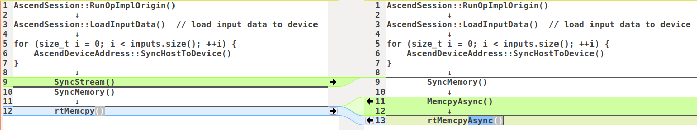

原始：

```cpp
AscendSession::RunOpImplOrigin()
			↓
AscendSession::LoadInputData()  // load input data to device
			↓
for (size_t i = 0; i < inputs.size(); ++i) {
    AscendDeviceAddress::SyncHostToDevice()
}
			↓
		SyncStream()
		SyncMemory()
			↓
		rtMemcpy()
```


修改后：

```cpp
AscendSession::RunOpImplOrigin()
			↓
AscendSession::LoadInputData()  // load input data to device
			↓
for (size_t i = 0; i < inputs.size(); ++i) {
    AscendDeviceAddress::SyncHostToDevice()
}
			↓
		SyncMemory()
			↓
		MemcpyAsync()
			↓
		rtMemcpy()
```


对比图如下：

{: width="1086" height="542"}


LoadInputData里按照input的数量循环调用SyncHostToDevice->CopyHostMemToDeviceAsync->cudaMemcpyAsync进行Host2Device的内存同步操作，但是最后加了SyncStream操作，GPU上底层调用的就是cudaStreamSynchronize，使得相当于调用的是同步内存拷贝，影响性能。

