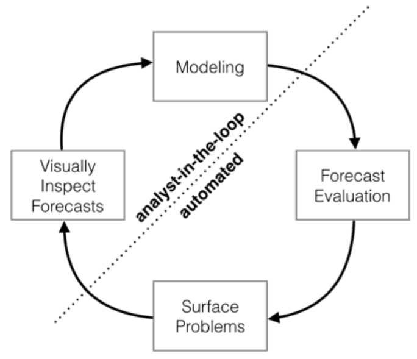
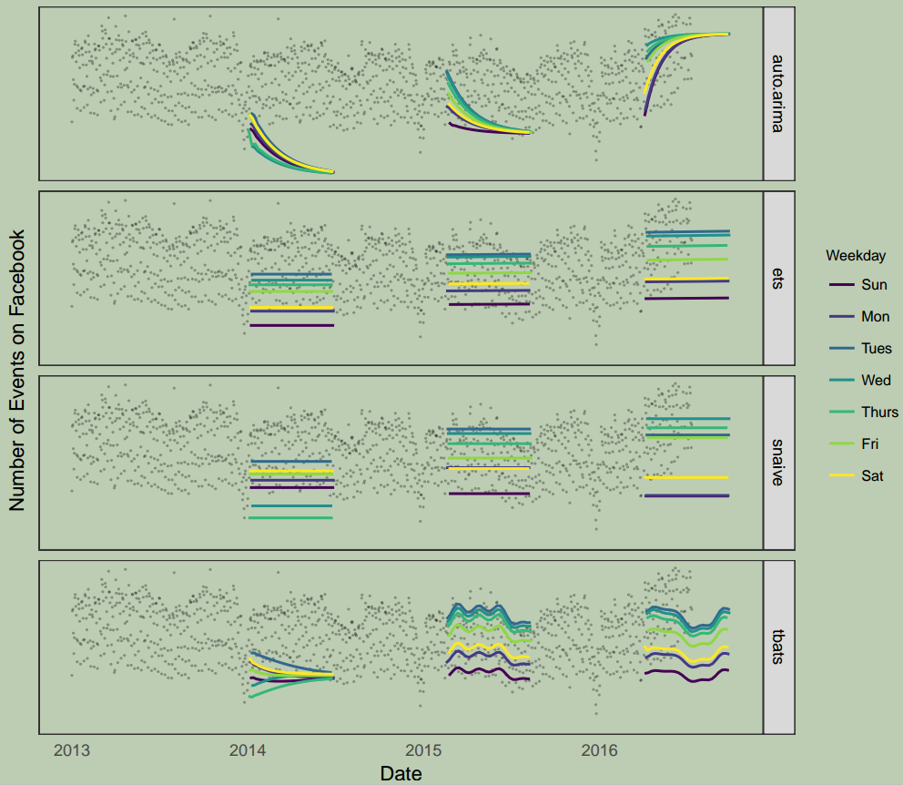

原文链接： [Forecasting at scale](https://peerj.com/preprints/3190/)

# 摘要

预测是一项常见的数据科学任务，可帮助组织进行容量规划、目标设定和异常检测。虽然预测很重要，但是在产生可靠和高质量的预测方面存在着严重的挑战，特别是面对各种时间序列，而在时间序列建模方面具有专业知识的分析师相对较少时。

为了解决这些挑战，我们描述了一种实用的大规模预测方法，它将**可配置模型**与**分析师分析**相结合。我们提出了一个**带可解释参数的模块化回归模型**，分析师可以基于时间序列的领域知识直观地调整这些参数。我们描述了性能分析，以比较和评估预测过程，并自动标记预测，以供手动审查和调整。帮助分析师最有效地利用其专业知识的工具实现了可靠、实用的商用时间序列预测。

# 引言

预测是一项数据科学任务，是组织内许多活动的核心。例如，企业所有部门都必须参与能力规划，以有效分配稀缺资源和制定目标，从而衡量相对于基线的性能。无论是对机器还是对大多数分析师来说，生成高质量的预测都不是一个容易的问题。我们在创建业务预测的实践中观察到两个主要主题。首先，完全自动的预测技术是很难调节的，往往太不灵活，无法吸纳有用的假设或启发。其次，整个组织中负责数据科学任务的分析师通常对其支持的特定产品或服务具有深厚的领域专业知识，但通常没有时间序列预测方面的培训。因此，能够做出高质量预测的分析师非常罕见，因为预测是一项需要大量经验的专业技能。

这样的结果是，对高质量预测的需求往往远远超过了其产生的速度。这一观察是我们在这里进行研究的动机，我们打算在大规模预测方面提供一些有用的指导。

我们讨论的前两种规模是，商业预测方法应适用于：

- 大量进行预测的人，可能没有时间序列方法方面的培训；
- 大量具有潜在特殊特征的预测问题。

在第3节中，我们提出了一个时间序列模型，该模型足够灵活，适用于各种业务时间序列，但可由非专家配置，这些非专家可能对数据生成过程具有领域知识，但对时间序列模型和方法知之甚少。

我们讨论的第三种规模是，在最现实的情况下，大量的预测会被创建，因此需要高效、自动化的方法来评估和比较预测，并检测预测何时可能表现不佳。当进行了成百上千的预测时，让机器进行模型评估和比较的艰苦工作，同时有效地利用人类反馈来解决性能问题就变得非常重要。在第4节中，我们描述了一个预测评估系统，该系统使用模拟的历史预测来估计样本外的效果，并识别有问题的预测，以便分析人员了解错误并进行必要的模型调整。

值得注意的是，我们并没有关注规模的典型考虑：计算和存储。我们发现预测大量时间序列的计算和基础设施问题相对直接，通常，这些拟合过程很容易并行化，预测也不难存储在关系数据库中。我们在实践中观察到的规模带来的实际问题包括预测问题的多样性带来的复杂性，以及在大量预测产生后对其建立置信度。

{: width="1086" height="542"}*图1: `Analyster in the loop`方法的示意图，该方法可最大程度地利用人工和自动化任务。*

我们在图1中总结了大规模商业预测中的`analyst-in-the-loop`方法。我们首先用灵活的规范对时间序列进行建模，该规范对每个参数都有直接的人工解释。然后，我们为该模型和一组跨越各种历史模拟预测日期的合理基线生成预测，并评估预测效果。当预测表现不佳或其他方面需要人工干预时，我们将这些潜在问题按优先顺序标记给人工分析师。然后，分析员可以检查预测并基于该反馈权威地调整模型。

# 商业时间序列的特征

商业预测问题种类繁多，但其中许多都有一些共同的特征。图2示出了`Facebook Events`平台代表性的时间序列。`Facebook`用户可以使用`Events`平台为事件创建页面，邀请他人，并以多种方式与事件互动。图2显示了`Facebook`上创建的事件数量的每日数据。在这个时间序列中有几个明显的季节性影响：周周期和年周期，以及圣诞节和新年前后的明显下降。这些类型的季节性影响是自然产生的，可以在人类活动产生的时间序列中预料到。时间序列也显示了过去六个月内趋势的明显变化，这可能出现在受新产品或市场变化影响的时间序列中。最后，真实数据集通常有离群值，这个时间序列也不例外。

{: width="1086" height="542"}*图3：使用一组自动预测程序对图2的时间序列进行预测。预测是在历史上的三个说明性点进行的，每一个点仅使用到该点为止的时间序列的一部分。每天的预测按星期几分组和着色，以显示每周的季节性。我们在绘制过程中删除了异常值，以便在图中留出更多的垂直空间。*

这一时间序列为用全自动方法进行合理预测中的困难提供了有用的说明。图3显示了使用`Hyndman`等人介绍的`R`语言的`forcast`包中的几个自动方法进行的预测。在历史上的三个时间点进行预测，每个时间点仅使用到该时间点之前的时间序列的一部分来模拟对该日期进行的预测。图中的方法是：

- `atuo.arima`，该方法拟合了一系列`ARIMA`模型，并自动选择最佳模型；
- `ets`，其拟合一组指数平滑模型并选择最佳模型；
- `snaive`，一种随机游走模型，它以每周的季节性进行恒定预测；
- `tbats`，一种具有每周和年度季节性的`TBATS`模型。

图3中的方法通常难以产生与这些时间序列的特征相匹配的预测。自动化的`ARIMA`模型在截止时间附近出现趋势变化时，容易出现较大的趋势误差，并且无法捕捉任何季节性。指数平滑和季节性原始预测捕捉每周季节性，但忽略了长期季节性。所有这些方法都对年终下跌反应过度，因为它们没有充分模拟年度季节性。

当预测不佳时，我们希望能够根据手头的问题调整方法的参数。调整这些方法需要彻底了解底层时间序列模型的工作方式。例如，自动化`ARIMA`模型的第一个输入参数是差分、自回归分量和移动平均分量的最大阶数。典型的分析师不知道如何调整这些阶数以避免图3中的行为，这是难以规模化的专业知识类型。

# `Prophet`预测模型

我们现在描述一个时间序列预测模型，该模型旨在处理图2所示商业时间序列的常见特征。重要的是，它还设计为具有直观的参数，可以在不了解基础模型细节的情况下进行调整。这对于分析员有效地调整模型（如图1所示）是必要的。我们的实现是基于`Python`和`R`的开源软件，称为[`Prophet`](https://facebook.github.io/prophet/)。

我们使用带有三个主要组件的可分解时间序列模型：趋势、季节性和节假日。它们组合在以下等式中：
$$
y(t) = g(t) + s(t) + h(t) + \epsilon_{t}
$$
这里，$g(t)$ 是趋势函数，用于模拟时间序列值的非周期性变化，$s(t)$ 表示周期性变化（例如，每周和每年的季节性），$h(t)$ 代表在一天或几天内可能出现的不规则日程上的假日影响。误差项 $\epsilon_{t}$ 表示模型不适应的任何特殊变化；稍后，我们将假设 $\epsilon_{t}$ 服从正态分布。

本规范类似于广义相加模型`GAM`，这是一类回归模型，具有应用于回归器的潜在非线性平滑器。在这里，我们只使用时间作为回归因子，但可能使用时间的若干线性和非线性函数作为分量。将季节性建模为附加成分与指数平滑采用的方法相同。乘性季节性，其中季节效应是乘以 $g(t)$ 的因子，可以通过对数变换实现。

`GAM`公式具有易于分解，并在必要时(例如，当确定新的季节性来源时)容纳新成分的优点。`GAM`也可以非常快地拟合，要么使用反向拟合，要么使用`L-BFGS`（我们更喜欢后者），因此用户可以交互地更改模型参数。

实际上，我们将预测问题视为曲线拟合问题，这与明确说明数据中时间依赖性结构的时间序列模型有本质区别。虽然我们放弃了使用生成模型（如`ARIMA`）的一些重要推理优势，但该公式提供了许多实际优势：

- 灵活性：我们可以轻松适应多个时期的季节性，让分析师对趋势做出不同的假设.
- 与`ARIMA`模型不同，测量值不需要固定间隔，我们也不需要插值缺失值，例如去除异常值。
- 拟合速度非常快，允许分析师以交互方式探索许多模型规范，例如在`Shiny`应用中。
- 预测模型具有易于解释的参数，分析师可以更改这些参数以对预测进行假设。此外，分析师通常具有回归方面的经验，并且能够轻松地扩展模型以包括新组件。

自动预测有着悠久的历史，有许多方法适合特定类型的时间序列。我们的方法是由我们在`Facebook`上预测的时间序列的性质（分段趋势、多季节性、浮动假日）以及大规模预测所涉及的挑战驱动的。

## 趋势模型

我们已经实现了两个趋势模型，涵盖了许多`Facebook`应用程序：**饱和增长模型**和**分段线性模型**。

### 非线性饱和增长

对于增长预测，数据生成过程的核心部分是数量如何增长以及预期如何继续增长的模型。`Facebook`上的增长建模通常类似于自然生态系统中的增长，其中存在非线性增长，在承载能力下饱和。例如，特定地区`Facebook`用户数量的承载能力可能是可以访问互联网的人数。这种增长通常使用`logistic`增长模型进行建模，其最基本的形式是
$$
g(t) = \frac{C}{1+\text{exp}(-k(t-m))}
$$
其中 $C$ 为承载能力，$k$ 为增长率，$m$ 为偏移参数。

`Facebook`增长的两个重要方面没有在公式(2)中体现。

- 承载能力不是恒定的—随着上网人数的增加，增长上限也随之增加。因此，我们用时变容量 $C(t)$ 代替固定容量 $C$ 。
- 增长率不是恒定的。新产品可以深刻地改变一个地区的增长率，因此模型必须能够结合不同的增长率以适应历史数据。

我们通过明确定义允许增长率变化的变化点，将趋势变化纳入增长模型。假设在时间 $s_{j} , j = 1,...,S$ 有 $S$ 个变化点。我们定义了一个速率调整向量 $\pmb{\delta} \in \mathbb{R}^{S}$ ，其中 $\delta_{j}$ 是在 $s_{j}$ 时刻发生的速率变化。任何时间 $t$ 的速率是基本速率 $k$，加上到该点为止的所有调整：$k+ \sum_{j:t>s_{j}} \delta_{j}$。这通过定义向量 $\pmb{a}(t) \in \{0,1\}^{S}$ 更清晰地表示，$\pmb{a}(t)$ 满足：

​													                            $a_{j}(t) = \begin{cases}
​						 			   1 &\text{if} \ t \ge s_{j} \\
​									   0 &\text{otherwise}
​								               \end{cases}$

时间 $t$ 处的速率为 $k + \pmb{a}(t)^{\top} \pmb{δ}$ 。当调整速率 $k$ 时，还必须调整偏移参数 $m$ 以连接段的端点。转换点 $j$ 处的正确调整很容易计算：

​                                                                          $\gamma_{j} = \Big(s_{j} -m - \sum_{l < j} \gamma_{l} \Big) \Big(1 - \frac{k + \sum_{l<j} \delta_{l}}{k+\sum_{l \le j} \delta_{l}} \Big)$

分段`logistic`增长模型为：
$$
g(t) = \frac
		{C(t)}
		{
		  1 + \text{exp}(
				-(k+ \pmb{a}(t)^{\top} \pmb{\delta})
				(t-(m+\pmb{a}(t)^{\top} \pmb{\gamma}))
			)
		}
$$
我们模型中的一组重要参数是 $C(t)$，即系统在任何时间点的预期容量。分析师通常能够洞察市场规模，并据此设定这些规模。也可能有外部数据来源可以提供承载能力，例如世界银行的人口预测。

本文提出的`logistic`增长模型是广义`logistic`增长曲线的一个特例，它只是一种单一类型的S形曲线。将此趋势模型扩展到其他曲线族是很简单的。

### 带变化点的线性趋势

对于不呈现饱和增长的预测问题，分段恒定增长率提供了一个简约且通常有用的模型。这里的趋势模型是
$$
g(t) = (k + \pmb{a}(t)^{\top} \pmb{δ})t + (m + \pmb{a}(t)^{\top} \pmb{\gamma})
$$
如前所述，$k$ 是增长率，$\pmb{\delta}$ 是速率调整，$m$ 是偏移参数，$\gamma_{j}$ 设置为 $-s_{j} \delta_{j}$ 以使函数连续。

### 变更点自动选择

变更点 $s_{j}$ 可以由分析员使用已知的产品发布日期和其他改变增长的事件来指定，或可以在给定一组候选者的情况下自动选择。**通过在 $\pmb{\delta}$ 上放置稀疏先验，可以非常自然地使用公式(3)和(4)进行自动选择**。

我们通常指定大量的变更点（例如，几年里每月一个变更点），并使用先验 $\delta_{j} \sim \text{Laplace}(0, \tau)$ 。参数 $\tau$ 通过改变其速率直接控制模型的灵活性。重要的是，调整向量 $\pmb{\delta}$ 上的稀疏先验对主要增长率 $k$ 没有影响，因此，当 $\tau$ 变为 $0$ 时，拟合退化为标准（非分段）`logistic`或线性增长。

### 趋势预测不确定性

## 季节性

## 节假日和事件

## 模型拟合

## `Analyst-in-the-Loop`建模

# 预测的自动评估

# 结论

大规模预测的一个关键主题是，具有各种背景的分析师必须做出比手动预测更多的预测。我们预测系统的第一个组成部分是我们在`Facebook`多次迭代预测各种数据后开发的新模型。我们使用一个简单的模块化回归模型，该模型自带的默认参数就可以表现不错，并允许分析师选择与其预测问题相关的组件，并根据需要轻松进行调整。第二个部分是一个测量和跟踪预测准确性的系统，并标记应手动检查的预测，以帮助分析师进行增量改进。这是一个关键组件，它允许分析师识别何时需要对模型进行调整，或者何时可以使用完全不同的模型。简单、可调整的模型和可扩展的效果监控相结合，允许大量分析师预测大量和多种时间序列，这就是我们说的大规模预测。
