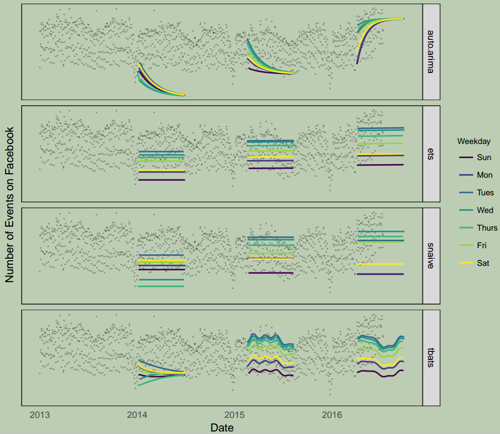

原文链接： [Forecasting at scale](https://peerj.com/preprints/3190/)


# 摘要

预测是一项常见的数据科学任务，可帮助组织进行容量规划、目标设定和异常检测。虽然预测很重要，但是在产生可靠和高质量的预测方面存在着严重的挑战，特别是面对各种时间序列，具有时间序列建模方面专业知识的分析师相对较少时。

为了解决这些挑战，我们描述了一种实用的大规模预测方法，它将**可配置模型**与**分析师分析**相结合。我们提出了一个**带可解释参数的模块化回归模型**，分析师可以基于时间序列的领域知识直观地调整这些参数。我们描述了性能分析，以比较和评估预测过程，并自动标记预测，以供手动审查和调整。帮助分析师最有效地利用其专业知识的工具实现了可靠、实用的商用时间序列预测。


# 引言

预测是一项数据科学任务，是组织内许多活动的核心。例如，企业所有部门都必须参与能力规划，以有效分配稀缺资源和制定目标，从而衡量相对于基线的性能。无论是对机器还是对大多数分析师来说，生成高质量的预测都不是一个容易的问题。我们在创建业务预测的实践中观察到两个主要主题。首先，完全自动的预测技术是很难调节的，往往太不灵活，无法吸纳有用的假设或启发。其次，整个组织中负责数据科学任务的分析师通常对其支持的特定产品或服务具有深厚的领域专业知识，但通常没有时间序列预测方面的培训。因此，能够做出高质量预测的分析师非常罕见，因为预测是一项需要大量经验的专业技能。

这样的结果是，对高质量预测的需求往往远远超过了其产生的速度。这一观察是我们在这里进行研究的动机，我们打算在大规模预测方面提供一些有用的指导。

我们讨论的前两种规模是，商业预测方法应适用于：

- 大量进行预测的人，可能没有时间序列方法方面的培训；
- 大量具有潜在特殊特征的预测问题。

在第3节中，我们提出了一个时间序列模型，该模型足够灵活，适用于各种业务时间序列，但可由非专家配置，这些非专家可能对数据生成过程具有领域知识，但对时间序列模型和方法知之甚少。

我们讨论的第三种规模是，在最现实的情况下，大量的预测会被创建，因此需要高效、自动化的方法来评估和比较预测，并检测预测何时可能表现不佳。当进行了成百上千的预测时，让机器进行模型评估和比较的艰苦工作，同时有效地利用人类反馈来解决性能问题就变得非常重要。在第4节中，我们描述了一个预测评估系统，该系统使用模拟的历史预测来估计样本外的效果，并识别有问题的预测，以便分析人员了解错误并进行必要的模型调整。

值得注意的是，我们并没有关注规模的典型考虑：计算和存储。我们发现预测大量时间序列的计算和基础设施问题相对直接，通常，这些拟合过程很容易并行化，预测也不难存储在关系数据库中。我们在实践中观察到的规模带来的实际问题包括预测问题的多样性带来的复杂性，以及在大量预测产生后对其建立置信度。

{: width="1086" height="542"}*图1: `Analyster in the loop`方法的示意图，该方法可最大程度地利用人工和自动化任务。*


我们在图1中总结了大规模商业预测中的`analyst-in-the-loop`方法。我们首先用灵活的规范对时间序列进行建模，该规范对每个参数都有直接的人工解释。然后，我们为该模型和一组跨越各种历史模拟预测日期的合理基线生成预测，并评估预测效果。当预测表现不佳或其他方面需要人工干预时，我们将这些潜在问题按优先顺序标记给人工分析师。然后，分析员可以检查预测并基于该反馈权威地调整模型。


# 商业时间序列的特征

商业预测问题种类繁多，但其中许多都有一些共同的特征。图2示出了`Facebook Events`平台代表性的时间序列。`Facebook`用户可以使用`Events`平台为事件创建页面，邀请他人，并以多种方式与事件互动。图2显示了`Facebook`上创建的事件数量的每日数据。在这个时间序列中有几个明显的季节性影响：周周期和年周期，以及圣诞节和新年前后的明显下降。这些类型的季节性影响是自然产生的，可以在人类活动产生的时间序列中预料到。时间序列也显示了过去六个月内趋势的明显变化，这可能出现在受新产品或市场变化影响的时间序列中。最后，真实数据集通常有离群值，这个时间序列也不例外。

## 四大成分

- `Trend`

  较长一段时间内呈现出来的持续向上或持续向下的变动。

- `Seasonality`

  周期性/季节性。通常以日、周、年为单位的周期性变化。

- `Regressor`

  外部变量。已知的、引起短期波动的因素，如节假日、促销等。

- `Noise`

  残差。由未知因素产生的波动。如果产生因素知道了，就变成了外部变量。

{: width="1086" height="542"}*图3：使用一组自动预测程序对图2的时间序列进行预测。预测是在历史上的三个说明性点进行的，每一个点仅使用到该点为止的时间序列的一部分。每天的预测按星期几分组和着色，以显示每周的季节性。我们在绘制过程中删除了异常值，以便在图中留出更多的垂直空间。*


这一时间序列为用全自动方法进行合理预测中的困难提供了有用的说明。图3显示了使用`Hyndman`等人介绍的`R`语言的`forcast`包中的几个自动方法进行的预测。在历史上的三个时间点进行预测，每个时间点仅使用到该时间点之前的时间序列的一部分来模拟对该日期进行的预测。图中的方法是：

- `atuo.arima`，该方法拟合了一系列`ARIMA`模型，并自动选择最佳模型；
- `ets`，其拟合一组指数平滑模型并选择最佳模型；
- `snaive`，一种随机游走模型，它以每周的季节性进行恒定预测；
- `tbats`，一种具有每周和年度季节性的`TBATS`模型。

图3中的方法通常难以产生与这些时间序列的特征相匹配的预测。自动化的`ARIMA`模型在截止时间附近出现趋势变化时，容易出现较大的趋势误差，并且无法捕捉任何季节性。指数平滑和季节性原始预测捕捉每周季节性，但忽略了长期季节性。所有这些方法都对年终下跌反应过度，因为它们没有充分模拟年度季节性。

当预测不佳时，我们希望能够根据手头的问题调整方法的参数。调整这些方法需要彻底了解底层时间序列模型的工作方式。例如，自动化`ARIMA`模型的第一个输入参数是差分、自回归分量和移动平均分量的最大阶数。典型的分析师不知道如何调整这些阶数以避免图3中的行为，这是难以规模化的专业知识类型。


# `Prophet`预测模型

我们现在描述一个时间序列预测模型，该模型旨在处理图2所示商业时间序列的常见特征。重要的是，它还设计为具有直观的参数，可以在不了解基础模型细节的情况下进行调整。这对于分析员有效地调整模型（如图1所示）是必要的。我们的实现是基于`Python`和`R`的开源软件，称为[`Prophet`](https://facebook.github.io/prophet/)。

我们使用带有三个主要组件的可分解时间序列模型：趋势、季节性和节假日。它们组合在以下等式中：
$$
y(t) = g(t) + s(t) + h(t) + \epsilon_{t}
$$
这里，$g(t)$ 是趋势函数，用于模拟时间序列值的非周期性变化，$s(t)$ 表示周期性变化（例如，每周和每年的季节性），$h(t)$ 代表在一天或几天内可能出现的不规则日程上的假日影响。误差项 $\epsilon_{t}$ 表示模型不适应的任何特殊变化；稍后，我们将假设 $\epsilon_{t}$ 服从正态分布。

本规范类似于广义相加模型`GAM`，这是一类回归模型，具有应用于回归器的潜在非线性平滑器。在这里，我们只使用时间作为回归因子，但可能使用时间的若干线性和非线性函数作为分量。将季节性建模为附加成分与指数平滑采用的方法相同。乘性季节性，其中季节效应是乘以 $g(t)$ 的因子，可以通过对数变换实现。

`GAM`公式具有易于分解，并在必要时(例如，当确定新的季节性来源时)容纳新成分的优点。`GAM`也可以非常快地拟合，要么使用反向拟合，要么使用`L-BFGS`（我们更喜欢后者），因此用户可以交互地更改模型参数。

实际上，我们将预测问题视为曲线拟合问题，这与明确说明数据中时间依赖性结构的时间序列模型有本质区别。虽然我们放弃了使用生成模型（如`ARIMA`）的一些重要推理优势，但该公式提供了许多实际**优势**：

- 灵活性：我们可以轻松适应多个时期的季节性，让分析师对趋势做出不同的假设.
- 与`ARIMA`模型不同，测量值不需要固定间隔，我们也不需要插值缺失值，例如去除异常值。
- 拟合速度非常快，允许分析师以交互方式探索许多模型规范，例如在`Shiny`应用中。
- 预测模型具有易于解释的参数，分析师可以更改这些参数以对预测进行假设。此外，分析师通常具有回归方面的经验，并且能够轻松地扩展模型以包括新组件。

自动预测有着悠久的历史，有许多方法适合特定类型的时间序列。我们的方法是由我们在`Facebook`上预测的时间序列的性质（分段趋势、多季节性、浮动假日）以及大规模预测所涉及的挑战驱动的。


## 趋势模型

我们已经实现了两个趋势模型，涵盖了许多`Facebook`应用程序：**饱和增长模型**和**分段线性模型**。

### 非线性饱和增长

对于增长预测，数据生成过程的核心部分是数量如何增长以及预期如何继续增长的模型。`Facebook`上的增长建模通常类似于自然生态系统中的增长，其中存在非线性增长，在承载能力下饱和。例如，特定地区`Facebook`用户数量的承载能力可能是可以访问互联网的人数。这种增长通常使用`logistic`增长模型进行建模，其最基本的形式是
$$
g(t) = \frac{C}{1+\text{exp}(-k(t-m))}
$$
其中 $C$ 为承载能力，$k$ 为增长率，$m$ 为偏移参数。

`Facebook`增长的两个重要方面没有在公式(2)中体现。

- 承载能力不是恒定的—随着上网人数的增加，增长上限也随之增加。因此，我们用时变容量 $C(t)$ 代替固定容量 $C$ 。
- 增长率不是恒定的。新产品可以深刻地改变一个地区的增长率，因此模型必须能够结合不同的增长率以适应历史数据。


我们通过明确定义允许增长率变化的变化点，将趋势变化纳入增长模型。假设在时间 $s_{j} , j = 1,...,S$ 有 $S$ 个变化点。我们定义了一个速率调整向量 $\pmb{\delta} \in \mathbb{R}^{S}$ ，其中 $\delta_{j}$ 是在 $s_{j}$ 时刻发生的速率变化。任何时间 $t$ 的速率是基本速率 $k$，加上到该点为止的所有调整：$k+ \sum_{j:t>s_{j}} \delta_{j}$。这通过定义向量 $\pmb{a}(t) \in \{0,1\}^{S}$ 更清晰地表示，$\pmb{a}(t)$ 满足：

​													                            $a_{j}(t) = \begin{cases}
​						 			   1 &\text{if} \ t \ge s_{j} \\
​									   0 &\text{otherwise}
​								               \end{cases}$


时间 $t$ 处的速率为 $k + \pmb{a}(t)^{\top} \pmb{δ}$ 。当调整速率 $k$ 时，还必须调整偏移参数 $m$ 以连接段的端点。转换点 $j$ 处的正确调整很容易计算：

​                                                                          $\gamma_{j} = \Big(s_{j} -m - \sum_{l < j} \gamma_{l} \Big) \Big(1 - \frac{k + \sum_{l<j} \delta_{l}}{k+\sum_{l \le j} \delta_{l}} \Big)$

分段`logistic`增长模型为：
$$
g(t) = \frac
		{C(t)}
		{
		  1 + \text{exp}(
				-(k+ \pmb{a}(t)^{\top} \pmb{\delta})
				(t-(m+\pmb{a}(t)^{\top} \pmb{\gamma}))
			)
		}
$$
我们模型中的一组重要参数是 $C(t)$，即系统在任何时间点的预期容量。分析师通常能够洞察市场规模，并据此设定这些规模。也可能有外部数据来源可以提供承载能力，例如世界银行的人口预测。

本文提出的`logistic`增长模型是广义`logistic`增长曲线的一个特例，它只是一种单一类型的S形曲线。将此趋势模型扩展到其他曲线族是很简单的。


### 带变化点的线性趋势

对于不呈现饱和增长的预测问题，分段恒定增长率提供了一个简约且通常有用的模型。这里的趋势模型是
$$
g(t) = (k + \pmb{a}(t)^{\top} \pmb{δ})t + (m + \pmb{a}(t)^{\top} \pmb{\gamma})
$$
如前所述，$k$ 是增长率，$\pmb{\delta}$ 是速率调整，$m$ 是偏移参数，$\gamma_{j}$ 设置为 $-s_{j} \delta_{j}$ 以使函数连续。


### 变更点自动选择

变更点 $s_{j}$ 可以由分析员使用已知的产品发布日期和其他改变增长的事件来指定，或可以在给定一组候选者的情况下自动选择。**通过在 $\pmb{\delta}$ 上放置稀疏先验，可以非常自然地使用公式(3)和(4)进行自动选择**。

我们通常指定大量的变更点（例如，几年里每月一个变更点），并使用先验 $\delta_{j} \sim \text{Laplace}(0, \tau)$ 。参数 $\tau$ 通过改变其速率直接控制模型的灵活性。重要的是，调整向量 $\pmb{\delta}$ 上的稀疏先验对主要增长率 $k$ 没有影响，因此，当 $\tau$ 变为 $0$ 时，拟合退化为标准（非分段）`logistic`或线性增长。


### 趋势预测不确定性

当模型通过历史外推进行预测时，趋势将具有恒定速率。我们通过向前扩展生成模型来估计预测趋势中的不确定性。趋势的生成模型是在 $T$ 个点的历史上有 $S$ 个变化点，每个变化点都有一个变化率$\delta_{j} \sim \text{Laplace}(0, \tau)$。我们通过用从数据中推断的方差来替换 $\tau$， 来模拟未来的速率变化。在完全贝叶斯框架中，这可以通过 $\tau$ 上的分层先验来获得其后验，否则我们可以使用速率参数的最大似然估计: $\lambda = \frac{1}{S} \sum_{j=1}^{S} \vert \delta_{j} \vert$。对未来的变化点进行随机采样，以使变化点的平均频率与历史中的频率相匹配：

​	                                                                       $\forall j>T, \quad \begin{cases}
​				 			   \delta_{j}=0 &\text{w.p.} \ \frac{T-S}{T} \\
​							   \delta_{j} \sim \text{Laplace}(0, \lambda) &\text{w.p.} \ \frac{S}{T}
​						               \end{cases}$


因此，我们通过假设未来速率变化的平均频率和幅度与历史上相同，来衡量预测趋势的不确定性。从数据中推断出 $\lambda$ 后，我们使用该生成模型模拟未来可能的趋势，并使用模拟的趋势计算不确定性区间。

趋势将继续以与历史上相同的频率和幅度变化，这一假设相当强烈，因此我们不期望不确定性区间具有精确的覆盖范围。但是，它们是不确定性水平的有用指标，尤其是过度拟合的指标。随着 $\tau$ 的增加，模型在拟合历史方面具有更大的灵活性，因此训练误差将下降。然而，当向前预测时，这种灵活性将产生较大的不确定性区间。


## 季节性

商业时间序列通常具有多周期的季节性，这是它们所代表的人类行为的结果。例如，每周5天的工作制会对每周重复的时间序列产生影响，而假期安排和学校休息会产生每年重复的影响。为了拟合和预测这些影响，我们必须指定季节性模型，即 $t$ 的周期函数。

我们依赖傅立叶级数来提供周期效应的灵活模型。假设 $P$ 是我们期望时间序列具有的规则周期（例如，当我们以天为单位缩放时间变量时，年数据的 $P=365.25$，周数据的 $P=7$）。我们可以用以下公式近似任意平滑季节效应：

​	                                                                          $s(t) = \sum_{n=1}^{N} \Big(a_{n} \text{cos} \Big(\frac{2\pi nt}{P} \Big) + b_{n} \text{sin} \Big(\frac{2\pi nt}{P} \Big) \Big)$

这是一个标准的傅里叶级数。拟合季节性需要估计 $2N$ 个参数 $\pmb{\beta} = [a_{1},b_{1},...,a_{N},b_{N}]^{\top}$。这是通过为历史和未来数据中的每个 $t$ 值构建一个季节性向量矩阵来实现的，例如，考虑年季节性和$N=10$，
$$
X(t) = \Bigg[ \text{cos} \Bigg( \frac{2\pi (1) t}{365.25} \Bigg),..., \text{sin} \Bigg( \frac{2\pi (10) t}{365.25} \Bigg) \Bigg]
$$
季节性分量就是：
$$
s(t) = X(t) \pmb{\beta}
$$
在我们的生成模型中，我们采用 $\beta \sim \text{Normal} (0, \sigma^{2})$ 对季节性施加平滑先验。

截断 $N$ 处的序列等价于将低通滤波器应用于季节性，因此增加 $N$ 将允许拟合变化更快的季节性模式，尽管也会增加过度拟合的风险。对于年度和每周这两种季节性，我们发现 $N=10$ 和 $N=3$ 适用于大多数问题。这些参数的选择可使用模型选择程序(如`AIC`)自动进行。


## 节假日和事件

节假日和事件为许多商业时间序列提供了巨大的、在某种程度上可预测的冲击，并且通常不遵循周期性模式，因此它们的影响不能很好地由平稳周期进行建模。例如，美国的感恩节是在11月的第四个星期四。超级碗是美国最大的电视赛事之一，在1月或2月的一个周日举行，很难以编程方式进行宣布。世界上许多国家都有农历节日。特定假日对时间序列的影响通常每年都相似，因此将其纳入预测很重要。

| Holiday      | Country | Year | Date        |
| ------------ | ------- | ---- | ----------- |
| Thanksgiving | US      | 2015 | 26 Nov 2015 |
| Thanksgiving | US      | 2016 | 24 Nov 2016 |
| Thanksgiving | US      | 2017 | 23 Nov 2017 |
| Thanksgiving | US      | 2018 | 22 Nov 2018 |
| Christmas    | *       | 2015 | 25 Dec 2015 |
| Christmas    | *       | 2016 | 25 Dec 2016 |
| Christmas    | *       | 2017 | 25 Dec 2017 |
| Christmas    | *       | 2018 | 25 Dec 2018 |

​											表1：假日列表示例。指定国家/地区是因为不同国家/地区的假日可能在不同的日期。  


我们允许分析员提供过去和未来事件的自定义列表，由事件或假日的唯一名称标识，如表1所示。我们增加了“国家”列，以便除了全球假日之外，还保留特定于国家的假日列表。对于给定的预测问题，我们使用全球假日和特定国家的假日的联合。

通过假设假期的影响是独立的，将假期列表纳入模型变得简单。对于每个假日 $i$，$D_{i}$ 表示该假日过去和未来的日期集。我们添加了一个表示时间 $t$ 是否在假日 $i$ 期间的指标函数，并为每个假日分配一个参数 $\kappa_{i}$，该参数是预测中的相应变化。这与季节性相似，通过生成回归矩阵来实现

​																					$Z(t) = [\pmb{1}(t \in D_{1}),...,\pmb{1}(t \in D_{L})]$
$$
h(t) = Z(t)\pmb{\kappa}
$$
与季节性一样，我们使用先验 $\pmb{\kappa} \sim \text{Normal} (0, \nu^{2})$。

将某个特定假日（如感恩节的周末）周围的一段时间的效果考虑进来通常是重要的。为了说明这一点，我们为假日周围的天数添加了额外的参数，基本上将假日周围窗口中的每一天都视为假日本身。


## 模型拟合

当将每个观测的季节性和假日特征组合成矩阵 $X$，变化点指标 $a(t)$组成矩阵 $A$ 中的时，可以用几行`Stan`代码表示公式(1)中的整个模型，如下面伪代码所示。对于模型拟合，我们使用`Stan`的`L-BFGS`来找到最大后验估计，还可以进行全后验推理，以将模型参数不确定性包括在预测不确定性中。

```c++
model {
    // Priors
    k ∼ normal(0, 5);
    m ∼ normal(0, 5);
    epsilon ∼ normal(0, 0.5);
    delta ∼ double_exponential(0, tau);
    beta ∼ normal(0, sigma);
    
	// Logistic likelihood
	y ∼ normal(C ./ (1 + exp(-(k + A * delta) .* (t - (m + A * gamma)))) +
	X * beta, epsilon);
	
    // Linear likelihood
	y ∼ normal((k + A * delta) .* t + (m + A * gamma) + X * beta, sigma);
}
```


图4显示了图3中`Facebook`事件时间序列的`Prophet`模型预测。这些预测是在与图3相同的三个日期进行的，与之前一样，仅使用截至该日期的数据进行预测。`Prophet`能够预测每周和每年的季节性变化，与图3中的基线不同，它不会对第一年的假日下降做出过度反应。在第一次预测中，`Prophet`稍微过拟合了仅一年数据的年度季节性。在第三次预测中，模型尚未了解到趋势已发生变化。图5显示，结合最近三个月数据的预测显示出趋势变化(虚线)。

可分解模型的一个重要好处是，它允许我们单独查看预测的每个组成部分。图6显示了图4中最后一次预测相对应的趋势、每周季节性和年度季节性分量。这为分析人员提供了一个有用的工具，以了解他们的预测问题，而不仅仅是生成预测。

伪代码中的参数`tau`和`sigma`分别控制模型变化点和季节性的正则化量。正则化对于这两种方法都很重要，以避免过度拟合，但可能没有足够的历史数据通过交叉验证来选择最佳正则化参数。我们设置了适用于大多数预测问题的默认值，当需要优化这些参数时，分析人员会在循环中进行优化。


## `Analyst-in-the-Loop`建模

进行预测的分析师通常对其预测的数量有广泛的领域知识，但统计知识有限。在`Prophet`模型中，分析师可以在几个地方修改模型，以应用其专业知识和外部知识，而无需了解基础统计数据。

- **容量**：分析师可能有关于总市场规模的外部数据，可以直接应用这些知识来设定容量。

- **变更点**：可以直接指定变更点的已知日期，如产品变更日期。

- **假日和季节性**：我们合作的分析师对哪些假日影响哪些地区的增长有经验，他们可直接输入相关假日日期和适用的季节性时间尺度。

- **平滑参数**：通过调整 $\tau$，分析师可以从一系列更全局或局部平滑的模型中进行选择。季节性和假日平滑参数 $(\sigma, \nu)$ 允许分析师告诉模型未来预计会有多少历史季节性变化。

使用良好的可视化工具，分析师可以使用这些参数来改进模型拟合。当在历史数据上绘制模型拟合时，如果转换点自动选择遗漏了转换点，则很快就会发现。可以调节 $\tau$ 参数来增加或减少趋势的灵活性，调节 $\sigma$ 可以增加或减小季节性分量的强度。可视化为卓有成效的人工干预提供了许多其他机会：线性趋势或`logistic`增长、确定季节性的时间尺度以及确定应从拟合中删除的外围时间段。所有这些干预都可以在没有统计专业知识的情况下进行，并且是分析师应用其见解或领域知识的重要方式。

关于预测的文献通常区分统计预测（基于适合历史数据的模型）和判断预测（也称为管理预测，人类专家使用他们所学的任何过程生成的预测往往适用于特定的时间序列）。这些方法都有各自的优势。统计预测需要较少的领域知识和预测人员投入，并且可以很容易地扩展到许多预测。判断性预测可以包含更多的信息，并对不断变化的条件做出更大的反应，但可能需要分析师进行更多的投入。

我们的`analyst-in-the-loop`建模方法是一种替代方法，它试图通过在必要时将分析员的工作集中在改进模型上来融合统计预测和判断预测的优势，而不是通过一些未说明的过程来直接生成预测。我们发现，我们的方法与`Wickham&Grolemund`提出的`transform-visualize-model`循环非常相似，在该循环中，人类领域知识体现在经过一些迭代后改进的模型中。

预测的典型缩放将依赖于全自动程序，但在许多应用中，判断预测被证明是高度准确的。我们提出的方法允许分析师通过一小组直观的模型参数和选项对预测进行判断，同时保留在必要时依靠全自动统计预测的能力。截至本文撰写之时，我们仅有可能提高准确性的传闻的经验证据，但我们期待着未来的研究，以评估分析师在模型辅助环境下的改进。

大规模的`analyst-in-the-loop`能力在很大程度上取决于预测质量的自动评估和良好的可视化工具。现在，我们将描述如何自动进行预测评估，以识别分析师输入的最相关预测。


# 预测的自动评估

本节中，我们通过比较各种方法和识别可能需要人工干预的预测，概述了自动预测性能评估的程序。本节与所使用的预测方法无关，包含了我们在各种应用程序中发布生产业务预测时确定的一些最佳实践。

## 预测基线的使用(用尽可能简单的方法设置预估基线)

在评估任何预测程序时，与一组基线方法进行比较非常重要。我们倾向于使用简单化的预测，对基础过程做出强有力的假设，但在实践中可以产生合理的预测。我们发现比较简单模型（最后值和样本平均值）以及第2节中描述的自动预测程序非常有用


## 模型预测精度(确定用于评价模型精度的指标)

预测是在一定的范围内进行的，我们称之为 $H$。预测范围是我们预测的未来的天数—在我们的应用程序中，这通常是30、90、180或365天。因此，对于任何具有每日观测的预测，我们最多会生成 $H$ 个未来状态的估计，每个状态都有相关的误差。我们需要声明一个预测目标，以比较方法并跟踪效果。此外，了解我们的预测过程有多容易出错，可以让预测的消费者以确定是否完全信任它。

设 $\hat{y}(t|T)$ 表示使用截止至时间 $T$ 的历史信息对时间 $t$ 进行的预测，$d(y,y^{'})$ 是距离度量，如对于平均绝对误差，$d(y,y^{'}) = \vert y - y^{'} \vert$。距离函数的选择应针对具体问题。`De Gooijer&Hyndman`回顾了几种此类误差度量—在实践中，我们由于其可解释性更倾向于平均绝对百分比误差(`MAPE`)。我们将时间 $T$ 之前的 $h \in (0, H]$ 时段预测的经验精度定义为：

​																			$ \phi (T,h) = d(\hat{y}(T+h|T), y(T+h))$

为了形成该精度的估计及其随 $h$ 的变化，通常为误差项指定参数模型，并根据数据估计其参数。例如，如果我们使用`AR(1)`模型，$y(t) = \alpha +\beta y(t− 1) + \nu(t)$，我们假设 $\nu(t) \sim \text{Normal}(0, \sigma_{\nu}^{2})$，并关注从数据中估计方差项 $\sigma_{\nu}^{2}$。然后，我们可以通过模拟使用任何距离函数或通过使用误差之和的期望的解析表达式来形成期望。不幸的是，这些方法仅在为过程指定正确模型的条件下给出正确的误差估计—这一条件在实践中不太可能成立。

我们倾向于采用非参数方法来估计适用于所有模型的预期误差。该方法类似于应用交叉验证来估计对独立同分布数据进行预测的模型的样本外误差。在给定一组历史预测的情况下，我们拟合了我们在不同预测范围 $h$ 下的预期误差模型：
$$
\xi(h)=\mathbf{E}[\phi(T,h)]
$$
该模型应该是灵活的，但可以加一些简单的假设。

- 函数在 $h$ 中应该是局部平滑的，因为我们期望连续几天所犯的任何错误都相对相似。

- 我们可以假设函数在 $h$ 中应缓慢增加，尽管并非所有预测模型都是如此。

在实践中，我们使用局部回归或保序回归作为误差曲线的灵活非参数模型。为了生成历史预测误差以拟合该模型，我们使用了一个称为模拟历史预测的过程


## 仿真的历史预测(模拟模型在历史数据中的表现)

我们希望拟合公式(8)中的预期误差模型，以进行模型选择和评估。不幸的是，很难使用交叉验证这样的方法，因为观察值不可交换—我们不能简单地随机划分数据。

我们使用模拟历史预测`SHFs`，在历史的不同截止时间点生成 $K$ 个预测，预测的时间点是在历史数据内，因此可以评估总误差。该思路来源于经典的“滚动原点”`rolling origin`预测评估法，但仅使用一小截日期序列(一部分历史数据)，而不是对每个历史日期都做预测。使用较少模拟日期的主要优点(`rolling origin`法每个日期都会产生一个预测)是因为它可节省计算时间，同时给出的精度相关性较低。

如果我们在过去的这些时间点使用这种预测方法，SHF会模拟我们在预测时会犯的错误。如图3和图4中SHF的示例。这种方法的优点是简单，易于向分析师和决策者解释，并且对于生成对预测误差的洞察力而言也相对没有争议。使用SHF方法评估和比较不同的预测模型时，要注意两个主要问题。

首先，我们做出的模拟预测越多，他们的误差估计就越相关。这里考虑一种极端情况，即每天都做模拟预测，鉴于每天增加的信息量，预测不太可能发生太大变化，而且从一天到第二天的误差几乎相同。另一方面，如果我们进行的模拟预测很少，那么对历史预测误差的观察就更少了，根据我们的模型选择作为一种启发式方法，对于预测范围H，我们通常每 $H/2$ 个周期进行一次模拟预测。尽管误差测相关性不会对我们对模型准确性的估计带来偏差，但这样做也没什么益处，并且还需浪费时间来计算。
**译者注：作者根据时间序列的历史数据构造了一个移动时间窗，这个移动时间窗包含两部分内容，前部分是train集，后部分是test集，train集用于训练模型，test集用于测试模型，那么这个时间窗的移动步长也是一个参数（cutoff的间隔），所以这段内容作者在讲述如何设置这个时间窗的移动步长，如果移动步长太小，假设极端情况下，每一个时间点，移动一次，那么这两次做出来的样本外误差是高度相关的，作者认为尽管相关性不会造成预测精度的估计偏差，但是会浪费计算时间，因此，作者建议时间窗的移动步长要大一点，但是过大了，会导致时间窗的个数减少，可用于分析的样本外误差数据就少了，因此，这里他们建议时间窗的移动步长应该是样本外预测长度的一半，假设未来做100天的预测，那么时间窗的移动步长应该设置为50**

其次，有了更多的数据，预测方法就可以做得更好或更差。当模型设定不正确或过拟合时，历史样本越多，误差越大，例如使用样本均值来预测含有趋势增长的时间序列。图7显示了我们对函数 $\xi(h)$ 的估计，即用局部回归法，给出的图3和图4中的时间序列，在整个预测期间的预期平均绝对百分比误差(mape)； 误差估计是使用9个模拟的预测日期进行的，从第一年开始每季度做一次。prophet在所有预测范围内的预测误差都较低。prophet模型参数用的是默认值，调参可能会进一步提高预测精度。

在可视化预测时，我们更喜欢使用点而不是直线来表示历史数据，因为这些数据代表了非插值的预测误差。然后，我们用线把每个预测误差连接起来。 对于SHF，可视化可以帮助找出哪些模型在哪些长度的预测误差比较大，既可以是时间序列（如图3所示），也可以在SHF上汇总（如图7所示）。

## 识别大的预测误差(从误差分析模型的优化点)

当有太多预测需要分析师手动检查时，能够自动识别可能有问题的预测非常重要。自动识别错误预测使分析师能够最有效地利用有限的时间，并利用其专业知识纠正任何问题。有几种方法可用于识别预测中可能存在的问题。

- 当预测相对于基线有较大误差时，模型可能被错误指定。分析师可以根据需要调整趋势模型或季节性。
- 所有方法在某一特定日期都有大误差，表明存在异常值。分析师可以识别异常值并将其删除。
- 当一种方法的`SHF`误差从一个截止值到下一个截止点急剧增加时，可能表明数据生成过程发生了变化。单独添加变更点或建模不同阶段可以解决该问题。

有些病态的预测问题不易纠正，但我们遇到的大多数问题都可以通过指定变更点和删除异常值来纠正。一旦预测值被标记，就可以用于审查和可视化，那么这些问题很容易识别和纠正。


# 结论

大规模预测的一个主要问题是，不同知识背景的分析师要预测的场景可能远远超过其手动可以做的范围。

我们预测系统的第一个组成部分是我们在`Facebook`多次迭代预测各种数据后开发的新模型。我们使用一个简单的模块化回归模型，该模型自带的默认参数就可以表现很好，并允许分析师选择与其预测问题相关的组件，并根据需要轻松进行调整。

第二个部分是一个测量和跟踪预测准确性的系统，并标记应手动检查的预测，以帮助分析师进行增量改进。这是一个关键组件，它允许分析师识别何时需要对模型进行调整，或者何时可以使用完全不同的模型。简单、可调整的模型和可扩展的效果监控相结合，允许大量分析师预测大量和多种时间序列，这就是我们说的大规模预测。


# 参考

[fbprophet论文翻译：Forecasting at Scale](https://www.it610.com/article/1398871064817225728.htm)
