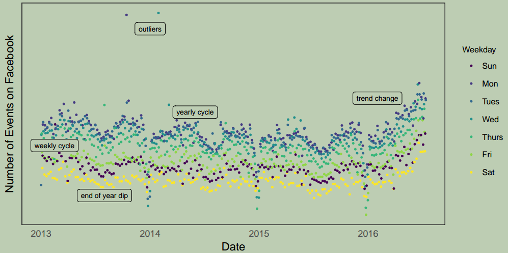
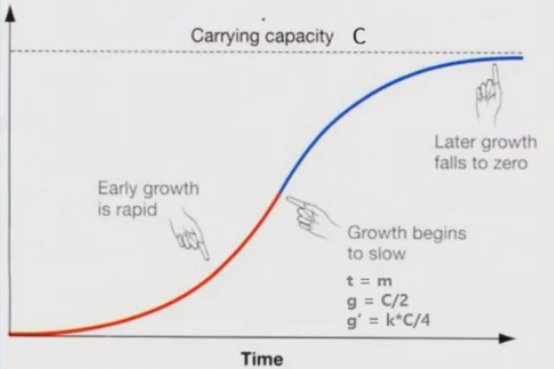

原文链接： [Forecasting at scale](https://peerj.com/preprints/3190/)

# 引言

## 时间序列预测的难点

- 通常的预测算法无法融入专家的经验和假设
- 算法调试难度大
- 时间序列预测领域的专业人才比较稀缺

## 希望解决的问题

- 降低算法门槛
- 适用于各种不同类型的预测问题
- 全自动产生大量序列的预测结果
- 可以将专家经验结合到预估算法中

# 商业时间序列的特点

{: width="1086" height="542"}*图2: `Facebook`上创建的事件数。每一天对应一个点，点按周的天数进行颜色编码，以显示周周期。该时间序列的特征代表了许多商业时间序列：多重强季节性、趋势变化、异常值和假日效应。*

## 四个组成分量

- `Trend`

  较长一段时间内呈现出来的持续向上或持续向下的变动。

- `Seasonality`

  周期性/季节性。通常以日、周、年为单位的周期性变化。

- `Regressor`

  外部变量。已知的、引起短期波动的因素，如节假日、促销等。

- `Noise`

  残差。由未知因素产生的波动。如果产生因素知道了，就变成了外部变量。

# 传统时间序列预测方法的缺陷

传统时间序列预测方法都是**自回归模型**(`Auto Regression`): 
$$
y_{t}=f(y_{t-1}, y_{t-2}, ..., y_{t-n})
$$
**自回归**的理解：输入是观测变量的历史值，输出是观测变量的未来值，相当于观测值自己对自己的回归。

比如**移动平均模型**：
$$
y_{t} = \sum_{i=1}^{n}w_{i}y_{t-i}
$$
难以理解，难以调试。

# `Prophet`模型原理

$$
y(t) = g(t) + s(t) + h(t) + \epsilon_{t}
$$
这里：

- $g(t)$ 是趋势函数，用于模拟时间序列值的非周期性变化。用分段线性函数或者`logistic`函数拟合。
- $s(t)$ 表示周期性变化（例如，每周和每年的季节性）。用傅里叶级数拟合。
- $h(t)$ 代表在一天或几天内可能出现的不规则日程上的假日影响。用线性函数拟合。
- 误差项 $\epsilon_{t}$ 表示模型不适应的任何特殊变化；稍后，我们将假设 $\epsilon_{t}$ 服从正态分布。

## logistic增长曲线

$$
g(t) = \frac{C}{1+\text{exp}(-k(t-m))}
$$

{: width="1086" height="542"}

**以下超参数，由用户给定**:

- $C$，`carrying capactity`，曲线的渐近线。当 $k>0$ 时，其表示曲线的上限；当 $k<0$ 时，其表示曲线的下限。

**以下参数，由训练得到**:

- $k$，增长速率。当 $k>0$ 时，曲线呈上升趋势；当 $k<0$ 时，曲线呈下降趋势。
- $m$，曲线拐点对应的时间，即上图中红线和蓝线的分界点。

## 分段logistic增长曲线

假设增长曲线在 $S_{j}, j=1,...,s$ 时刻发生了变化(分段点) ，增长速率变化量为 $\delta_{j}$ ，拐点的变化量为 $\gamma_{j}$，那么在 $t \in [S_{j}, S_{j+1})$ 时刻，

增长速率为 $k+ \sum_{l \le j} \delta_{l}$ ；拐点为 $m+ \sum_{l \le j} \gamma_{l}$

写成向量形式：$k + \pmb{a}(t)^{\top} \pmb{δ}$ ；$m + \pmb{a}(t)^{\top} \pmb{\gamma}$ 

其中， $a_{j}(t) = \begin{cases}
						 			   1 &\text{if} \ t \ge s_{j} \\
									   0 &\text{otherwise}
								               \end{cases}$

所以，分段logistic增长曲线可以写成：
$$
g(t) = \frac
		{C(t)}
		{
		  1 + \text{exp}(
				-(k+ \pmb{a}(t)^{\top} \pmb{\delta})
				(t-(m+\pmb{a}(t)^{\top} \pmb{\gamma}))
			)
		}
$$
为了保证 $g$ 的连续性：
$$
\gamma_{j} = \Big(s_{j} -m - \sum_{l < j} \gamma_{l} \Big) \Big(1 - \frac{k + \sum_{l<j} \delta_{l}}{k+\sum_{l \le j} \delta_{l}} \Big)
$$
**以下超参数，由用户给定**:

- $C(t)$，曲线的渐近线。

- `n_change_points`，分段点的数量。

- $b$，$\delta$ 的先验概率分布。假设 $\delta$ 满足均值为0，标准差为 $b$ 的拉普拉斯分布。

  $b$ 越大，增长波动越大，越容易过拟合；$b$ 越小，增长波动越小，越容易欠拟合。

**以下超参数，可由用户给定**，**也可由训练得到**:

- $S_{j}$，分段点的位置。如果用户指定了 $S_{j}$ ，那么`n_change_points`不会起作用。

**以下参数，由训练得到**:

- $k$，第一段曲线的增长速率
- $m$，第一段曲线的拐点
- $\delta_{j}$，增长速率的变化量

## 线性趋势函数和分段线性趋势函数

线性趋势函数
$$
g(t) = kt + m
$$
分段线性趋势函数
$$
g(t) = (k+ \pmb{a}(t)^{\top} \pmb{\delta})t + (m+ \pmb{a}(t)^{\top} \pmb{\gamma})
$$
**以下超参数，由用户给定**:

- `n_change_points`，分段点的数量。
- $b$，$\delta$ 的先验概率分布。

**以下超参数，可由用户给定**，**也可由训练得到**:

- $S_{j}$，分段点的位置。如果用户指定了 $S_{j}$ ，那么`n_change_points`不会起作用。

**以下参数，由训练得到**:

- $k$，第一段曲线的增长速率
- $m$，第一段曲线的拐点
- $\delta_{j}$，增长速率的变化量

## Prophet 可以计算趋势的置信区间

根据历史数据中分段点发生的频率和增长率的平均变化幅度，估计未来的时间点分段点发生的概率和变化幅度的分布：

$\lambda = \frac{1}{S} \sum_{j=1}^{S} \vert \delta_{j} \vert$

$\forall j>T, \quad \begin{cases}
				 			   \delta_{j}=0 &\text{w.p.} \ \frac{T-S}{T} \\
							   \delta_{j} \sim \text{Laplace}(0, \lambda) &\text{w.p.} \ \frac{S}{T}
						               \end{cases}$

根据以上假设，模拟多个可能的未来趋势线，从而计算趋势的不确定性。

## 哪些专家知识可以整合在趋势曲线里

- 选择 线性 还是 logstic趋势线
- 趋势的上下限(仅针对`logstic`趋势线，通过调整超参数 $C$ )
- 指定分段点的数量和位置(通过调整超参数 $S_{j}$ )
- 趋势线的波动程度(通过调整超参数 $b$ )

## 用傅里叶级数拟合季节性

任何周期性函数都可以表示成傅里叶级数
$$
s(t) = \sum_{n=1}^{N} \Big(a_{n} \text{cos} \Big(\frac{2\pi nt}{P} \Big) + b_{n} \text{sin} \Big(\frac{2\pi nt}{P} \Big) \Big)
$$

**以下超参数，由用户给定**：

- $P$，周期长度
- $N$，傅里叶级数的阶数。$N$ 越大，季节性曲线波动越大，越容易过拟合。
- $\sigma$ ，$a_{n}, b_{n}$ 的先验概率分布。假设 $a_{n}, b_{n}$ 均值为0，标准差为 $\sigma$ 的正态分布。$\sigma$ 越大，季节性曲线波动越大，越容易过拟合。

**以下参数，由训练得到**：

- $a_{n}, b_{n}$，傅里叶级数的系数。

## 哪些专家知识可以整合在季节性曲线里

- 周期长度
- 季节性曲线的波动大小（通过调整超参 $N$ 和 $\sigma$ ）

## 外部因素的影响

$$
h(t) = Z(t)\pmb{\kappa}
$$

其中，$Z(t) = [\pmb{1}(t \in D_{1}),...,\pmb{1}(t \in D_{L})]$，模型输入，外部因素在 $t$ 时刻的取值

$\pmb{\kappa}$ 为线性回归系数。

**以下超参数，由用户给定**：

- $\nu$ ，$\kappa$ 的先验概率分布。假设 $\kappa$ 服从均值为0，标准差为 $\nu$ 的正态分布。$\nu$ 越大，外部因素对结果的影响越大，越容易引起过拟合。

**以下参数，由训练得到**：

- $\kappa$，线性回归系数。

## 哪些专家知识可以整合在外部变量的曲线里

- 需要加入哪些外部变量
- 外部变量在每个时间点的取值
- 外部因素对结果的影响的可能性大小（通过调整超参数 $\nu$ ）

# `Prophet`模型优势

- 可以灵活调整趋势、周期性的函数形式
- 不需要对历史数据中的缺失值、异常值进行填补。因为是把历史数据中的一个时间点的数据作为训练样本，如果这个时间点缺失值、异常值，不把其放进训练数据集即可。
- 拟合速度快。
- 预测结果具有高度的可解释性和可调整性。因为模型本身分成了4个分量，可以针对每个分量进行分析。

# 预测模型自动评估通用方案

- 用一个尽可能简单的方法设置预估效果的基准线
- 确定用于评价模型精度的指标
- 模拟模型在历史数据中的表现
- 从误差分析模型优化的机会点

# 常见的预估模型精度评价指标

## MAD/MAE

`Mean Absolute Deviation or Mean Absolute Error`
$$
MAD=\frac{1}{n} \sum_{t=1}^{n} \vert a_{t} - f_{t} \vert
$$

## MAPE

`Mean Absolute Percentage Error`
$$
MAPE=\frac{1}{n} \sum_{t=1}^{n} \vert \frac{a_{t} - f_{t}}{a_{t}} \vert
$$

## WMAPE

`Weighted MAPE`

最常见，有时也会被称作`MAPE`。
$$
WMAPE = \frac{ \sum_{t=1}^{n} \vert a_{t} - f_{t} \vert} {\sum_{t=1}^{n} a_{t}}
$$

# 模拟模型在历史数据中的表现

不能用交叉验证模拟模型的效果。

正确做法：`back test`

用滑动窗口的循环产生训练集和测试集。

{: width="1086" height="542"}
