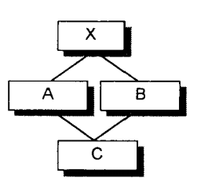
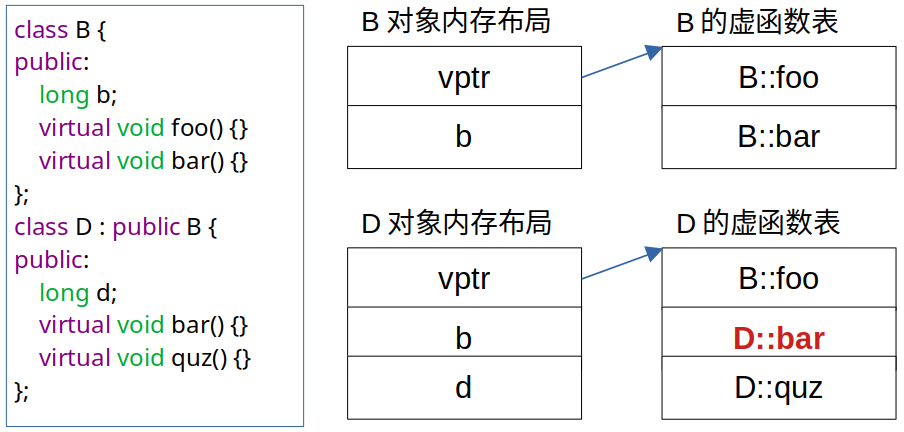
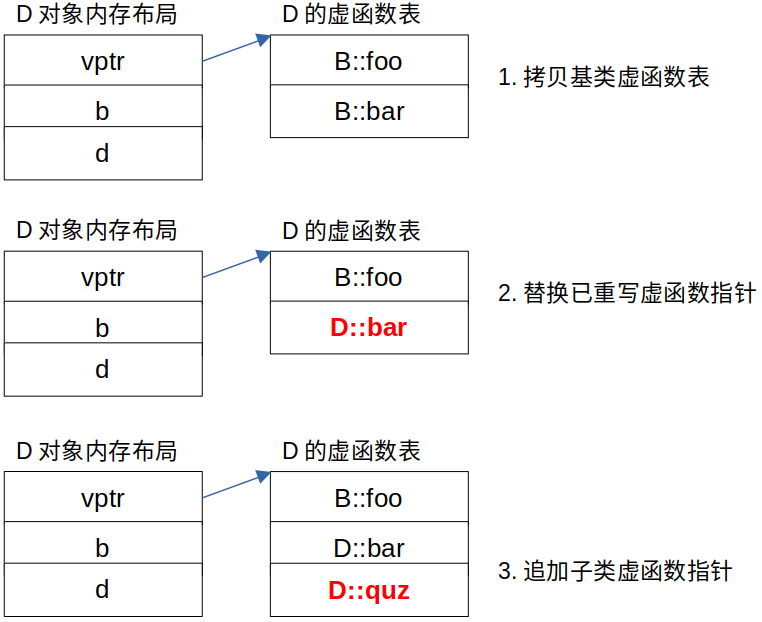

# 关于默认构造函数

> 惟有当默认构造函数**被需要**(被调用)，它们才会被编译器创建出来。

## 什么是默认构造函数

默认构造函数是可以不用实参进行调用的构造函数，它包括了以下两种情况：

- 没有带明显形参的构造函数。
- 提供了默认实参的构造函数。

类设计者可以自己写一个默认构造函数。编译器帮我们写的默认构造函数，称为“**合成的默认构造函数**”。强调“没有带明显形参”的原因是编译器总是会为构造函数形参表插入一个隐含的this指针，所以”本质上”是没有不带形参的构造函数的，只有不带明显形参的构造函数，它就是默认构造函数。

## 默认构造函数什么时候被调用

如果定义一个对象时没有提供初始化式，就使用默认构造函数。例如：

```cpp
class A {  
};

int main() {
    A a; // 调用类A的默认构造函数
    return 0;
}
```

## 理解"被需要"

引言中的”被需要“怎么理解。被谁需要? 做什么事情？像下面这段代码，默认构造函数”被需要“了吗？

```cpp
class A {
public:
    bool is_true_;
    int num_;
};

int main() {
    A a;
    cout << a.is_true_ << endl;
    cout << a.num_ << endl;
    return 0;
}
```

你可能认为这里定义类对象a的时候没有提供参数且A没有定义默认构造函数，编译器应该会合成一个默认构造函数并调用它来初始化A的数据成员，实则不是。上述代码在`gcc 7.3`下输出的结果是

```shell
24
32764
```

看起来是个垃圾值。

当类只含有内置类型或复合类型的成员时，编译器是不会为类合成默认构造函数的，这种类并不符合”被需要“的条件，甚至当类满足“被需要”条件，编译器合成了默认构造函数时，类中内置类型与复合类型数据成员依然不会在默认构造函数中进行初始化。C++ Primer中也有提到：“如果类包含内置或复合类型的成员，则该类不应该依赖于合成的默认构造函数“。

上面代码中，默认构造函数”被需要“是对程序来说的，程序需要is_true_, num\_被初始化以便可以输出。然而这种需要并不会促使编译器合成默认构造函数。**惟有被编译器所需要**时，编译器才会合成默认构造函数。那怎样的类才是编译器需要合成默认构造函数的呢？

## 编译器总是需要默认构造函数的四种类

### 1. 含有类对象成员，该类对象成员有默认构造函数

如果一个类没有任何构造函数，但它有一个类对象成员，且该类对象类型有默认构造函数，那么编译器就会为该类合成一个默认构造函数，不过这个合成操作只有在构造函数真正需要被调用的时候才会发生。

例：

```cpp
class Dopey   {public: Dopey(); ... };
class Sneezy  {public: Sneezy(int); Sneezy(); ... };
class Bashful {public: Bashful(); ... };

class Snow_White {
public:
    Dopey dopey;      // 类对象成员1
    Sneezy sneezy;    // 类对象成员2
    Bashful bashful;  // 类对象成员3
    // ...
private:
    int mumble;
}

int main() {
    Snow_White sw;  // 默认构造函数在这里被需要
    return 0;
}
```

如果`Snow_White`没有定义默认构造函数，编译器就会合成一个默认构造函数，依次调用`Dopey`, `Dopey`, `Bashful`的默认构造函数


### 2. 带有默认构造函数的类的派生类

当一个类派生自一个含有默认构造函数的基类时，该派生类也符合编译器需要合成默认构造函数的条件。

编译器合成的默认构造函数将根据基类声明顺序调用上层的基类默认构造函数。同样的道理，如果设计者定义了多个构造函数，编译器将不会重新定义一个合成默认构造函数，而是把合成默认构造函数的内容插入到每一个构造函数中去。、


### 3. 带有虚函数的类

类带有虚函数可以分为两种情况：

- 类本身定义了自己的虚函数；
- 类从继承体系中继承了虚函数（成员函数一旦被声明为虚函数，继承不会改变虚函数的”虚性质“）。

这两种情况都使一个类成为带有虚函数的类。这样的类也满足编译器需要合成默认构造函数的类，原因是含有虚函数的类对象都含有一个虚表指针vptr，编译器需要对vptr设置初值以满足虚函数机制的正确运行，编译器会把这个设置初值的操作放在默认构造函数中。如果设计者没有定义任何一个默认构造函数，则编译器会合成一个默认构造函数完成上述操作，否则，编译器将在每一个构造函数中插入代码来完成相同的事情。


### 4. 带有虚基类的类

虚基类的概念是存在于类与类之间的，如类A虚继承于类X，则对于A来说，类X是类A的虚基类，而不能说类X就是一个虚基类。

虚基类是为了解决多重继承下确保子类对象中每个父类只含有一个副本的问题，比如菱形继承。如下图：

{: width="1086" height="542"}

  

```cpp
class X {
public: 
    int i;
};
class A : public virtual X {
public:
    int j;
};
class B : public virtual X {
public:
    double d;
};
class C : public A, public B {
public:
    int k;
}

void foo(const A* pa) {
    pa->i = 1024;
}

int main() {
    foo(new A);
    foo(new C);
    return 0;
}
```

函数`foo`参数`pa`的真正类型是可改变的，既可把`A`对象指针赋值给`pa`，也可把`C`对象指针赋值给`pa`，在编译阶段并无法确定`pa`存储的`i`是属于`A`还是`C`的虚基类对象。为了解决这问题，编译器将产生一个指向虚基类`X`的指针，使得程序得以在运行期确定经由`pa`而存取的`X::i`的实际存储位置。这个指针的安插，编译器将会在合成默认构造函数中完成，同样的，如果设计者已经写了多个构造函数，那么编译器不会重新写默认构造函数，而是把虚基类指针的安插代码插入已有的构造函数中。


# C++类对象的内存分布

#### 空类

```cpp
class Empty {
};

sizeof(Empty)  // 1 byte
```

如果实例化一个空类，这个对象会在内存中占用1个字节。目的是标识一下这是一个类的实例。

#### 只含成员变量，不含成员函数

C++类成员变量的内存分布是**从上到下**，按照**内存对齐的原则**进行分布的。

内存对齐原则：

- 分配内存的顺序是按照声明的顺序；
- 每个变量相对于起始位置的偏移量必须是该变量类型大小的整数倍，不是整数倍则padding成整数倍；
- 最后整个类的大小必须是里面变量类型最大值的整数倍。

类的static成员变量是该类的所有对象共享的，不占对象的内存空间。

#### 带普通成员函数

用类定义对象时，系统会为每个对象分配存储空间。成员函数是不占实例内存的，因为一个类的成员函数是共享的，一个类的函数只有一份。这一份具体存放在哪取决于编译器。

#### 带虚函数的类

虚函数表也是每个类一份。但是类的每个实例会有一个虚函数表指针。

```cpp
class B {
public:
    long b;
    virtual void foo() {}
    virtual void bar() {}
};

class D : public B {
public:
    long d;
    virtual void bar() {}
    virtual void quz() {}
};
```

{: width="1086" height="542"}

#### 虚函数表的生成

父类的虚函数表会根据自身的虚函数自动生成。子类的虚函数表会先拷贝父类的虚函数表，然后替换父类中的同名虚函数，最后补上子类自己的虚函数。

{: width="1086" height="542"}


## 内存字节对齐，什么因素影响字节对齐，可以1字节对齐吗

理论上计算机对于任何变量的访问都可以从任意位置开始， 然而实际上系统会对这些变量的存放地址有限制， 通常将变量首地
址设为某个数 N 的倍数， 这就是内存对齐。

为什么要内存对齐

- 平台原因：内存以字节为单位，不同硬件平台不一定支持任何内存地址的存取，一般以2字节、4字节等为单位存取内存，为了保证处理器正确存取数据，需要进行内存对齐。
- 性能原因：提高CPU内存访问速度，一般处理器的内存存取粒度都是N的整数倍，假如访问N大小的数据，没有进行内存对齐，有可能就需要两次访问才可以读取出数据，而进行内存对齐可以一次性把数据全部读取出来，提高效率。


空class有六个默认函数：

- 默认构造函数/
- 复制构造函数
- 析构函数
- 赋值运算符
- 取址运算符
- 取址运算符const

```cpp
class Empty {
public:
  Empty();                           // 默认构造函数
  Empty(const Empty& );             // 拷贝构造函数
  ~Empty();                          // 析构函数
  Empty& operator=(const Empty&);  // 赋值运算符
  Empty* operator&();                // 取址运算符
  const Empty* operator&() const;    // 取址运算符 const};
}
```

### 深拷贝与浅拷贝区别
https://zhuanlan.zhihu.com/p/342851361

https://zhuanlan.zhihu.com/p/188311618

### 赋值函数，拷贝函数
### 手写深拷贝，动态分配内存
### 写一个拷贝构造函数？为什么引用传递而不是值传递
