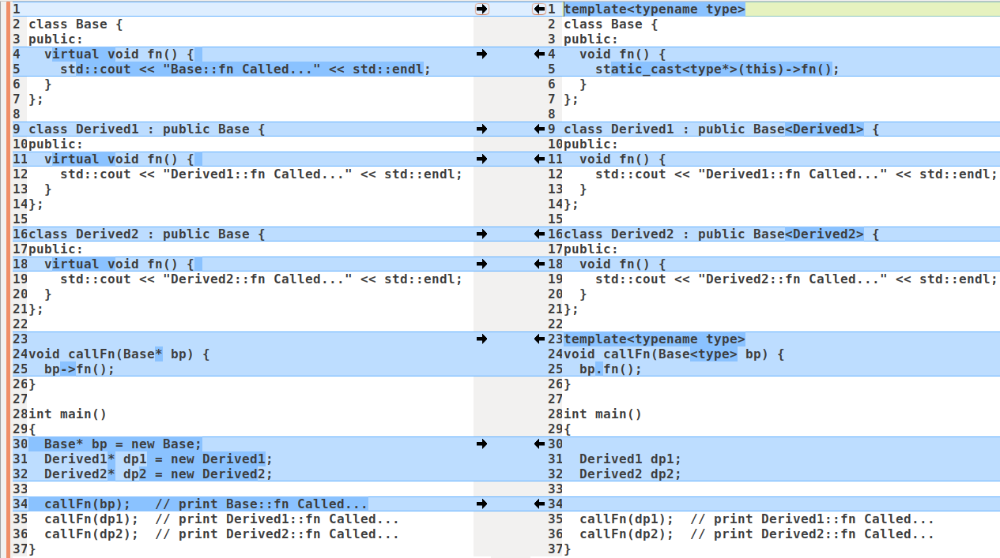

# SFINAE

https://modern-cpp.readthedocs.io/zh_CN/latest/sfinae.html


```cpp
static auto Anyone = [](auto&& k, auto&&... args) { return ((args == k) || ...); };

string s="autumn";

//等价于 if(s=="spring" || s== "summer" || s == "autumn" || s == "winter")
if (Anyone(s, "spring", "summer", "autumn", "winter")) {
    ...    
}
```


# RAII与pImpl
RAII(Resource Acquisition Is Initializationb)，也称为"资源获取即初始化"，是C++里一种资源管理，避免泄漏的惯用法。

C++标准保证在任何情况下，已构造的对象最终会被销毁，即对象的析构函数最终会被调用。

## RAII应用

### ScopeGuard

C++提供了一个叫ScopeGuard的关键技术：通过局部变量析构函数来管理资源，根据是否正常退出来决定是否需要清理资源。

```cpp
template <typename F>
class ScopeGuard {
public:
    ScopeGuard(F&& fn): m_fn(fn), m_active(true) {}
    ~ScopeGuard() {
        if (m_active) {
            m_fn();
        }
    }
    
    void dismiss() {
        m_active = false;
    }
    
private:
    F m_fn;
    bool m_active;
};

struct ScopeGuardOnExit {};

template <typename F>
static inline ScopeGuard<F> operator+(ScopeGuardOnExit, F&& fn) {
    return ScopeGuard<F>(std::forward<F>(fn));
}

#define ON_SCOPE_EXIT \
	auto __onGuardExit__ = ScopeGuardOnExit{} + [&]

#define CANCEL_SCOPRE_EXIT \
	__onGuardExit__.dismiss()

bool protcess1(char* buf) {
    return true;
}

bool protcess2(char* buf) {
    return true;
}

void process() {
    char* buf = (char*)malloc(512);
    
    // 函数退出时，执行ON_SCOPE_EXIT代码，资源释放统一放在这里
    ON_SCOPE_EXIT {
        free(buf);
        printf("exit func, free buf.");
    };
    
    if (!protcess1(buf)) {
        return;
    }
    if (!protcess2(buf)) {
        return;
    }    
}
```


### [RAII妙用之计算函数耗时](https://zhuanlan.zhihu.com/p/139519294)


# OutOfLine

`OutOfLine`的基本原理是把对象内部的数据分为热数据和冷数据，把冷数据放在对象外面保存。这样可以提升热数据的内存局部性，减少`cache miss`，从而获得更好的性能，同时不破坏原有对象的封装和`RAII`特性。

[OutOfLine – A Memory-Locality Pattern for High Performance C++](https://blog.headlandstech.com/2018/08/15/outofline-a-memory-locality-pattern-for-high-performance-c/)


# 模板特化

- 允许某些形式的优化
- 减少代码膨胀

偏特化有两种：
- 模板参数个数上，比如，有2个模板参数，特化其中一个
- 模板参数范围上，比如，有个任意类型的模板参数，特化成指向任意类型的指针类型

[Why Not Specialize Function Templates?](http://gotw.ca/publications/mill17.htm)

[深入理解特化与偏特化](https://sg-first.gitbooks.io/cpp-template-tutorial/content/jie_te_hua_yu_pian_te_hua.html)


# CRTP
CRTP(Curiously Recurring Template Pattern): 奇异递归模板模式.


## 基本形式
```cpp
// The Curiously Recurring Template Pattern(CRTP)
template <class T>
class Base
{
    // methods within Base can use template to access members of Derived
};

class Derived : public Base<Derived>
{
    // ...
};
```

## 典型应用
### 静态多态(编译时多态)
不使用虚函数但是达到了多态的效果。应用常见于各种各样的C++库，像boost里面就有大量使用，STL中也有一些。在C++里面，模板函数本身就不能定义为虚函数，因此，对于模板函数来说，要达到多态的效果，CRTP是一种非常好的途径，而且还没有虚函数的开销。


- 动态多态(运行时多态)的例子

```cpp
class Base {
public:
  virtual void fn() { 
    std::cout << "Base::fn Called..." << std::endl;
  }
};

class Derived1 : public Base {
public:
  virtual void fn() { 
    std::cout << "Derived1::fn Called..." << std::endl;
  }
};

class Derived2 : public Base {
public:
  virtual void fn() { 
    std::cout << "Derived2::fn Called..." << std::endl;
  }
};


void callFn(Base* bp) {
  bp->fn();
}

int main()
{
  Base* bp = new Base;
  Derived1* dp1 = new Derived1;
  Derived2* dp2 = new Derived2;
  
  callFn(bp);   // print Base::fn Called...
  callFn(dp1);  // print Derived1::fn Called...
  callFn(dp2);  // print Derived2::fn Called...
}
```

- 静态多态(编译时多态)的例子

```cpp
template<typename type>
class Base {
public:
  void fn() {
    static_cast<type*>(this)->fn();
  }
};

class Derived1 : public Base<Derived1> {
public:
  void fn() {
    std::cout << "Derived1::fn Called..." << std::endl;
  }
};

class Derived2 : public Base<Derived2> {
public:
  void fn() {
    std::cout << "Derived2::fn Called..." << std::endl;
  }
};

template<typename type>
void callFn(Base<type> bp) {
  bp.fn();
}

int main()
{
  Derived1 dp1;
  Derived2 dp2;

  callFn(dp1);  // print Derived1::fn Called...
  callFn(dp2);  // print Derived2::fn Called...
}
```

两者写法对比

{: width="1086" height="542"}

### 对象计数器
### Polymorphic chaining
### Polymorphic copy construction

# Expression Template
一个比较优秀的应用就是`Eigen`库。

