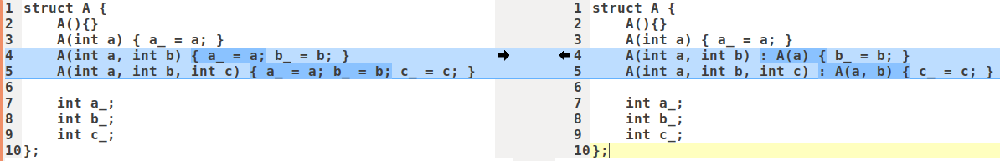
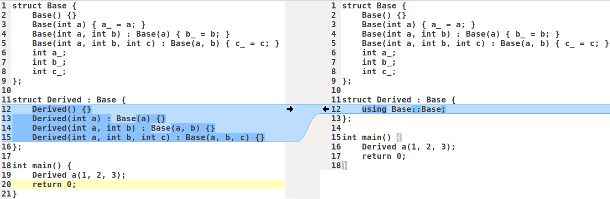
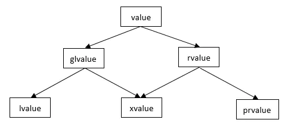

[C++11新特性](https://zhuanlan.zhihu.com/p/139515439)

语言

- Initializer list

- variadic templates
- move
- auto
- range-based for loop
- lambda

标准库
- type traits
- unordered container
- forward list
- array
- tuple
- con-currency
- regex


# initializer list(初始化列表， since c++11)

统一的类成员初始化方法与std::initializer_list。

在C++11中可以直接在变量名后面加上**初始化列表**来进行对象的初始化。例如：

```cpp
struct A {
public:
	A(int) {}
private:
	A(const A&) {}
};

int main() {
    A a(123);
    A b = 123; // error
    A c = { 123 };
    A d{ 123 }; // c++11
    int e = { 123 };
    int f{ 123 }; // c++11
    return 0;
}
```


和`vector`一样，`initializer_list`也是一种模板类。

```cpp
initializer_list<T>
void print(initializer_list<int> vals) {
    for(auto p = vals.begin(); p != vals.end(); ++p) {
        cout << *p;
    }
}

print({1,3,5,7,9});  // 必须以initializer_list<int>或者{...}的形式调用

auto z1{9};  // z1的类型是initializer_list<int>
```

初始化列表的好处如下：

- 方便，且基本上可替代括号初始化
- 可使用初始化列表接受任意长度
- 可以防止类型窄化， 避免精度丢失的隐式类型转换

# 委托构造函数

委托构造函数允许在类中的一个构造函数调用另外一构造函数，可以在变量初始化时简化操作。如下所示，右边就是采用了委托构造函数

{: width="1086" height="542"}

# 继承构造函数

继承构造函数可以让派生类直接使用基类的构造函数，如果有一个派生类，我们希望派生类采用和基类一样的构造方式， 可以直接使用基类的构造函数， 而不是再重新写一遍构造函数。类似于Python里的`super(Derived, self).__init__()`。

{: width="1086" height="542"}

# variadic templates(可变参数模板, since c++11)

> 谈的是templates

- function template
- class template

> 变化的是template parameters

- 参数个数，利用参数个数逐一递减的特性，实现递归调用，基于function template
- 参数类型，利用参数个数逐一递减导致参数类型数量也逐一递减的特性实现递归继承或者递归复合，基于class template

可以方便地完成递归函数调用。

可以方便地完成递归类继承。

## 可变模板参数函数

```cpp
template <class... T>
void f(T... args) {    
    cout << sizeof...(args) << endl;  // 在模板里面使用`sizeof...(args)`可以打印模板参数的数量。
}

int main() {
	f();        //0
	f(1, 2);    //2
	f(1, 2.5, "");    //3    
}
```

由于可变模版参数的类型和个数是不固定的，所以我们可以传任意类型和个数的参数给函数`f`。这个例子只是简单的将可变模版参数的个数打印出来，如果需要将参数包中的每个参数打印出来的话就需要通过一些方法了。展开可变模版参数函数的方法一般有两种：

- 通过递归函数来展开参数包

  通过递归函数展开参数包，需要提供一个参数包展开函数和一个递归终止函数，递归终止函数正是用来终止递归的。下面是例子

  ```cpp
  // 递归终止函数
  void print() {
  }
  
  // 参数包展开函数，每递归调用一次，参数包中的参数就少一个
  template <typename T, typename... Types>
  void print(const T& firstArg, const Types&... args) {  
  	cout << firstArg << endl;    
  	print(args...);
  }
  
  int main() {
      print(7.5, "hello", 666);
  }
  ```

- 通过逗号表达式来展开参数包

  递归函数展开参数包是一种标准做法，也比较好理解，但也有一个缺点,就是必须要一个重载的递归终止函数，即必须要有一个同名的终止函数来终止递归，这样可能会感觉稍有不便。有没有一种更简单的方式呢？其实还有一种方法可以不通过递归方式来展开参数包，这种方式需要借助逗号表达式和初始化列表。

  ```cpp
  template <class T>
  void printarg(T t) {
     cout << t << endl;
  }
  
  template <class ...Args>
  void expand(Args... args) {
     int arr[] = {(printarg(args), 0)...};
  }
  
  expand(1,2,3,4);
  ```

  `expand`函数中的逗号表达式`(printarg(args), 0)`先执行`printarg(args)`，再得到逗号表达式的结果`0`。

  同时还用到了`C++11`的另外一个特性——**初始化列表**，通过初始化列表来初始化一个变长数组, `{(printarg(args), 0)...}`将会展开成`((printarg(arg1),0), (printarg(arg2),0), (printarg(arg3),0), ...)`，最终会创建一个元素值都为`0`的数组int arr[sizeof...(Args)]。

  由于是逗号表达式，在创建数组的过程中会先执行逗号表达式前面的部分`printarg(args)`打印出参数，也就是说在构造`arr`数组的过程中就将参数包展开了，这个数组的目的纯粹是为了在数组构造的过程展开参数包。

  将上面的实现改进一下，少写最后的递归终止函数。如下所示：

  ```cpp
  template<class F, class ...Args>
  void expand(const F& f, Args...args) {
    std::initializer_list<int>{(f(args), 0)...};
  }
  
  expand([](int i){std::cout << i << std::endl;}, 1,2,3);
  ```


## 可变模板参数类

https://www.cnblogs.com/qicosmos/p/4325949.html


# std::is_same与std::decay
std::is_same<Type_a, Type_b>::value, 可以用于模板参数检查。严格判断类型是否一致(int, int&, const int, const int& 都不是同一种类型)。int和signed int是同一种。char和signed char不是同一种。char和unsigned char也不是同一种。
   如果不需要如此严格的校验,可以利用std::decay.
std::is_same<typename std::decay<Type_a>::type, Type_b>::value,
这个检查对于int, int&, int&&, const int&，会判断是同一种类型；int[2]与int*是同种类型， int(int)与int(*)(int)是同种类型。

# auto与decltype

## auto

1. C++是一种强类型语言，声明变量时必须明确指出其类型。
2. 实践中，有时人工很难推断出某个表达式值的类型，并且类型的名字可能会很长，尤其在泛型编程里。
    为了解决这个问题，C++11重新定义了auto的语义(以前是用于声明自动变量)，其核心在于类型推导(type deduction)，让编译器在编译期（非运行期）推导出表达式的类型。
    auto主要有2个用途：
3. 在变量声明时，根据初始化表达式自动推导该变量的类型。
4. 在声明函数时，作为函数返回值的占位符。

### 注意事项

1. 使用auto关键字的变量必须有初始值。

2. 可以使用`valatile`，*，&，&&来修饰auto关键字。

   ```cpp
   auto a = 10;
   auto *pa = new auto(a);
   auto **rpa = new auto(&a);
   cout << typeid(a).name() << endl;   // 输出： int
   cout << typeid(pa).name() << endl;  // 输出： int *
   cout << typeid(rpa).name() << endl; // 输出： int **
   ```

3. 函数参数和模板参数不能被声明为auto。

4. 使用auto关键字声明变量的类型，不能自动推导出顶层的CV-qualifiers和引用类型，除非显示声明。CC 是指const 和volatile。

   - 使用auto关键字进行类型推导时，如果初始化表达式是引用类型，编译器会去除引用，除非显示声明。例如：

     ```cpp
     int i = 10;
     int &r = i;
     auto a = r;
     a = 13; // 重新赋值
     cout << "i = " << i << " a = " << a << endl;    // 输出i=10，a=13
     
     // 显式声明
     auto &b = r;
     b = 15; // 重新赋值
     cout << "i = " << i << " b = " << b << endl;    // 输出i=15，a=15
     ```

   - 使用auto使用auto关键字进行类型推导时，编译器会自动忽略顶层const，除非显示声明。例如：

     ```cpp
     const int c1 = 10;
     auto c2 = c1;
     c1 = 11; // 报错，c1为const int类型，无法修改const变量
     c2 = 14; // 正确，c2为int类型
     
     // 显示声明
     const auto c3 = c1;
     c3 = 15; // 报错，c3为const int类型，无法修改const变量
     ```

5. 对于数组类型，auto关键字会推导为指针类型，除非被声明为引用。例如：

   ```cpp
   int a[10];
   auto b = a;
   cout << typeid(b).name() << endl;   // 输出：int *
   
   auto &c = a;
   cout << typeid(c).name() << endl;   // 输出：int [10]
   ```

6. 在类中auto不能用作非静态成员常量

   ```cpp
   class A {
       // error: non-static data member declared with placeholder 'auto'
       auto a = 1;
       
       // error: ISO C++ forbids in-class initialization of non-const static member 'A::b'
       static auto b = 1; 
       
       static const auto c = 1; // ok
   };
   ```

[参考]:(https://veitchkyrie.github.io/2020/02/19/C++-11-auto%E5%85%B3%E9%94%AE%E5%AD%97/)

## decltype

decltype用于推导表达式类型，其只用于编译器分析表达式的类型， 表达式实际不会进行运算。

decltype不会像auto一样忽略引用和CV属性，decltype会保留表达式的引用和cv属性。

对于`decltype(exp)`有:

- 若`exp`是表达式，`decltype(exp)`和`exp`类型相同
- 若`exp`是函数调用，`decltype(exp)`和函数返回值类型相同
- 其它情况，若`exp`是左值，`decltype(exp)`是`exp`类型的左值引用

```cpp
int a = 0, b = 0;
decltype(a + b) c = 0; // c 是 int， 因为(a+b)返回一个右值
decltype(a += b) d = c;// d 是 int&， 因为(a+=b)返回一个左值
d = 20;
cout << "c " << c << endl; // 输出 c 20
```


## auto与decltype配合使用

auto与decltype配合使用，作为返回值类型后置时的占位符。此时，auto不表示自动类型检测，仅表示后置返回值的语法的一部分。

```cpp
template<class T, class U>
auto add(T t, U u) -> decltype(t + u) 
{
    return t + u;
}
```

从C++14开始，例子中的 ->decltype(t+u)就不再需要，可以去掉了。

# for_each

一种STL泛型算法
```cpp
template<class InputIterator, class Function>
  Function for_each(InputIterator first, InputIterator last, Function fn)
{
  while (first!=last) {
    fn(*first);
    ++first;
  }
  return fn;      // or, since C++11: return move(fn);
}
// fn是unary function.
```

# nullptr
用来代替`0`或者`NULL`.

```cpp
void f(int);
void f(void*);

f(0);       // 调用f(int);
f(NULL);    // 会有歧义，调用f(int) if NULL is 0。
f(nullptr); // 调用f(void*)
```

# std::forward, std::move, 右值，右值引用，移动构造函数

C++ 98 中表达式值的类型只有左值和右值两种类型：可以取地址的表达式就是左值，不是左值的值就是右值。所有的具名变量都是左值，右值是不具名的。

C++11中表达式的值类型分成了lvalue(左值)、rvalue(右值)、prvalue(纯右值)、xvalue(将亡值)、gvalue(泛左值) 5种。

{: width="1086" height="542"}

**将亡值**(`xvalue`, `expiring value`)，`xvalue`是C++11新增的概念，与右值引用相关的表达式，如: 

- 将要被移动的对象；
- `T&&`函数返回值；
- `std::move`返回值；
- 转换为`T&&`类型的函数的返回值；

**纯右值**(`pvalue`, `pure right value`)，描述：

- 本身就是赤裸裸的、纯粹的字面值，如3、false。

- 求值结果相当于字面值或是一个不具名的临时对象

  举例：
  - 非引用返回的临时变量；
  - 运算表达式产生的临时变量；a+b、a&&b、a>=b、&a
  - **除字符串字面值以外的字面值**
  - lambda表达式
  - **后置自增/自减运算符连接的表达式i++/i--**

在C++11中，用左值去初始化一个对象或为一个已有对象赋值时，会调用拷贝构造函数或拷贝赋值运算符来拷贝资源，而当用一个右值（包括纯右值和将亡值）来初始化或赋值时，会调用移动构造函数或移动赋值运算符来移动资源，从而避免拷贝，提高效率。当该右值完成初始化或赋值的任务时，它的资源已经移动给了被初始化者或被赋值者，同时该右值也将会马上被销毁（析构）。也就是说，当一个右值准备完成初始化或赋值任务时，它已经“将亡”了。这种右值常用来完成移动构造或移动赋值的特殊任务，扮演着“将亡”的角色，所以C++11给这类右值起了一个新的名字——将亡值。

## std::move

std::move并不移动任何东西，它唯一的功能是将一个左值强制转化为右值引用，继而可以通过右值引用使用该值，以用于移动语义。

从实现上讲，std::move基本等同于一个类型转换：static_cast<T&&>(lvalue);


## 左值引用、右值引用

左值引用是对左值进行引用的类型，右值引用是对右值进行引用的类型，他们都是对象的一个别名，并不拥有所绑定对象的内存。

```cpp
type &name = exp; // 左值引用
type &&name = exp; // 右值引用

int a = 5;
int &b = a; // b 是左值引用
b = 4;
int &c = 10; // error， 10 无法取地址， 无法进行引用
const int &d = 10; // ok， 因为是常引用， 引用常量数字， 这个常量数字会存储在内存中， 可以取地址

int a = 4;
int &&b = a; // error, a 是左值
int &&c = std::move(a); // ok
```


## 移动语义

谈移动语义前， 我们首先需要了解深拷贝与浅拷贝的概念

深拷贝就是拷贝对象时，若被拷贝对象内部还有指针指向其它资源，自己需要重新开辟一块新内存存储资源， 而不是简单的赋值。

移动语义， 可理解为转移所有权，之前的拷贝是对于别人的资源自己重新分配一块内存存储复制过来的资源，而对于移动语义， 类似于转让或者资源窃取的意思，对于那块资源，转为自己所拥有，别人不再拥有也不会再使用，通过 C++11新增的移动语义可以省去很多拷贝负担，怎么利用移动语义呢，是通过移动构造函数。

移动语义仅针对于那些实现了移动构造函数的类的对象， 对于那种基本类型 int、 float 等没有任何优化作用， 还是会拷
贝， 因为它们实现没有对应的移动构造函数


## std::forward

std::forward通常是用于完美转发的，它会将输入的参数原封不动地传递到下一个函数中，这个“原封不动”指的是，如果输入的参数是左值，那么传递给下一个函数的参数的也是左值；如果输入的参数是右值，那么传递给下一个函数的参数的也是右值。


# emplace_back(), push_back()


# std::function、std::bind、lamda表达式

## std::function

**可调用对象**。满足以下条件之一就可称为可调用对象：

- 是一个函数指针
- 是一个具有operator()成员函数的类对象(传说中的仿函数)，lambda表达式
- 是一个可被转换为函数指针的类对象
- 是一个类成员(函数)指针
- bind表达式或其它函数对象

std::function就是可调用对象的封装器，可把std::function看做一个函数对象。std::function的实例可存储、复制和调用任何可调用对象，存储的可调用对象称为std::function的目标。

若 std::function不含目标，则称它为空，调用空std::function目标会抛出 std::bad_function_call异常。

```cpp
#include <functional>
#include <iostream>

std::function<void(int)> f; // function对象f的参数是int，返回值是void

struct Foo {
	Foo(int num) : num_(num) {}
	void print_add(int i) const { std::cout << num_ + i << '\n'; }
	int num_;
};

void print_num(int i) { std::cout << i << '\n'; }

struct PrintNum {
	void operator()(int i) const { std::cout << i << '\n'; }
};

int main() {
    // 存储自由函数
    std::function<void(int)> f_display = print_num;
    f_display(-9);

    // 存储 lambda
    std::function<void()> f_display_42 = []() { print_num(42); };
    f_display_42();
    
    // 存储到 std::bind 调用的结果
    std::function<void()> f_display_31337 = std::bind(print_num, 31337);
    f_display_31337();
    
    // 存储到成员函数的调用
    std::function<void(const Foo&, int)> f_add_display = &Foo::print_add;
    const Foo foo(314159);
    f_add_display(foo, 1);
    f_add_display(314159, 1);
    
    // 存储到数据成员访问器的调用
    std::function<int(Foo const&)> f_num = &Foo::num_;
    std::cout << "num_: " << f_num(foo) << '\n';
    
    // 存储到成员函数及对象的调用
    using std::placeholders::_1;
    std::function<void(int)> f_add_display2 = std::bind(&Foo::print_add, foo, _1);
    f_add_display2(2);
    
    // 存储到成员函数和对象指针的调用
    std::function<void(int)> f_add_display3 = std::bind(&Foo::print_add, &foo, _1);
    f_add_display3(3);
    
    // 存储到函数对象的调用
    std::function<void(int)> f_display_obj = PrintNum();
    f_display_obj(18);
}
```


## std::bind

使用std::bind可将**可调用对象**和**参数**绑定，绑定的结果使用std::function进行保存，并延迟调用到任何需要的时候。

std::bind通常有两大作用：

- 将可调用对象与参数绑定为另一个std::function供调用
- 将n元可调用对象转成m(m<n)元可调用对象，绑定一部分参数，这里需要使用 std::placeholders

```cpp
#include <functional>
#include <iostream>
#include <memory>

void f(int n1, int n2, int n3, const int& n4, int n5) {
	std::cout << n1 << ' ' << n2 << ' ' << n3 << ' ' << n4 << ' ' << n5 << std::endl;
}

int g(int n1) { return n1; }

struct Foo {
	void print_sum(int n1, int n2) { std::cout << n1 + n2 << std::endl; }
	int data = 10;
};

int main() {
    using namespace std::placeholders; // 针对 _1, _2, _3...
    // 演示参数重排序和按引用传递
    int n = 7;
    // _1 与 _2 来自std::placeholders，并表示将来会传递给 f1 的参数）
    auto f1 = std::bind(f, _2, 42, _1, std::cref(n), n);
    n = 10;
    f1(1, 2, 1001); // 1 为 _1 所绑定， 2 为 _2 所绑定， 不使用 1001
    // 进行到 f(2, 42, 1, n, 7) 的调用
    // 嵌套 bind 子表达式共享占位符
    auto f2 = std::bind(f, _3, std::bind(g, _3), _3, 4, 5);
    f2(10, 11, 12); // 进行到 f(12, g(12), 12, 4, 5); 的调用
    // 绑定指向成员函数指针
    Foo foo;
    auto f3 = std::bind(&Foo::print_sum, &foo, 95, _1);
    f3(5);
    // 绑定指向数据成员指针
    auto f4 = std::bind(&Foo::data, _1);
    std::cout << f4(foo) << std::endl;
    // 智能指针亦能用于调用被引用对象的成员
    std::cout << f4(std::make_shared<Foo>(foo)) << std::endl;
}
```


## lamda表达式

lamda表达式定义了一个匿名函数，可以捕获一定范围的变量，并在函数内部使用。

```cpp
auto func = [capture](params) opt -> ret { func_body; };
```

func当作lambda表达式的名字，作为一个函数使用，capture是捕获列表，params是参数表，opt是函数选项(mutable之类)，ret是返回值类型，func_body 是函数体。


std::function 和 std::bind 使得我们平时编程过程中封装函数更加的方便， 而 lambda 表达式将这种方便发挥到了极致， 可以在
需要的时间就地定义匿名函数， 不再需要定义类或者函数等， 在自定义 STL 规则时候也非常方便， 让代码更简洁， 更灵活， 提
高开发效率。


# 注解标签（attributes）
# final, override

`final`, `override`:用于更明确地管理大型类层次结构。

`final`用于：修饰一个类，表示禁止该类进一步派生；修饰父类成员函数，表明当前成员函数不能被覆盖。

```cpp
struct Base final {
	virtual void func() {
		cout << "base" << endl;
	}
};
struct Derived : public Base{ // 编译失败， final 修饰的类不可以被继承
	void func() override {
		cout << "derived" << endl;
	}
};
```

`override`用于修饰子类中的成员函数，表明该函数重写了基类函数，如果一个函数声明了`override`但父类却没有这个虚函数，编译报错，使用`override`关键字可以避免开发者在重写基类函数时无意产生的错误。同时提高了代码可读性，一看到`override`就能直观地知道当前函数是覆盖了父类的虚函数。

```cpp
struct Base {
	virtual void func() {
		cout << "base" << endl;
	}
};
struct Derived : public Base{
	void func() override { // 确保 func 被重写
		cout << "derived" << endl;
	} 
	void fu() override { // error， 基类没有 fu()， 不可以被重写
	}
};
```


# =default,=delete语法

## default

C++的类有几个特殊成员函数：默认构造函数、析构函数、拷贝构造函数、拷贝赋值运算符、移动构造函数、移动赋值运算符等。

如果代码里没有显式地为一个类定义某个特殊成员函数，而又需要用到时，编译器会隐式地生成一个默认的特殊成员函数。

但是如果代码里显式定义了非默认成员函数（编译器就不会隐式的生成一个默认的特殊成员函数），没有显式定义默认成员函数，那么想使用默认成员函数时，就会报错。那么就只能再显式定义一个默认成员函数。

为了解决上述过程中存在的2个问题：

- 减轻程序员的编程工作量
- 获得编译器自动生成的默认成员函数的高的性能。

程序员只需在函数声明后加速`==default`，编译器就会为该函数自动生成函数体。

## delete

c++中，如果程序员没有定义特殊成员函数，那么编译器在需要特殊成员函数时候会隐式自动生成一个默认的特殊成员函数，在声明后面加上`= delete;`可以禁用该特殊成员函数。

# range-based循环
```cpp
template<typename T>
void PrintElemets(const T& coll) {
  for (const auto& ele : coll) {
    cout << ele;
  }
}

//上面的for循环等价于下面这样
for (auto _pos = coll.begin(); _pos != coll.end(); ++_pos) {
  const auto ele& = *_pos;
  cout << ele;
}
```
# 结构化绑定


# std::thread
# 线程局部存储thread_local
# 线程同步原语std::mutex, std::condition_variable

并行算法(from C++17)
https://zhuanlan.zhihu.com/p/372004337