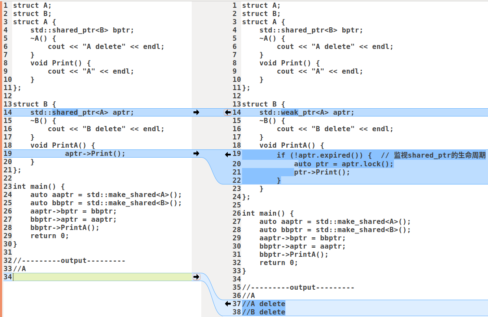

# 4种智能指针

# shared_ptr中循环引用怎么解决？

shared_ptr使用了引用计数，每个shared_ptr的拷贝都指向相同的内存，每次拷贝都会触发引用计数+1，每次生命周期结束析构的时候引用计数-1，在最后一个shared_ptr析构时，内存才会释放。

如下图左边代码存在shared_ptr循环引用问题，`aptr`和`bptr`的引用计数为`2`，离开作用域后`aptr`和`bptr`的引用计数减1，但不会为 0，导致指针永远不会析构， 产生了内存泄漏。可以通过`weak_ptr`来解决，如下图右边代码所示。

weak_ptr用来监视shared_ptr的生命周期，它不管理shared_ptr内部的指针，它的拷贝和析构都不会影响引用计数，纯粹是作为一个旁观者监视shared_ptr中管理的资源是否存在，可以用来返回 this 指针和解决循环引用问题。

weak_ptr有2个作用：

- 返回this指针，`shared_from_this()`其实就是通过`weak_ptr`返回的 this 指针。

  ```cpp
  class enable_shared_from_this {
      shared_ptr<const _Tp> shared_from_this() const {
          return shared_ptr<const _Tp>(this->_M_weak_this);
      }
  
      mutable weak_ptr<_Tp> _M_weak_this;
  };
  ```

  使用shared_from_this()的类需继承enable_shared_from_this类，enable_shared_from_this类中持有一个类型为weak_ptr的成员_M_weak_this，调用shared_from_this()就是将内部持有的weak_ptr转成了shared_ptr。

- 解决循环引用问题。



# 如果智能指针放到多线程中如何完成访问共享的对象

智能指针引用计数溢出是怎么处理的。

