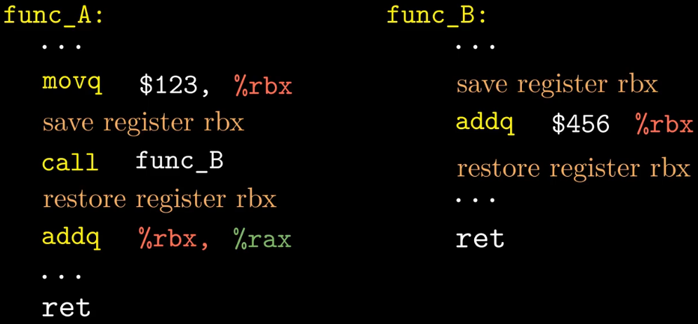
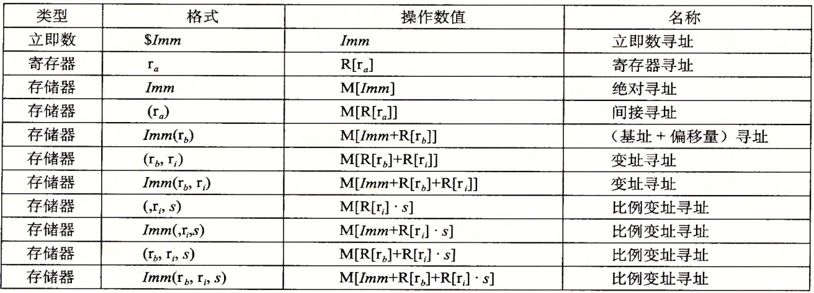

# 机器级代码

## 调用者保存 vs. 被调用者保存

如下图所示，`func_A`中会调用`func_B`，**调用者保存**就是在`func_A`中调用`func_B`之前保存`rbx`寄存器值，调用`funcB`之后恢复`rbx`值；**被调用者保存**就是在被调用函数`func_B`中使用`rbx`寄存器之前保存`rbx`，在使用`rbx`之后恢复`rbx`。

{: width="1086" height="542"}

# 访问信息

一个x86-64的CPU包含一组16个64-bit的通用目的寄存器，这些寄存器用来存储整数数据和指针。每个寄存器都有特殊的用途

- 被调用者保存寄存器：`%rbx`，`%rbp`，`%r12`，`%r13`，`%r14`，`%r15`
- 调用者保存寄存器：`%r10`，`%r11`，`%rax`，`%rdi`，`%rsi`，`%rdx`，`%rcx`，`%r8`，`%r9`

{: width="1086" height="542"}

Intel汇编格式 vs. AT&T汇编格式

- Intel省略了指示大小的后缀。比如`push`，`mov`，而不是`pushq`，`movq`。
- Intel省略了寄存器名前面的`%`符号，用的是`rbx`，而不是`%rbx`。
- Intel用不同的方式描述内存中的位置，例如`QWORD PTR [rbx]`，而不是`(%rbx)`。
- 在带有多个操作数的情况下，列出操作数的顺序相反。

## 操作数指示符

下图第一列展示了不同的操作数类型：

- 立即数
- 寄存器
- 内存引用

最后一列展示了不同的寻址模式：

- 立即数寻址
- 寄存器寻址
- 绝对寻址
- 间接寻址
- (基址+偏移量)寻址
- 变址寻址
- 比例变址寻址，注意比例因子`s`必须是1，2，4或8。编译器根据数组元素的类型确定比例因子的值。`char`型就是1，`int`型就是4。

{: width="1086" height="542"}

## 数据传送指令

