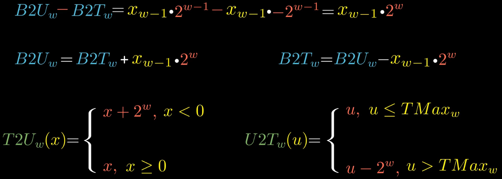

# 信息存储

程序将内存视为一个非常大的字节数组，称为虚拟内存。内存的每一个字节都有一个唯一的数字来标识，称为地址。所有可能地址的集合就是虚拟地址空间。

浮点运算是不可结合的。

```python
(3.14 + 1e20) - 1e20 => 0.0
3.14 + (1e20 - 1e20) => 3.14
```

整数运算和浮点运算会有不同的数学属性是因为它们处理数字表示有限性的方式不同：

- 整数的表示只能编码一个相对较小的数值范围，但是这种表示是精确的。
- 浮点数可以编码一个较大的数值范围，但是这种表示是近似的。

大量的计算机漏洞都是由于计算机算术运算的微妙细节引起的。


### 移动k位，K超过机器的位宽w时

对于一个由`w`位组成的数据，如果要移动`k≥w`位，会得到什么结果呢？

C标准对这种行为的结果是未定义的。但是一般的实现是实际位移量=`k%w`。比如

```c
// 在w=32位的机器上
int val1 = 0xABCDEF98 << 32;  // 实际左移了0位
int val1 = 0xABCDEF98 >> 36;  // 实际右移了4位
int val1 = 0xABCDEF98 >> 40;  // 实际右移了8位
```


# 整数表示

在各种整数类型`(unsigned)char`，`(unsigned)short`，`(unsigned)int`，`(unsigned)long`，`int32_t`，`int64_t`等中，只有`(unsigned)long`的位宽在`32-bit`机器和`64-bit`机器上是有区别的。

{: width="1086" height="542"}


补码

{: width="1086" height="542"}

非负整数的补码是其二进制表示本身。负数补码是其相反数的补码取反加一。


### 有符号数和无符号数转换

对于大多数C的实现，有符号数和无符号数之间的转换规则是：位模式不变，但是解释这些位的方式改变。

{: width="1086" height="542"}


在C语言中，如果一个运算的操作数，一个是有符号数，一个是无符号数，那么C语言会隐式地将有符号数转为无符号数。

{: width="1086" height="542"}


# 整数运算

