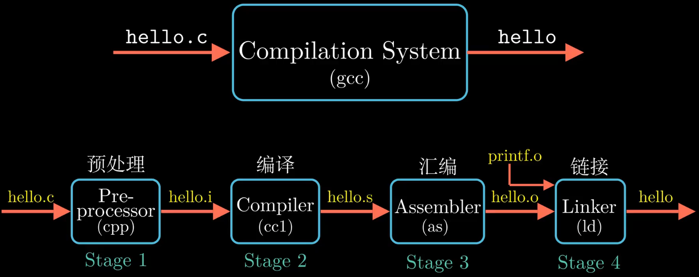
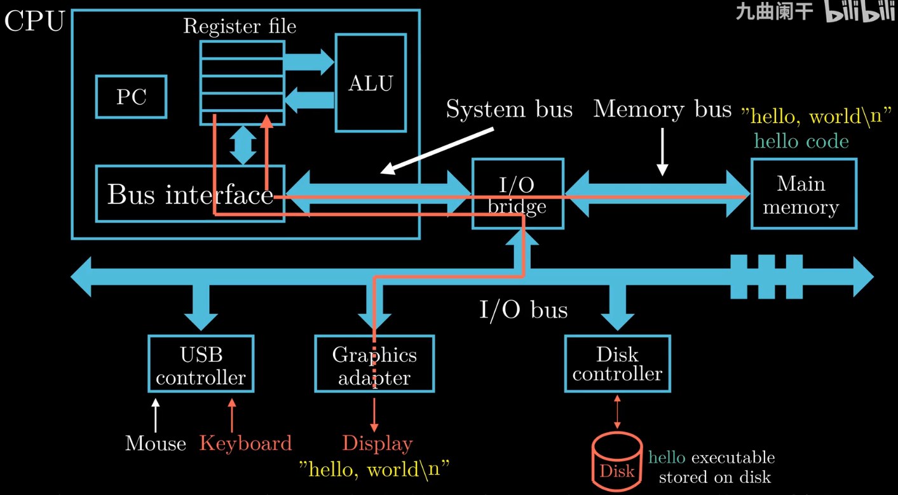
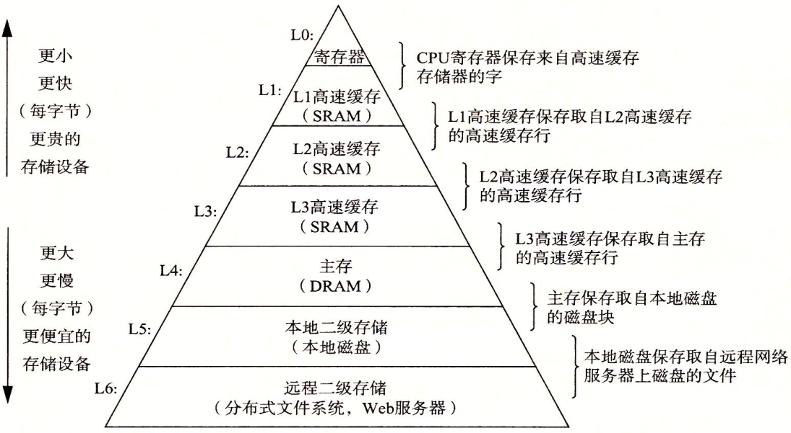
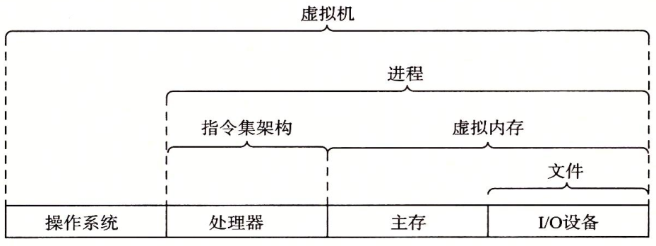
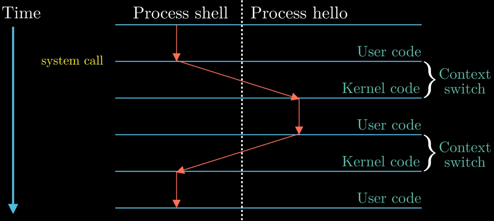
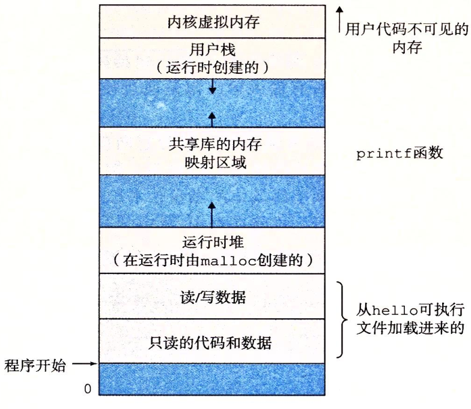

> # Information Is Bits + Context.


# 编译过程

{: width="1086" height="542"}

## 预处理

预处理器根据以`#`开头的命令，修改原始的C程序。比如插入`#include`的头文件、进行宏(`#define`)的替换、删除注释等操作，生成的文件名后缀为`.i`。

```shell
g++ -E main.cpp > main.i  #-E让g++只进行预处理操作
```

## 编译
将预处理过后的文件翻译成汇编文件，文件名后缀`.s`。
```shell
g++ -S main.i  #-S让g++只进行编译操作
```

编译过程包括词法分析，语法分析，语义分析，中间代码生成，优化等一系列中间操作。

## 汇编

将汇编文件翻译成机器指令，并且把这些指令按照固定的规则进行打包，成为可重定位的目标文件main.o。
```shell
g++ -c main.s  #-c让g++单独进行汇编操作
```
## 链接
引入代码中使用到的库文件，生成可执行文件。比如若使用到了`printf`，就要链接标准库。可执行就可被加载到内存中，由系统执行。
```shell
g++ main.o -o main #-E让g++只进行预处理操作
```


# 处理器如何执行程序

## 系统的硬件组成

- **总线**。携带信息字节并负责在各个部件之间传递。

- **IO设备**。是系统与外部世界的联系通道。每个IO设备都通过一个控制器或适配器与IO总线相连。控制器或适配器在IO设备与总线之间传递信息。

- **主存**。由一组DRAM芯片组成。在CPU执行程序时，用来存放程序和程序处理的数据。

- **处理器**。处理器的核心是程序计数器PC。在任何时刻，PC都指向主存中的某条机器指令。

  从系统通电开始，直到系统断电，处理器一直在不断地执行PC指向的指令，再更新PC，使其指向下一条PC。

{: width="1086" height="542"}

## Hello程序是如何运行的

- 初始时，`shell`程序执行它的指令，就是等待我们输入一个命令。
- 当键盘上输入字符串`./hello`后，`shell`程序将字符逐一读入**寄存器**，再把它们存放到**内存**中。当敲下回车键，`shell`就知道我们结束了命令的输入。
- 然后`shell`开始加载可执行的`hello`文件，具体就是将`hello`目标文件中的代码和数据从磁盘复制到主存。
- 目标文件中的代码和数据被加载到主存后，处理器就开始执行`main`中的机器指令。
- `main`中的指令就是将主存中的`"hello, world\n"`字符串从主存复制到寄存器文件，再从寄存器文件中复制到显示设备，最终显示在屏幕上。


# 存储器层次结构

存储器层次结构的主要思想是上一层的存储器作为低一层存储器的高速缓存。因此，寄存器文件就是L1的高速缓存，L3是主存的高速缓存，依次类推。

{: width="1086" height="542"}


# 抽象


{: width="1086" height="542"}

- 指令集架构 —> 处理器硬件的抽象。
- 文件 —> 对IO设备的抽象
- 虚拟内存 —> 对程序存储器的抽象
- 进程 —> 对一个正在运行的程序的抽象
- 虚拟机 —> 对整个计算机的抽象，包括操作系统，处理器，主存，IO设备


# 进程切换示例

{: width="1086" height="542"}

- 最开始时，只有`shell`进程在运行，即`shell`在等待命令行的输入。
- 当通过`shell`进程加载`hello`进程时，`shell`进程通过**系统调用**执行我们的请求。**系统调用**会将**控制权**从`shell`进程传递给操作系统，操作系统保存`shell`进程的**上下文**。
- 然后操作系统创建一个新**进程**及其**上下文**，然后将**控制权**转交给`hello`进程。
- `hello`进程执行完后，**操作系统**会恢复`shell`进程的上下文，并将控制权交给`shell`进程。
- `shell`进程继续等待下一个命令行的输入。


上下文，进程运行所需的所有状态信息，包括PC，寄存器文件的当前值，主存的内容等。

当操作系统决定要把控制权由当前进程转移到某个新进程时，就会进行上下文切换，即保存当前进程的上下文，恢复新进程的上下文，然后将控制权传递给新进程。


# 虚拟内存

虚拟内存是一个抽象概念，它为每个进程提供了一个假象：每个进程都独占地使用主存。每个进程看到的内存都是一致的，称为虚拟地址空间。

下图是linux虚拟地址空间。地址从下往上增大

{: width="1086" height="542"}


## 内存分区

全局区、堆区、栈区、常量区、代码区

