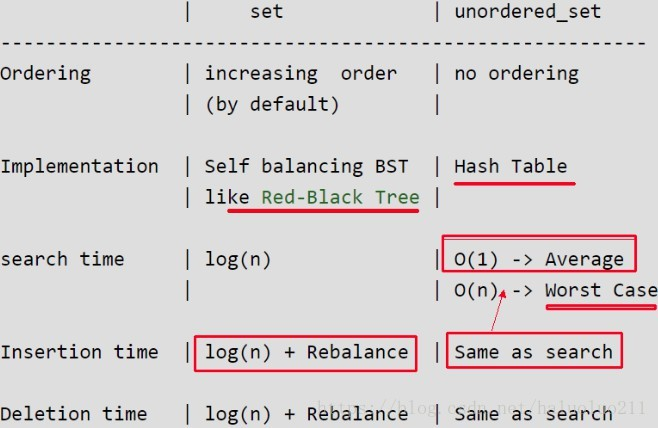

# 数组


# 链表

### [2. 两数相加](https://leetcode-cn.com/problems/add-two-numbers/)

- **构造链表**
- 要考虑到最后如果有进位的场景

**用递归如何实现？**

### [19. 删除链表的倒数第 N 个结点](https://leetcode-cn.com/problems/remove-nth-node-from-end-of-list/)

### [21. 合并两个有序链表](https://leetcode-cn.com/problems/merge-two-sorted-lists/)

### [23. 合并K个升序链表](https://leetcode-cn.com/problems/merge-k-sorted-lists/)


### [61. 旋转链表](https://leetcode-cn.com/problems/rotate-list/)


### [203. 移除链表元素](https://leetcode-cn.com/problems/remove-linked-list-elements/)

**引入虚拟头结点，使得操作统一**。虚拟头结点指向原头结点。最后返回虚拟头结点的`next`指针。

### [206. 反转链表](https://leetcode-cn.com/problems/reverse-linked-list/)

用双指针实现原地反转。

### [142. 环形链表 II](https://leetcode-cn.com/problems/linked-list-cycle-ii/)


### [707. 设计链表](https://leetcode-cn.com/problems/design-linked-list/)


### [445. 两数相加 II](https://leetcode-cn.com/problems/add-two-numbers-ii/)


# 栈

### [19. 删除链表的倒数第 N 个结点](https://leetcode-cn.com/problems/remove-nth-node-from-end-of-list/)

### [20. 有效的括号](https://leetcode-cn.com/problems/valid-parentheses/)

### [42. 接雨水](https://leetcode-cn.com/problems/trapping-rain-water/)

### [150. 逆波兰表达式求值](https://leetcode-cn.com/problems/evaluate-reverse-polish-notation/)

### [1047. 删除字符串中的所有相邻重复项](https://leetcode-cn.com/problems/remove-all-adjacent-duplicates-in-string/)

栈的思想，不一定要实现栈的数据结构。


# 队列

### [622. 设计循环队列](https://leetcode-cn.com/problems/design-circular-queue/)

### [641. 设计循环双端队列](https://leetcode-cn.com/problems/design-circular-deque/)

## 优先队列(堆)

### [1046. 最后一块石头的重量](https://leetcode-cn.com/problems/last-stone-weight/)


# 堆

最大堆

最小堆


# 哈希表

## 基本知识

### `map` vs `unordered_map`

#### 底层实现

数据结构其实是两种类型最为根本的区别，其他的不同都是这种区别产生的结果。

- `map`基于**红黑树**

  红黑树是一种平衡二叉查找树的变体结构，它的左右子树的高度差有可能会大于 1。所以红黑树不是严格意义上的平衡二叉树AVL，但对之进行平衡的代价相对于AVL较低， 其平均统计性能要强于AVL。红黑树具有**自动排序**的功能，因此它使得map也具有按key排序的功能，所以在map中的元素排列都是有序的。在map中，红黑树的每个节点就代表一个元素，因此实现对map的增删改查，也就是相当于对红黑树的操作。对于这些操作的复杂度都为`O(logn)`，复杂度即为红黑树的高度。

- `unordered_map`基于**哈希表**。

  哈希表是根据key值直接进行访问的数据结构。它通过把key值映射到表中一个位置来访问记录，以加快查找的速度。这个映射函数叫做散列函数，存放记录的数组叫做散列表。散列表使得unordered_map的插入和查询速度接近于`O(1)`（在没有冲突的情况下），但是其内部元素的排列顺序是**无序的**。

#### 优缺点及适用场景

##### map

- 优点：
  - map元素有序;
  - 其红黑树的结构使得map的很多操作都可在O(logn)下完成；
  - map的各项性能较为稳定，与元素插入顺序无关；
  - map支持范围查找。

- 缺点：
  - 占用的空间大：红黑树的每一个节点需要保存其父节点位置、孩子节点位置及红/黑性质，因此每一个节点占用空间大。
  - 查询平均时间不如unordered_map。

- 适用场景：
  - 元素需要**有序**；
  - 对于单次查询时间较为敏感，必须保持查询**性能的稳定性**，比如实时应用等等。

##### unordered_map

- 优点：
  - 查询速度快，平均性能接近于常数时间O(1)；

- 缺点：
  - 元素无序；
  - unordered_map相对于map空间占用更大，且其利用率不高；
  - 查询性能不太稳定，最坏时间复杂度可达到O(n)。

- 适用场景：
  - 要求查找速率快，且对单次查询性能要求不敏感。

#### 常用API

- `find()`

  ```cpp
  iterator find(const key_type &key);
  hash.find(key) == map.end();
  ```

- `count()`

  `count`函数统计`key`值在`unordered_map`中出现的次数。`unordered_map`不允许重复`key`。

  ```cpp
  size_type count(const key_type &key) const;
  hash.count(key) // 只会返回0或1
  ```

- `insert()`

  ```cpp
  hash.insert(pair<int, int>(nums[i], i));
  hash[num[i]] = i;
  ```


### [1. 两数之和](https://leetcode-cn.com/problems/two-sum/)

### [49. 字母异位词分组](https://leetcode-cn.com/problems/group-anagrams/)


### `set` vs `unordered_set`

{: width="1086" height="542"}

#### 常用API

```cpp
unordered_set<char> occ;
occ.insert('z');
occ.erase('c');
```


### [3. 无重复字符的最长子串](https://leetcode-cn.com/problems/longest-substring-without-repeating-characters/)

最长子串考虑使用**滑窗法**。

有无重复考虑使用**Hash表**。


### [36. 有效的数独](https://leetcode-cn.com/problems/valid-sudoku/)

### [73. 矩阵置零](https://leetcode-cn.com/problems/set-matrix-zeroes/)

### [1577. 数的平方等于两数乘积的方法数](https://leetcode-cn.com/problems/number-of-ways-where-square-of-number-is-equal-to-product-of-two-numbers/)


# 二叉树

### [94. 二叉树的中序遍历](https://leetcode-cn.com/problems/binary-tree-inorder-traversal/)

### [98. 验证二叉搜索树](https://leetcode-cn.com/problems/validate-binary-search-tree/)

中序遍历下，输出的二叉搜索树节点的数值是有序数列。

### [102. 二叉树的层序遍历](https://leetcode-cn.com/problems/binary-tree-level-order-traversal/)

### [103. 二叉树的锯齿形层序遍历](https://leetcode-cn.com/problems/binary-tree-zigzag-level-order-traversal/)

### [113. 路径总和 II](https://leetcode-cn.com/problems/path-sum-ii/)

### [114. 二叉树展开为链表](https://leetcode-cn.com/problems/flatten-binary-tree-to-linked-list/)

将二叉树展开为单链表后，单链表中的节点顺序即为二叉树的前序遍历访问各节点的顺序。

### [199. 二叉树的右视图](https://leetcode-cn.com/problems/binary-tree-right-side-view/)


# 图

### [130. 被围绕的区域](https://leetcode-cn.com/problems/surrounded-regions/)

### [200. 岛屿数量](https://leetcode-cn.com/problems/number-of-islands/)


# 字符串

前缀树（字典树）

后缀树

### [58. 最后一个单词的长度](https://leetcode-cn.com/problems/length-of-last-word/)

