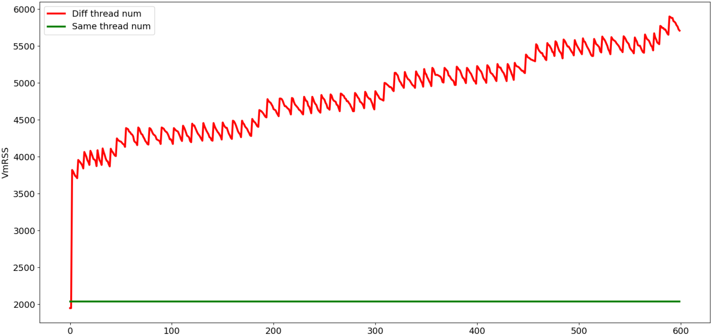

# 背景

在长稳执行某网络时，出现了内存占用持续上升的问题。经过初步分析隔离，发现是某些算子引入的，因为把那几个算子打桩掉后，内存占用就稳定了。那几个算子有个共性，底层是调用的`oneDNN`库实现的。`oneDNN`库的算子有内存泄漏问题？

# 目标

分析`oneDNN`库的那几个算子为什么会内存泄漏。

# 定位过程

选择其中一个算子，梳理出调用流程，发现几处显式申请释放内存的操作，但都是严格匹配的，不会存在泄漏情况。

## 隔离

按照梳理出的流程逐步隔离，发现问题出在算子里实现并行化的地方。

```cpp
parallel(nthr_to_use, [&](int ithr, int nthr) {
    /* do something */
}
```

实验发现，将`parallel`函数体里的内容删掉，内存还是持续泄漏；将`parallel`整个删掉就不会泄漏。所以问题出在`parallel`的实现上。

`oneDNN`里的多线程并行是基于`OpenMP`实现的，我们的版本里用的是`GCC`的`libgomp.so`。

难道`GCC`的`libgomp.so`里有内存泄漏？

动用`google`大法，在`stackoverflow`上找到了几个非常有用的问题及解答：

- [Increasing memory consumption for 2 alternating OpenMP parallel regions with different number of threads](https://stackoverflow.com/questions/67267035/increasing-memory-consumption-for-2-alternating-openmp-parallel-regions-with-dif)

- [What causes increasing memory consumption in OpenMP-based simulation?](https://stackoverflow.com/questions/67131322/what-causes-increasing-memory-consumption-in-openmp-based-simulation)


## 验证

构造两个函数`funcA`, `funcB`，分别配置不同的线程数，比如一个配`8`，一个配`4`。然后循环执行这两个函数，监控内存占用情况。

```cpp
#include <cstdio>
#include "omp.h"

void funcA()
{
  #pragma omp parallel num_threads(8)
	{
    usleep(30);
    printf("A in parallel: %d\n", omp_in_parallel());
  }
  //printf("%d ", gettid());
	//printf("----------------\n");	  
}

void funcB()
{
  #pragma omp parallel num_threads(4)
  {
      usleep(30);
      printf("B in parallel: %d\n", omp_in_parallel());
  }
  //printf("%d ", gettid());
  //printf("****************\n");
}

void test_omp()
{
  while(true) {
    funcA();
    funcB();
  }
}

int main(void) {
  test_omp();
  return 0;
}

```

内存监控shell脚本`mem_monitor.sh`，用法：`mem_monitor.sh 进程号`。

```shell
# 每2秒获取一次$1号进程的内存占用情况VmRSS, 监控20分钟
for((i=1;i<=600;i++));
do
    cat /proc/$1/status | grep RSS | awk 'BEGIN{OFS=","}{print $1,$2}'
    sleep 2
done    
```


{: width="1086" height="542"}

从上图可以看出：

- 给`funcA`, `funcB`配置不同的线程数时，内存总体上是在持续增长的。

- 给`funcA`, `funcB`配置相同的线程数时，内存占用是稳定不变的。

## 解释

`OpenMP`复用公共的`4`个线程，但`funcA`中另外`4`个线程会不断创建和销毁。这种持续的线程创建会导致内存消耗增加，可能是因为存泄漏，也可能是内存碎片。

此外，这个问题只存在于`GCC`的`OpenMP`库中。用`Clang`的`OpenMP`库没有复现这个问题。

# 解决方案

- 编译时链接`Clang`的`OpenMP`库。
- 所有并行域配置相同的线程数，比如通过环境变量配置`export OMP_NUM_THREADS=4`。
