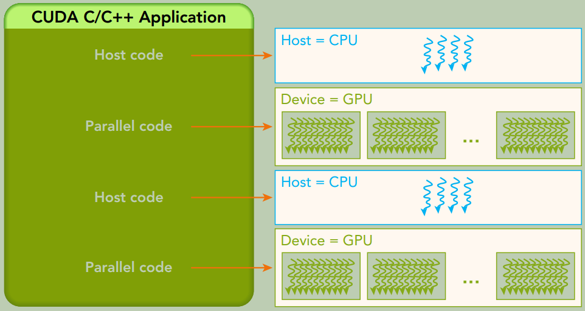
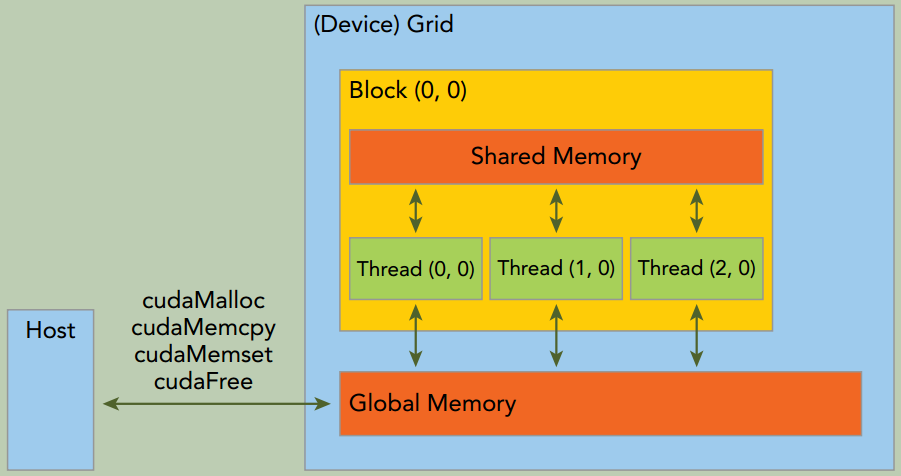
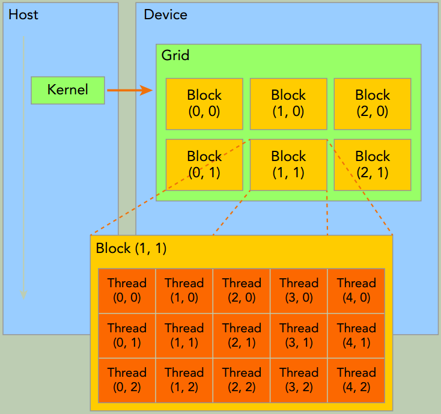
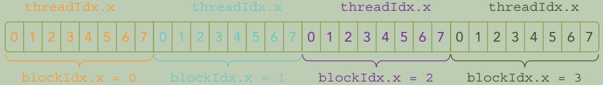
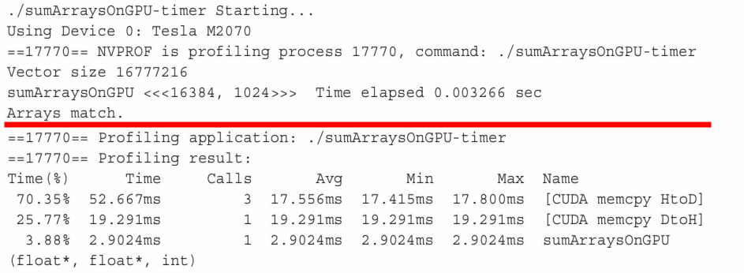
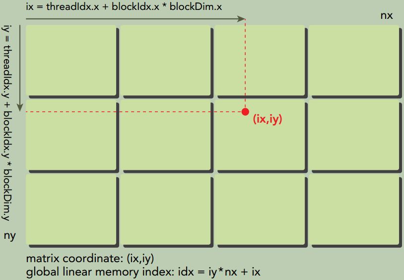
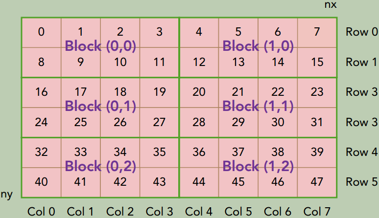
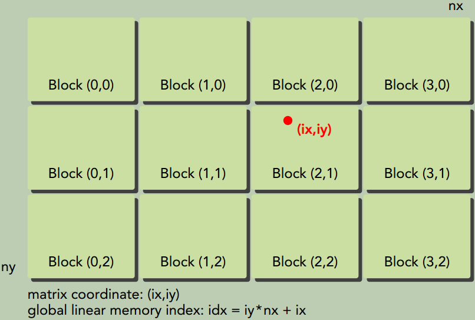

# 二、CUDA编程模型

## CUDA编程模型概述

### CUDA编程结构

站在程序员的角度，可以从以下几个不同层面来看待并行计算：

- **领域层**(Domain level)
- **逻辑层**(Logic level)
- **硬件层**(Hardware level)

这三个层面对应了并行计算编程的不同阶段：

- 算法**设计阶段**，最关心的应是在**领域层**如何解析数据和函数，以便在并行环境中能正确、高效地解决问题。 
- **编码阶段**，关注点应转向如何组织并发线程。在这个阶段，需要从**逻辑层面**来思考，以确保线程和计算能正确地解决问题。在C语言并行编程中，需要使用`pthreads`或`OpenMP`技术来显式地管理线程。CUDA提出了一个线程层次结构抽象的概念，以允许控制线程行为。 
- 在**硬件层**，通过理解线程是如何映射到核心可以帮助提高其性能。

CUDA编程模型主要是异步的，因此在GPU上进行的运算可以与主机-设备通信重叠。内核一旦被启动，管理权立刻返回给主机，释放CPU来执行由设备上运行的并行代码实现的额外的任务。 

{: width="1086" height="542"}
### 内存管理

**CUDA运行时**负责分配与释放设备内存， 并且在主机内存和设备内存之间传输数据。

| 标准C函数 | CUDA C函数 |
| :------: | :--------: |
|  malloc   | `cudaError_t cudaMalloc(void** devPtr, size_t size)` |
|   free    |   cudaFree |
|  memset   | cudaMemset |
|  memcpy   | `cudaError_t cudaMemcpy(void* dst, const void* src, size_t count, cudaMemcpyKind kind)`<br>同步函数，会导致主机阻塞 |

{: width="1086" height="542"}


上图是一个简化的GPU内存结构， 它主要包含两部分： **全局内存**和**共享内存**。全局内存类似于CPU的系统内存， 共享内存类似于CPU的缓存。 不过GPU的共享内存可以由CUDA C的kernel直接控制。

### 线程管理

当kernel函数在host侧启动时， 它的执行会移动到device侧， 此时设备中会产生大量的线程并且每个线程都执行由kernel函数指定的语句。

{: width="1086" height="542"}


一个`kernel`函数启动后产生的所有线程统称为一个**`Grid`**。 同一**`Grid`**的所有线程共享全局内存空间。一个**`Grid`**由多个`thread blocks`构成，一个`thread block`包含一组线程，同一线程块内的线程协作可以通过2种方式来实现：同步`Block-local synchronization`和共享内存`Block-local shared memory`。（不同block内的线程不能协作）

在CUDA程序中有两组不同的网格和块变量：手动定义的`dim3`数据类型和预定义的`uint3`数据类型。在主机端，作为内核调用的一部分，你可以使用`dim3`数据类型定义一个网格和块的维度。当执行核函数时，CUDA运行时会生成相应的内置预初始化的网格、块和线程变量，它们在核函数内均可被访问到且为`unit3`类型。手动定义的`dim3`类型的网格和块变量仅在主机端可见，而`unit3`类型的内置预初始化的网格和块变量仅在设备端可见。


#### 内置变量

- **`gridDim`**, grid dimension, measured in blocks
- **`blockDim`**, block dimension, measured in threads
- **`blockIdx`**, block index within a grid
- **`threadIdx`**, thread index within a block


### 启动一个CUDA核函数

```cpp
void kernel_name <<<grid, block>>>(argument_list);
```

执行配置的第一个值是网格维度， 也就是启动块的数目。 第二个值是块维度， 也就是每个块中线程的数目。

下图所示就是`void kernel_name <<<4, 8>>>(argument_list);`配置下的线程布局。

{: width="1086" height="542"}

#### CUDA核函数的限制

- 只能访问设备内存
- 必须具有void返回类型
- 不支持可变数量的参数
- 不支持静态变量
- 显式异步行为


#### 验证kernel函数

除了使用调试工具外， 还有两个非常简单实用的方法可以验证核函数。

- 在`Fermi`及更高版本的设备端的核函数中使用`printf`函数。
- 可以将执行参数设置为`<<<1, 1>>>`， 因此强制用`1`个块和`1`个线程执行核函数， 这模拟了串行执行。


## 给核函数计时

### 用CPU计时器计时

```cpp
#include <sys/time.h>

#define CHECK(call)                                                            \
{                                                                              \
    const cudaError_t error = call;                                            \
    if (error != cudaSuccess)                                                  \
    {                                                                          \
        fprintf(stderr, "Error: %s:%d, ", __FILE__, __LINE__);                 \
        fprintf(stderr, "code: %d, reason: %s\n", error,                       \
                cudaGetErrorString(error));                                    \
        exit(1);                                                               \
    }                                                                          \
}

int main() {
    double iStart, iElaps;
    ...
    iStart = seconds();
    sumArraysOnHost(h_A, h_B, hostRef, nElem);
    iElaps = seconds() - iStart;
    printf("sumArraysOnHost Time elapsed %f sec\n", iElaps);
    ...
    iStart = seconds();
    sumArraysOnGPU<<<grid, block>>>(d_A, d_B, d_C, nElem);
    CHECK(cudaDeviceSynchronize());  // 等待所有的GPU线程运行结束
    iElaps = seconds() - iStart;
    printf("sumArraysOnGPU <<<  %d, %d  >>>  Time elapsed %f sec\n", grid.x, block.x, iElaps);
    
    // check kernel error
    CHECK(cudaGetLastError()) ;
    return 0;
}
```

### 用`nvprof`工具计时

自CUDA 5.0以来，NVIDIA提供了一个名为nvprof的命令行分析工具。

```shell
$ nvprof [nvprof_args] <application> [application_args]
```

{: width="1024" height="512"}

以上结果的前半部分来自于程序的输出，后半部分来自于`nvprof`的输出。可以注意到，CPU计时器显示消耗的内核时间为3.26ms，而`nvprof`显示消耗的内核时间为2.90ms。在这个例子中，`nvprof`的结果更为精确，因为CPU计时器测量的时间中包含了来自`nvprof`附加的时间。

## 组织并行线程

使用合适的网格和块大小来正确地组织线程，可以对内核性能产生很大的影响。

下图说明了块和线程索引、矩阵坐标以及线性全局内存索引之间的对应关系。

{: width="1024" height="512"}

{: width="1024" height="512"}

{: width="1024" height="512"}

## 设备管理

### 使用运行时API查询设备信息

```cpp
#include "../common/common.h"
#include <cuda_runtime.h>
#include <stdio.h>

/*
 * Display a variety of information on the first CUDA device in this system,
 * including driver version, runtime version, compute capability, bytes of global memory, etc.
 */
int main(int argc, char **argv)
{
    printf("%s Starting...\n", argv[0]);

    int deviceCount = 0;
    cudaGetDeviceCount(&deviceCount);
    if (deviceCount == 0) {
        printf("There are no available device(s) that support CUDA\n");
    } else {
        printf("Detected %d CUDA Capable device(s)\n", deviceCount);
    }

    int dev = 0, driverVersion = 0, runtimeVersion = 0;
    CHECK(cudaSetDevice(dev));
    cudaDeviceProp deviceProp; // cudaDeviceProp结构体存放GPU设备的属性
    CHECK(cudaGetDeviceProperties(&deviceProp, dev));
    printf("Device %d: \"%s\"\n", dev, deviceProp.name);

    cudaDriverGetVersion(&driverVersion);
    cudaRuntimeGetVersion(&runtimeVersion);
    printf("  CUDA Driver Version / Runtime Version          %d.%d / %d.%d\n",
           driverVersion / 1000, (driverVersion % 100) / 10,
           runtimeVersion / 1000, (runtimeVersion % 100) / 10);
    printf("  CUDA Capability Major/Minor version number:    %d.%d\n", deviceProp.major, deviceProp.minor);
    printf("  Total amount of global memory:                 %.2f GBytes (%llu bytes)\n", 
           (float)deviceProp.totalGlobalMem / pow(1024.0, 3), (unsigned long long)deviceProp.totalGlobalMem);
    printf("  GPU Clock rate:                                %.0f MHz (%0.2f "
           "GHz)\n", deviceProp.clockRate * 1e-3f, deviceProp.clockRate * 1e-6f);
    printf("  Memory Clock rate:                             %.0f Mhz\n", deviceProp.memoryClockRate * 1e-3f);
    printf("  Memory Bus Width:                              %d-bit\n", deviceProp.memoryBusWidth);

    if (deviceProp.l2CacheSize) {
        printf("  L2 Cache Size:                                 %d bytes\n", deviceProp.l2CacheSize);
    }

    printf("  Max Texture Dimension Size (x,y,z)             1D=(%d), "
           "2D=(%d,%d), 3D=(%d,%d,%d)\n", deviceProp.maxTexture1D,
           deviceProp.maxTexture2D[0], deviceProp.maxTexture2D[1],
           deviceProp.maxTexture3D[0], deviceProp.maxTexture3D[1],
           deviceProp.maxTexture3D[2]);
    printf("  Max Layered Texture Size (dim) x layers        1D=(%d) x %d, "
           "2D=(%d,%d) x %d\n", deviceProp.maxTexture1DLayered[0],
           deviceProp.maxTexture1DLayered[1], deviceProp.maxTexture2DLayered[0],
           deviceProp.maxTexture2DLayered[1],
           deviceProp.maxTexture2DLayered[2]);
    printf("  Total amount of constant memory:               %lu bytes\n", deviceProp.totalConstMem);
    printf("  Total amount of shared memory per block:       %lu bytes\n", deviceProp.sharedMemPerBlock);
    printf("  Total number of registers available per block: %d\n", deviceProp.regsPerBlock);
    printf("  Warp size:                                     %d\n", deviceProp.warpSize);
    printf("  Maximum number of threads per multiprocessor:  %d\n", deviceProp.maxThreadsPerMultiProcessor);
    printf("  Maximum number of threads per block:           %d\n", deviceProp.maxThreadsPerBlock);
    printf("  Maximum sizes of each dimension of a block:    %d x %d x %d\n",
           deviceProp.maxThreadsDim[0],
           deviceProp.maxThreadsDim[1],
           deviceProp.maxThreadsDim[2]);
    printf("  Maximum sizes of each dimension of a grid:     %d x %d x %d\n",
           deviceProp.maxGridSize[0],
           deviceProp.maxGridSize[1],
           deviceProp.maxGridSize[2]);
    printf("  Maximum memory pitch:                          %lu bytes\n", deviceProp.memPitch);

    exit(EXIT_SUCCESS);
}
```


### 确定最优GPU

一些系统支持多GPU。在每个GPU都不同的情况下，选择性能最好的GPU运行核函数是非常重要的。 通过比较GPU包含的多处理器的数量选出计算能力最佳的GPU。如果你有一个多GPU系统， 可以使用以下代码来选择计算能力最优的设备。

```cpp
int numDevices = 0;
cudaGetDeviceCount(&numDevices);
if (numDevice > 1) {
    int maxMultiprocessors = 0;
    int maxDevice = 0;
    for (int i = 0; i < numDevices; i++) {
        cudaDeviceProp props;
        cudaGetDeviceProperties(&props, i);
        if (maxMultiprocessors < props.maxMultiprocessors) {
            maxMultiprocessors = props.maxMultiprocessors;
            maxDevice = i;
        }
    }
    cudaSetDevice(maxDevice);
}
```

### 在运行时设置设备

对于一个有`N`个GPU的系统，`nvidia-smi`将设备ID标记为`0`到`N-1`。 使用环境变量`CUDA_VISIBLE_DEVICES`，就可在运行时指定所选的GPU且无须更改应用程序。设置运行时环境变量`export CUDA_VISIBLE_DEVICES=2`。 nvidia驱动程序会屏蔽其他GPU，这时设备`2`作为设备`0`出现在应用程序中。`CUDA_VISIBLE_DEVICES`也可用来指定多个设备。例如，如果想测试`GPU 2`和`GPU3`，可设置`CUDA_VISIBLE_DEVICES=2,3`。那么在运行时，nvidia驱动程序将只使用ID为2和3的设备，并且会将设备ID分别映射为0和1。


