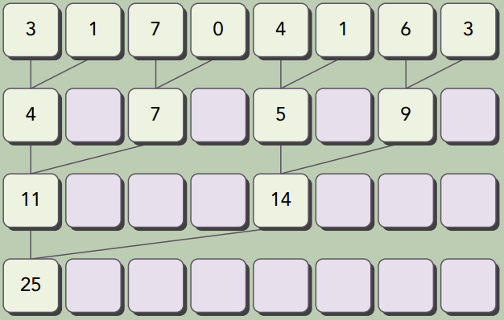
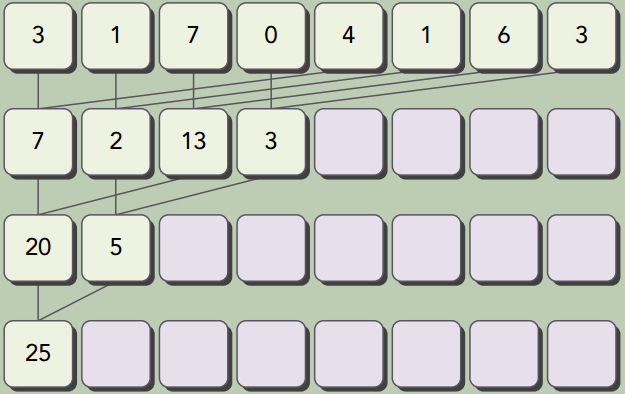
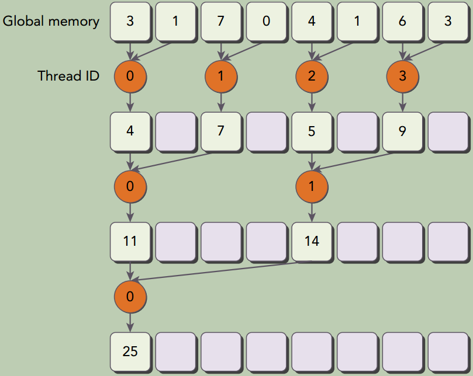
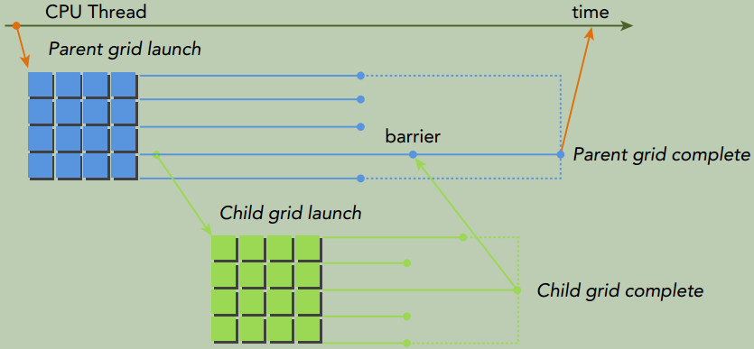
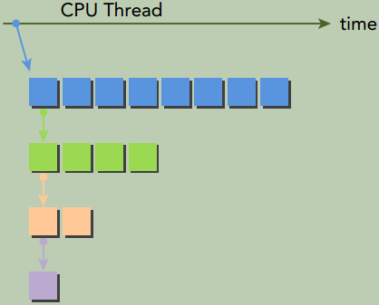
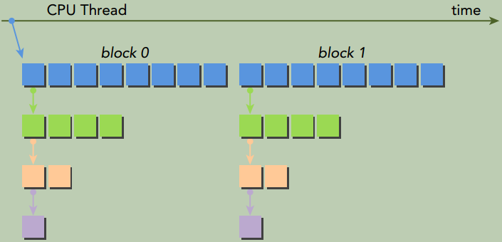
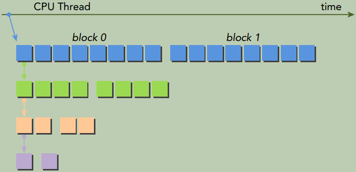

# 三、CUDA执行模型

通过第二章的练习，已经了解了如何**在网格和线程块中组织线程**以获得最佳的性能。尽管可通过反复试验找到最佳的执行配置，但可能仍然会感到疑惑，为什么选择这样的执行配置会更好。你可能想知道是否有一些选择网格和块配置的准则。本章将回答这些问题， 并从硬件方面深入介绍内核启动配置和性能分析的信息。

## CUDA执行模型概述

一般来说，执行模型会提供一个操作视图，说明如何在特定的计算架构上执行指令。CUDA执行模型揭示了GPU并行架构的抽象视图，使我们能够据此分析线程并发。CUDA执行模型能够提供有助于在指令吞吐量和内存访问方面编写高效代码的见解。

### GPU架构概述

`Streaming Multiprocessors (SM)`，流式多处理器。GPU实际上是一个SM的阵列，每个SM包含N个真正执行计算的`Stream Processors(SP)`，也叫`Cuda Core`，能支持数百个线程并发执行。

下图说明了`Fermi SM`的关键组件：

- CUDA核心
- 寄存器文件
- 共享内存/一级缓存
- 加载/存储单元
- 特殊功能单元
- 线程束调度器

{: width="1086" height="542"}

当启动一个kernel网格时， 它的线程块被分布在了可用的SM上来执行。 一个线程块只能在一个SM上被调度。 一旦线程块在一个SM上被调度， 就会保存在该SM上直到执行完成。 在同一时间， 一个SM可以容纳多个线程块，即多个线程块可能会被分配到同一SM上， 而且是根据SM资源的可用性进行调度的。

CUDA采用**单指令多线程**(**SIMT**) 架构来管理和执行线程，每**32**个线程为一组， 被称为**线程束**(`warp`)。线程束中的所有线程同时执行相同的指令。 每个线程都有自己的指令地址计数器和寄存器状态， 利用本线程自己的数据执行当前的指令。

> SIMT vs. SIMD

两者都是将相同的指令广播给多个执行单元来实现并行。一个关键的区别是`SIMD`要求同一向量中的所有元素要在一个统一的同步组中一起执行，而`SIMT`允许同一线程束的多个线程独立执行。尽管一个线程束中的所有线程从相同的程序地址同时开始执行，但是单独的线程仍可能有不同的行为。 `SIMT`让你可以为独立的标量线程编写线程级并行代码，甚至为互相协作的线程编写数据并行的代码。

`SIMT`模型包含3个`SIMD`所不具备的关键特征：

- 每个线程有自己的指令地址计数器

- 每个线程有自己的寄存器状态

- 每个线程可以有一个独立的执行路径


寄存器和共享内存是SM中的稀缺资源。这些有限的资源限制了在SM上活跃的线程束数量，活跃的线程束数量对应于SM上的并行量。

### Fermi架构

`Fermi`架构是第一个完整的GPU计算架构。下图所示为`Fermi`架构的逻辑框图。

{: width="1086" height="542"}

CUDA核心被组织到`16`个SM中， 每一个SM含有`32`个CUDA核心。

每个CUDA核心都有一个全流水线的整数算术逻辑单元(ALU) 和一个浮点运算单元(FPU) ，在这里每个时钟周期执行一个整数或是浮点数指令。 

`Fermi`架构有6个384位的`GDDR5 DRAM`存储器接口，支持多达`6GB`的全局机载内存。

`GigaThread`引擎是一个全局调度器，用来分配线程块到SM线程束调度器上。

`Fermi`架构的一个关键特征是有一个`64KB`的片内可配置存储器，它在共享内存与一级缓存之间进行分配。


### Kepler架构

`Kepler` GPU架构是一种快速、高效、高性能的计算架构。`Kepler`的特点使得混合计算更容易。Kepler架构的3个重要的创新。

- **强化的SM**

   每个Kepler SM单元包含192个单精度CUDA核心，64个双精度单元，32个特殊功能单元（SFU） 以及32个加载/存储单元（LD/ST） 

- **动态并行**

  动态并行是Kepler GPU的一个新特性，它允许GPU动态启动新的网格。有了动态并行，任一内核都能启动其他的内核， 并且管理任何核间需要的依赖关系来正确地执行附加的工作，消除了与CPU通信的需求。动态并行拓宽了GPU在各种学科上的适用性。 

  {: width="1086" height="542"}

- **`Hyper-Q`技术**

  Fermi GPU依赖一个单一的硬件工作队列来从CPU到GPU间传送任务，这可能会导致一个单独的任务阻塞队列中在该任务之后的所有其他任务。`Kepler `Hyper-Q`消除了这个限制。 如下图所示，Kepler GPU在主机与GPU之间提供了32个硬件工作队列。`Hyper-Q保证了在GPU上有更多的并发执行，最大限度地提高了GPU的利用，也减少了CPU的闲置时间，提高了整体的性能。

  {: width="1086" height="542"}


### Profile驱动的优化

性能分析工具深入洞察内核的性能， 检测核函数中影响性能的瓶颈。 CUDA提供了两个主要的性能分析工具： nvvp和nvprof。

- **`nvvp`**

  独立的可视化分析器，它可以可视化并优化CUDA程序的性能。该工具会显示CPU与GPU上程序活动的时间表，从而找到可以改善性能的点。此外nvvp可以分析应用程序潜在的性能瓶颈，并给出消除或减少这些瓶颈的建议。该工具既可作为一个独立的应用程序，也可作为`Nsight Eclipse Edition(nsight)`的一部分。

- **`nvprof`**

  在命令行上收集和显示分析数据。`nvprof`是和CUDA 5一起发布的，它是从一个旧的命令行CUDA分析工具进化而来的。跟`nvvp`一样，它可获得CPU与GPU上CUDA关联活动的时间表，其中包括内核执行、内存传输和CUDA的API调用。它也可以获得硬件计数器和CUDA内核的性能指标。

有3种常见的**限制内核性能**的因素：

- 存储带宽
- 计算资源
- 指令和内存延迟


## 线程束执行的本质

启动内核时， 内核中所有的线程似乎都是并行地运行的，在逻辑上这是正确的， 但从硬件的角度来看， 不是所有线程在物理上都可以同时并行地执行。

### 线程束和线程块

线程束是`SM`中的基本执行单元。当一个`Grid`被启动后，`Grid`中的线程块分布在`SM`中。一旦线程块被调度到一个`SM`上，线程块中的线程会被进一步划分为**线程束**。一个线程束由`32`个连续的线程组成，一个线程束中所有的线程按照`SIMT`方式执行，即所有线程都执行相同的指令，每个线程在**私有数据**上进行操作。

如果线程块的大小不是线程束大小的偶数倍，那么最后的线程束里有些线程就不会活跃，即这些线程未被使用，但它们仍然消耗`SM`的资源，如寄存器。比如，某个线程块有`80`个线程，那么硬件会为这个线程块配置`80/32=3`个线程束，最后一个线程束的最后`16`个线程不会被使用。

### 线程束分化

一个线程束中的所有线程在同一周期中必须执行相同的指令，如果一个线程执行一条指令，那么线程束中的所有线程都必须执行该指令。如果在同一线程束中的线程使用不同的路径通过同一个应用程序，这可能会产生问题。一半的线程束需要执行if语句块中的指令，而另一半需要执行else语句块中的指令。**在同一线程束中的线程执行不同的指令， 被称为线程束分化**。

 线程束分化会导致性能明显地下降。条件分支越多，并行性削弱越严重。

下面这个核函数是会产生线程束分化的例子，在同一个线程束里，不同线程有不同的路径。

```cpp
__global__ void mathKernel1(float *c) {
	int tid = blockIdx.x * blockDim.x + threadIdx.x;
	float a, b;
	a = b = 0.0f;
	if (tid % 2 == 0) {
		a = 100.0f;
    } else {
		b = 200.0f;
	}
	c[tid] = a + b;
}
```

下面这个核函数由于是按照线程束为粒度，所以不会产生线程束分化。

```cpp
__global__ void mathKernel2(void) {
	int tid = blockIdx.x * blockDim.x + threadIdx.x;
	float a, b;
	a = b = 0.0f;
	if ((tid / warpSize) % 2 == 0) {
		a = 100.0f;
	} else {
		b = 200.0f;
	}
	c[tid] = a + b;
}
```


### 资源分配

线程束的执行上下文主要由以下资源组成：

- 程序计数器

- 寄存器

- 共享内存

由于**计算资源是在线程束之间进行分配的，而且在线程束的整个生存期中都保持在芯片内，因此线程束上下文的切换是非常快的**。

对于一个给定的内核，同时存在于同一个`SM`中的线程块和线程束的数量取决于在`SM`中可用的且内核所需的寄存器和共享内存的数量。

资源可用性通常会限制SM中常驻线程块的数量。如果每个SM没有足够的寄存器或共享内存去处理至少一个块，那么内核将无法启动。

当计算资源已分配给线程块时，线程块被称为**活跃的块**。它所包含的线程束被称为**活跃的线程束**。活跃的线程束可以进一步被分为以下3种类型：

- 选定的线程束：活跃执行的线程束

- **阻塞的**线程束：活跃的准备执行但尚未执行的线程束

- 符合条件的线程束：没有做好执行准备的线程束

如果同时满足以下两个条件则线程束符合执行条件：

- 32个CUDA核心可用于执行

- 当前指令中所有的参数都已就绪

计算资源限制了活跃的线程束的数量。 为了最大程度地利用GPU， 需要最大化活跃的线程束数量。

### 延迟隐藏

**利用率**与**常驻线程束的数量**直接相关。当每个时钟周期中所有的线程调度器都有一个符合条件的线程束时，可达到计算资源的完全利用。

指令可以被分为两种基本类型：

- 算术指令，算术指令延迟是一个算术操作从开始到它产生输出之间的时间。为10～20个周期。

- 内存指令，内存指令延迟是指发送出的加载或存储操作和数据到达目的地之间的时间。全局内存访问为400～800个周期。

>  指令延迟： 在指令发出和完成之间的时钟周期

### 占用率

占用率是每个SM中活跃的线程束占最大线程束数量的比值。

为了提高占用率，还需调整线程块配置或重新调整资源的使用情况，以允许更多的线程束同时处于活跃状态和提高计算资源的利用率。 极端地操纵线程块会限制资源的利用：

- 小线程块：每个块中线程太少，会在所有资源被充分利用之前导致硬件达到每个SM的线程束数量的限制。
- 大线程块：每个块中有太多的线程，会导致在每个SM中每个线程可用的硬件资源较少。

**网格和线程块大小的准则**：

- 保持每个块中线程数量是线程束大小(32)的倍数

- 避免块太小：**每个块至少要有128或256个线程**

- 根据内核资源的需求调整块大小

- **块的数量要远远多于SM的数量**，从而在设备中可以显示有足够的并行

- 通过实验得到最佳执行配置和资源使用情况

占用率唯一注重的是在每个SM中并发线程或线程束的数量。 然而，充分的占用率不是性能优化的唯一目标。内核一旦达到一定级别的占用率，进一步增加占用率可能不会改进性能。 

### 同步

在CUDA中，同步可以在两个级别执行：

- **系统级**：等待主机和设备完成所有的工作

  对于主机来说，许多CUDA API调用和所有的内核启动不是同步的，`cudaDeviceSynchronize()`可用来阻塞主机应用程序，直到所有的CUDA操作（复制、核函数等）完成。

- **块级**：在设备执行过程中等待一个线程块中所有线程到达同一点

  当`__syncthreads()`被调用时，同一个线程块中的每个线程都必须等待直至该线程块中所有其他线程都已经达到这个同步点。在栅栏之前所有线程产生的所有全局内存和共享内存访问，将会在栅栏后对线程块中所有其他的线程可见。该函数可以协调同一个块中线程之间的通信，但它强制线程束空闲，从而可能对性能产生负面影响。

线程块中的线程可以通过共享内存和寄存器来共享数据。在不同的块之间不允许线程同步。块间同步，唯一安全的方法是在每个内核执行结束端使用全局同步点； 也就是说，在全局同步之后，终止当前的核函数，开始执行新的核函数。

### 可扩展性

一个可扩展的并行程序可以高效地使用所有的计算资源以提高性能。可扩展性意味着增加的计算核心可以提高性能。 例如，若一个CUDA程序在两个SM中是可扩展的，则与在一个SM中运行相比，在两个SM中运行会使运行时间减半。能够在可变数量的计算核心上执行相同的应用程序代码的能力被称为**透明可扩展性**。

CUDA内核启动时，线程块分布在多个SM中。网格中的线程块以并行或连续或任意的顺序被执行。线程块执行的独立性质使得CUDA编程在任意数量的核心中都是可扩展的。独立性是基于不允许跨线程块同步，线程块可以以任何顺序、并行、串行的顺序在任何SM上执行。


## 并行性的表现

为更好地理解线程束执行的本质，将使用不同的执行配置分析下述的`sumMatrixOnGPU2D`核函数。

```c++
__global__ void sumMatrixOnGPU2D(float *A, float *B, float *C, int NX, int NY) {
    unsigned int ix = blockIdx.x * blockDim.x + threadIdx.x;
    unsigned int iy = blockIdx.y * blockDim.y + threadIdx.y;
    unsigned int idx = iy * NX + ix;
    if (ix < NX && iy < NY) {
    	C[idx] = A[idx] + B[idx];
    }
}
```

### 用`nvprof`检测活跃的线程束

一个内核的可实现占用率被定义为： 每周期内活跃线程束的平均数量与一个SM支持的线程束最大数量的比值。 

可通过命令`nvprof --metrics achieved_occupancy xxx_exe`检测。

更高的占用率并不一定意味着有更高的性能。

### 用nvprof检测内存操作

可通过命令`nvprof --metrics gld_efficiency xxx_exe`检测。

可通过命令`nvprof --metrics gld_throughput xxx_exe`检测。

更高的加载吞吐量并不一定意味着更高的性能。

### 增大并行性

线程块最内层维度的大小对性能起着的关键的作用。

值得注意的是， 最好的执行配置既不具有最高的可实现占用率， 也不具有最高的加载吞吐量。


## 避免分支分化

通过重新组织数据的获取模式， 可以减少或避免线程束分化。

### 并行规约问题

在向量中执行满足交换律和结合律的运算，被称为**归约问题**。并行归约问题是这种运算的并行执行。并行归约是一种常见的并行模式，并且是许多并行算法中的一个关键运算。

根据每次迭代后**输出元素就地存储的位置**，成对的并行求和实现可以被进一步分为以下两种类型：

- 相邻配对： 元素与它们直接相邻的元素配对。如下图所示

  {:width="1086" height="542"}

- 交错配对： 根据给定的跨度配对元素。如下图所示

  {:width="1086" height="542"}

### 并行规约中的分化及改善

{:width="1086" height="542"}

```cpp
__global__ void reduceNeighbored(int *g_idata, int *g_odata, unsigned int n) {
    // set thread ID
    unsigned int tid = threadIdx.x;
    // convert global data pointer to the local pointer of this block
    int *idata = g_idata + blockIdx.x * blockDim.x;
    // boundary check
    if (idx >= n) {
        return;
    }
    // in-place reduction in global memory
    for (int stride = 1; stride < blockDim.x; stride *= 2) {
    	if ((tid % (2 * stride)) == 0) {
    		idata[tid] += idata[tid + stride];
	    }
    	// synchronize within block
    	__syncthreads();
    }
    // write result for this block to global mem
    if (tid == 0) {
        g_odata[blockIdx.x] = idata[0];
    }
}
```

{:width="1086" height="542"}

```cpp
__global__ void reduceNeighboredLess (int *g_idata, int *g_odata, unsigned int n) {
    // set thread ID
    unsigned int tid = threadIdx.x;
    unsigned int idx = blockIdx.x * blockDim.x + threadIdx.x;
    // convert global data pointer to the local pointer of this block
    int *idata = g_idata + blockIdx.x*blockDim.x;
    // boundary check
    if(idx >= n) {
        return;
    }
    // in-place reduction in global memory
    for (int stride = 1; stride < blockDim.x; stride *= 2) {
        // convert tid into local array index
        int index = 2 * stride * tid;
        if (index < blockDim.x) {
        	idata[index] += idata[index + stride];
        }
        // synchronize within threadblock
        __syncthreads();
    }
    // write result for this block to global mem
    if (tid == 0) {
        g_odata[blockIdx.x] = idata[0];
    }
}
```

在上面第一张图的实现中，只有ID为偶数的线程执行这个条件语句的主体，但所有的线程都必须被调度。在第二次迭代中，只有四分之一的线程是活跃的，但是所有的线程仍然都必须被调度。通过重新组织每个线程的数组索引来强制ID相邻的线程执行求和操作，线程束分化就能被归约了，如上面第二张图所示。

### 交错配对的规约

```cpp
/// Interleaved Pair Implementation with less divergence
__global__ void reduceInterleaved (int *g_idata, int *g_odata, unsigned int n) {
    // set thread ID
    unsigned int tid = threadIdx.x;
    unsigned int idx = blockIdx.x * blockDim.x + threadIdx.x;
    // convert global data pointer to the local pointer of this block
    int *idata = g_idata + blockIdx.x * blockDim.x;
    
    // boundary check
    if(idx >= n) {
    	return;
    }
    // in-place reduction in global memory
    for (int stride = blockDim.x / 2; stride > 0; stride >>= 1) {
    	if (tid < stride) {
    		idata[tid] += idata[tid + stride];
    	}
    	__syncthreads();
    }
    // write result for this block to global mem
    if (tid == 0) {
        g_odata[blockIdx.x] = idata[0];
    }
}
```

交错实现比相邻配对的第一个实现快了1.69倍，比第二个实现快了1.34倍。这种性能的提升主要是由kernel函数里的全局内存加载/存储模式导致的。

## 循环展开

循环展开是一个尝试通过减少分支出现的频率和循环维护指令来优化循环的技术。循环体的复制数量被称为循环展开因子，迭代次数就变为了原始循环迭代次数除以循环展开因子。

在CUDA中，循环展开的意义非常重大。目标仍是相同的：通过减少指令消耗和增加更多独立调度指令来提高性能。因此，更多的并发操作被添加到流水线上，以产生更高的指令和内存带宽。这为线程束调度器提供更多符合条件的线程束，它们可帮助隐藏指令或内存延迟。

>  当在CUDA中展开循环、 数据块或线程束时， 可以提高性能的两个主要原因是什么？ 解释每种展开是如何提升指令吞吐量的。

Unrolling loops, data blocks, or warps can lead to less frequent branching from fewer loop conditionals. Additionally, unrolling can lead to an increase in the number of independent memory operations discoverable by the compiler. As a result, more concurrent read and write operations can be issued and memory bandwidth utilization will increase. 

### 展开的规约

```cpp
__global__ void reduceUnrolling2 (int *g_idata, int *g_odata, unsigned int n) {
    // set thread ID
    unsigned int tid = threadIdx.x;
    unsigned int idx = blockIdx.x * blockDim.x * 2 + threadIdx.x;
    // convert global data pointer to the local pointer of this block
    int *idata = g_idata + blockIdx.x * blockDim.x * 2;
    // unrolling 2 data blocks
    if (idx + blockDim.x < n) {
        g_idata[idx] += g_idata[idx + blockDim.x];
    }
    __syncthreads();
    // in-place reduction in global memory
    for (int stride = blockDim.x / 2; stride > 0; stride >>= 1) {
        if (tid < stride) {
        	idata[tid] += idata[tid + stride];
        }
        // synchronize within threadblock
        __syncthreads();
    }
    // write result for this block to global mem
    if (tid == 0) {
        g_odata[blockIdx.x] = idata[0];
    }
}
```


### 展开线程束的规约

```cpp
__global__ void reduceUnrollWarps8 (int *g_idata, int *g_odata, unsigned int n) {
    // set thread ID
    unsigned int tid = threadIdx.x;
    unsigned int idx = blockIdx.x*blockDim.x*8 + threadIdx.x;
    // convert global data pointer to the local pointer of this block
    int *idata = g_idata + blockIdx.x*blockDim.x*8;
    // unrolling 8
    if (idx + 7*blockDim.x < n) {
        int a1 = g_idata[idx];
        int a2 = g_idata[idx+blockDim.x];
        int a3 = g_idata[idx+2*blockDim.x];
        int a4 = g_idata[idx+3*blockDim.x];
        int b1 = g_idata[idx+4*blockDim.x];
        int b2 = g_idata[idx+5*blockDim.x];
        int b3 = g_idata[idx+6*blockDim.x];
        int b4 = g_idata[idx+7*blockDim.x];
        g_idata[idx] = a1+a2+a3+a4+b1+b2+b3+b4;
    }
    __syncthreads();
    // in-place reduction in global memory
    for (int stride = blockDim.x / 2; stride > 32; stride >>= 1) {
        if (tid < stride) {
            idata[tid] += idata[tid + stride];
        }
        // synchronize within threadblock
        __syncthreads();
    }
    // unrolling warp
    if (tid < 32) {
        volatile int *vmem = idata;
        vmem[tid] += vmem[tid + 32];
        vmem[tid] += vmem[tid + 16];
        vmem[tid] += vmem[tid + 8];
        vmem[tid] += vmem[tid + 4];
        vmem[tid] += vmem[tid + 2];
        vmem[tid] += vmem[tid + 1];
    }
    // write result for this block to global mem
    if (tid == 0) {
        g_odata[blockIdx.x] = idata[0];
    }
}
```


### 完全展开的规约

如果编译时已知一个循环中的迭代次数， 就可以把循环完全展开。

```cpp
__global__ void reduceCompleteUnrollWarps8 (int *g_idata, int *g_odata, unsigned int n) {
    // set thread ID
    unsigned int tid = threadIdx.x;
    unsigned int idx = blockIdx.x * blockDim.x * 8 + threadIdx.x;
    // convert global data pointer to the local pointer of this block
    int *idata = g_idata + blockIdx.x * blockDim.x * 8;
    // unrolling 8
    if (idx + 7*blockDim.x < n) {
        int a1 = g_idata[idx];
        int a2 = g_idata[idx + blockDim.x];
        int a3 = g_idata[idx + 2 * blockDim.x];
        int a4 = g_idata[idx + 3 * blockDim.x];
        int b1 = g_idata[idx + 4 * blockDim.x];
        int b2 = g_idata[idx + 5 * blockDim.x];
        int b3 = g_idata[idx + 6 * blockDim.x];
        int b4 = g_idata[idx + 7 * blockDim.x];
        g_idata[idx] = a1 + a2 + a3 + a4 + b1 + b2 + b3 + b4;
    }
    __syncthreads();
    // in-place reduction and complete unroll
    if (blockDim.x>=1024 && tid < 512) idata[tid] += idata[tid + 512];
    __syncthreads();
    if (blockDim.x>=512 && tid < 256) idata[tid] += idata[tid + 256];
    __syncthreads();
    if (blockDim.x>=256 && tid < 128) idata[tid] += idata[tid + 128];
    __syncthreads();
    if (blockDim.x>=128 && tid < 64) idata[tid] += idata[tid + 64];
    __syncthreads();
    // unrolling warp
    if (tid < 32) {
        volatile int *vsmem = idata;
        vsmem[tid] += vsmem[tid + 32];
        vsmem[tid] += vsmem[tid + 16];
        vsmem[tid] += vsmem[tid + 8];
        vsmem[tid] += vsmem[tid + 4];
        vsmem[tid] += vsmem[tid + 2];
        vsmem[tid] += vsmem[tid + 1];
    }

    // write result for this block to global mem
    if (tid == 0) g_odata[blockIdx.x] = idata[0];
}
```


### 模板函数的规约

使用模板函数有助于进一步减少分支消耗。如下所示，可以指定块的大小作为模板函数的参数。

```cpp
template <unsigned int iBlockSize>
__global__ void reduceCompleteUnroll(int *g_idata, int *g_odata, unsigned int n) {
    // set thread ID
    unsigned int tid = threadIdx.x;
    unsigned int idx = blockIdx.x * blockDim.x * 8 + threadIdx.x;
    // convert global data pointer to the local pointer of this block
    int *idata = g_idata + blockIdx.x * blockDim.x * 8;
    // unrolling 8
    if (idx + 7*blockDim.x < n) {
        int a1 = g_idata[idx];
        int a2 = g_idata[idx + blockDim.x];
        int a3 = g_idata[idx + 2 * blockDim.x];
        int a4 = g_idata[idx + 3 * blockDim.x];
        int b1 = g_idata[idx + 4 * blockDim.x];
        int b2 = g_idata[idx + 5 * blockDim.x];
        int b3 = g_idata[idx + 6 * blockDim.x];
        int b4 = g_idata[idx + 7 * blockDim.x];
        g_idata[idx] = a1+a2+a3+a4+b1+b2+b3+b4;
    }
    __syncthreads();
    // in-place reduction and complete unroll
    if (iBlockSize>=1024 && tid < 512) idata[tid] += idata[tid + 512];
    __syncthreads();
    if (iBlockSize>=512 && tid < 256) idata[tid] += idata[tid + 256];
    __syncthreads();
    if (iBlockSize>=256 && tid < 128) idata[tid] += idata[tid + 128];
    __syncthreads();
    if (iBlockSize>=128 && tid < 64) idata[tid] += idata[tid + 64];
    __syncthreads();
    // unrolling warp
    if (tid < 32) {
        volatile int *vsmem = idata;
        vsmem[tid] += vsmem[tid + 32];
        vsmem[tid] += vsmem[tid + 16];
        vsmem[tid] += vsmem[tid + 8];
        vsmem[tid] += vsmem[tid + 4];
        vsmem[tid] += vsmem[tid + 2];
        vsmem[tid] += vsmem[tid + 1];
    }
    // write result for this block to global mem
    if (tid == 0) g_odata[blockIdx.x] = idata[0];
}
```

检查块大小的`if`语句将在编译时被评估，如果这一条件为`false`，那么编译时它将会被删除，使得内循环更有效率。该核函数一定要在`switch-case`结构中被调用。这允许编译器为特定的线程块大小自动优化代码，但这也意味着它只对在特定块大小下启动`reduceCompleteUnroll`有效。

```cpp
switch (blocksize) {
    case 1024:
        reduceCompleteUnroll<1024><<<grid.x/8, block>>>(d_idata, d_odata, size);
        break;
    case 512:
        reduceCompleteUnroll<512><<<grid.x/8, block>>>(d_idata, d_odata, size);
        break;
    case 256:
        reduceCompleteUnroll<256><<<grid.x/8, block>>>(d_idata, d_odata, size);
        break;
    case 128:
        reduceCompleteUnroll<128><<<grid.x/8, block>>>(d_idata, d_odata, size);
        break;
    case 64:
        reduceCompleteUnroll<64><<<grid.x/8, block>>>(d_idata, d_odata, size);
        break;
}
```


### 总结

在上面几种展开方式中，最大的相对性能增益是通过`reduceUnrolling8`核函数获得的，在这个函数之中每个线程在归约前处理8个数据块。有了8个独立的内存访问，可以更好地让内存带宽饱和及隐藏加载/存储延迟。


## 动态并行

CUDA的动态并行允许在GPU端直接创建和同步新的GPU内核。这使得可以在一个核函数中任意点动态增加GPU应用程序的并行性。

动态并行提供了一个更有层次结构的方法， 在这个方法中， 并发性可以在一个GPU内核的多个级别中表现出来。

使用动态并行可以让递归算法更加清晰易懂， 也更容易理解。

有了动态并行， 可推迟到运行时决定要在GPU上创建多少个块和网格， 可以动态地利用GPU硬件调度器和加载平衡器， 并进行调整以适应数据驱动或工作负载。

在GPU端直接创建工作的能力可以减少在主机和设备之间传输执行控制和数据的需求。

### 嵌套执行

在动态并行中，内核执行分为两种类型：**父母**和**孩子**。

- 父线程、父线程块或父网格启动一个新的网格（子网格）。
- 子线程、子线程块或子网格被父母启动。子网格必须在父线程、父线程块或父网格完成之前完成。
- 只有在所有的子网格都完成之后，父母才会完成。

{:width="1086" height="542"}

上图中，主机线程配置和启动父网格，父网格配置和启动子网格。子网格的调用和完成必须进行适当地嵌套，这意味着在线程创建的所有子网格都完成之后，父网格才会完成。如果调用的线程没有显式地同步启动子网格，那么运行时保证父母和孩子之间的隐式同步。上图中，在父线程中设置了栅栏，从而可以与其子网格显式地同步。

设备线程中的网格启动，在线程块间是可见的。这意味着线程可能与由该线程启动的或由相同线程块中其他线程启动的子网格同步。在线程块中，只有当所有线程创建的所有子网格完成之后，线程块的执行才会完成。如果块中所有线程在所有的子网格完成之前退出，那么在那些子网格上隐式同步会被触发。

当父母启动一个子网格，父线程块与孩子显式同步之后，孩子才能开始执行。

父网格和子网格**共享全局和常量内存**，但它们有不同的局部内存和共享内存。有了**孩子和父母之间的弱一致性**作为保证，父网格和子网格可以对全局内存并发存取。有两个时刻，子网格和它的父线程见到的内存完全相同：**子网格开始时**和**子网格完成时**。当父线程优于子网格调用时，所有的全局内存操作要保证对子网格是可见的。当父母在子网格完成时进行同步操作后，子网格所有的内存操作应保证对父母是可见的。

共享内存和局部内存分别对于线程块或线程来说是私有的，同时，在父母和孩子之间不是可见或一致的。局部内存对线程来说是私有存储，并且对该线程外部不可见。当启动一个子网格时，向局部内存传递一个指针作为参数是无效的。

### GPU上嵌套的Hello World

{:width="1086" height="542"}

上图说明了用动态并行由这个核函数构造的嵌套、递归执行。主机应用程序调用父网格，该父网格在一个线程块中有8个线程。然后该父网格中的线程0调用一个子网格，该子网格中有4个线程。之后，第一个子网格中的线程0再调用一个新的子网格，这个新的子网格中也只有一半线程，即2个线程，以此类推，直到最后的嵌套中只剩下一个线程。实现代码如下：

```cpp
__global__ void nestedHelloWorld(int const iSize,int iDepth) {
    int tid = threadIdx.x;
    printf("Recursion=%d: Hello World from thread %d block %d\n",iDepth,tid,blockIdx.x);
    // condition to stop recursive execution
    if (iSize == 1) return;
    // reduce block size to half
    int nthreads = iSize>>1;
    // thread 0 launches child grid recursively
    if(tid == 0 && nthreads > 0) {
    	nestedHelloWorld<<<1, nthreads>>>(nthreads,++iDepth);
    	printf("-------> nested execution depth: %d\n",iDepth);
    }
}
```

因为动态并行是由设备运行时库所支持的，所以`nestedHelloWorld`函数必须在命令行使用`-lcudadevrt`进行明确链接。当`-rdc`标志为`true`时，它强制生成可重定位的设备代码，这是动态并行的一个要求。编译命令及输出效果如下所示：(`-arch=sm_35`是因为递归调用仅支持compute_35及以上的架构)

```shell
$ nvcc -arch=sm_35 -rdc=true nestedHelloWorld.cu -o nestedHelloWorld -lcudadevrt

$ ./nestedHelloWorld Execution Configuration: grid 1 block 8
Recursion=0: Hello World from thread 0 block 0
Recursion=0: Hello World from thread 1 block 0
Recursion=0: Hello World from thread 2 block 0
Recursion=0: Hello World from thread 3 block 0
Recursion=0: Hello World from thread 4 block 0
Recursion=0: Hello World from thread 5 block 0
Recursion=0: Hello World from thread 6 block 0
Recursion=0: Hello World from thread 7 block 0
-------> nested execution depth: 1
Recursion=1: Hello World from thread 0 block 0
Recursion=1: Hello World from thread 1 block 0
Recursion=1: Hello World from thread 2 block 0
Recursion=1: Hello World from thread 3 block 0
-------> nested execution depth: 2
Recursion=2: Hello World from thread 0 block 0
Recursion=2: Hello World from thread 1 block 0
-------> nested execution depth: 3
Recursion=3: Hello World from thread 0 block 0
```


使用2个线程块启动父网络有2种策略：

- 策略1

  {:width="1086" height="542"}

- 策略2，这种启动策略产生的子网络数量更少

  {:width="1086" height="542"}

### 嵌套规约

```cpp
__global__ void gpuRecursiveReduce (int *g_idata, int *g_odata, unsigned int isize) {
    // set thread ID
    unsigned int tid = threadIdx.x;
    // convert global data pointer to the local pointer of this block
    int *idata = g_idata + blockIdx.x*blockDim.x;
    int *odata = &g_odata[blockIdx.x];
    // stop condition
    if (isize == 2 && tid == 0) {
    	g_odata[blockIdx.x] = idata[0]+idata[1];
    	return;
    }
    // nested invocation
    int istride = isize>>1;
    if(istride > 1 && tid < istride) {
    	// in place reduction
    	idata[tid] += idata[tid + istride];
    }
    // sync at block level
    __syncthreads();
    // nested invocation to generate child grids
    if(tid==0) {
    	gpuRecursiveReduce <<<1, istride>>>(idata,odata,istride);
    	// sync all child grids launched in this block
    	cudaDeviceSynchronize();
    }
    // sync at block level again
    __syncthreads();
}
```

`gpuRecursiveReduce`的第一步是将全局内存地址`g_idata`转换为每个线程块的本地地址。接着，如果满足停止条件（这是指如果该条件是嵌套执行树上的叶子），结果就被拷贝回全局内存，并且控制立刻返回到父内核中。如果它不是一片叶子内核，就需要计算本地归约的大小，一半的线程执行就地归约。在就地归约完成后，同步线程块以保证所有部分和的计算。紧接着，线程0产生一个只有一个线程块和一个当前线程块一半线程数量的子网格。在子网格被调用后，所有子网格会设置一个障碍点。因为在每个线程块里，一个线程只产生一个子网格，所以这个障碍点只会同步一个子网格。

当一个子网格被调用后，它看到的内存与父线程是完全一样的。因为每一个子线程只需要父线程的数值来指导部分归约，所以在每个子网格启动前执行线程块内部的同步是没有必要的。去除所有同步操作会产生如下的核函数`gpuRecursiveReduceNosync`：

```cpp
__global__ void gpuRecursiveReduceNosync (int *g_idata, int *g_odata, unsigned int isize) {
    // set thread ID
    unsigned int tid = threadIdx.x;
    // convert global data pointer to the local pointer of this block
    int *idata = g_idata + blockIdx.x * blockDim.x;
    int *odata = &g_odata[blockIdx.x];
    // stop condition
    if (isize == 2 && tid == 0) {
    	g_odata[blockIdx.x] = idata[0] + idata[1];
    	return;
    }
    // nested invoke
    int istride = isize>>1;
    if(istride > 1 && tid < istride) {
    	idata[tid] += idata[tid + istride];
    	if(tid==0) {
    	gpuRecursiveReduceNosync<<<1, istride>>>(idata,odata,istride);
    	}
    }
}
```

`gpuRecursiveReduceNosync`相较于相邻配对内核的性能仍然很差。需要考虑如何减少由大量的子网格启动引起的消耗。在当前的实现中，每个线程块产生一个子网格，并且引起了大量的调用。如果使用了前面策略2所示图的方法，当创建的子网格数量减少时，那么每个子网格中线程块的数量将会增加， 以保持相同数量的并行性。

以下的核函数`gpuRecursiveReduce2`实现了这种方法：网格中第一个线程块中的第一个线程在每一步嵌套时都调用子网格。比较这两个核函数，会发现多了一个参数。因为每次嵌套调用时，子线程块大小会减到其父线程块大小的一半，父线程块的维度也必须传递给嵌套的子网格。这使得每个线程都能为它的工作负载部分正确计算出消耗部分的全局内存偏移地址。值得注意的是，在这个实现中，所有空闲的线程都是在每次内核启动时被移除的，而对于第一次实现而言，在每个嵌套层的内核执行过程中都会有一半的线程空闲下来。这样的改变将会释放一半的被第一个核函数消耗的计算资源，这样可以让更多的线程块活跃起来。

```cpp
__global__ void gpuRecursiveReduce2(int *g_idata, int *g_odata, int iStride, int const iDim) {
    // convert global data pointer to the local pointer of this block
    int *idata = g_idata + blockIdx.x*iDim;
    // stop condition
    if (iStride == 1 && threadIdx.x == 0) {
    	g_odata[blockIdx.x] = idata[0]+idata[1];
    	return;
    }
    // in place reduction
    idata[threadIdx.x] += idata[threadIdx.x + iStride];
    // nested invocation to generate child grids
    if(threadIdx.x == 0 && blockIdx.x == 0) {
    	gpuRecursiveReduce2 <<<gridDim.x,iStride/2>>>(g_idata,g_odata,iStride/2,iDim);
    }
}
```

**总结**

对于一个给定的算法，通过使用不同的动态并行技术，可以有多种可能的实现方式。避免大量嵌套调用有助于减少消耗并提升性能。同步对性能与正确性都至关重要，但减少线程块内部的同步次数可能会使嵌套内核效率更高。因为在每一个嵌套层上设备运行时系统都要保留额外的内存，所以内核嵌套的最大数量可能是受限制的。这种限制的程度依赖于内核，也可能会限制任何使用动态并行应用程序的扩展、性能以及其他的性能。


## 习题

### 1

**当在CUDA中展开循环、 数据块或线程束时， 可以提高性能的两个主要原因是什么？ 解释每种展开是如何提升指令吞吐量的**。

> - 减少了循环次数，导致更少的分支预测。
> - 增加了能被编译器识别的独立内存操作的数量
>
> 最终，可以并发更多的读写操作，增加带宽利用率。

### 2

**参考核函数`reduceUnrolling8`实现核函数`reduceUnrolling16`，在这个函数中每个线程处理16个数据块。将该函数的性能与`reduceUnrolling8`内核性能进行比较，通过nvprof使用合适的指标与事件来解释性能差异**。

```cpp
__global__ void reduceUnrolling16 (int *g_idata, int *g_odata, unsigned int n)
{
    // set thread ID
    unsigned int tid = threadIdx.x;
    unsigned int idx = blockIdx.x * blockDim.x * 16 + threadIdx.x;

    // convert global data pointer to the local pointer of this block
    int *idata = g_idata + blockIdx.x * blockDim.x * 16;

    // unrolling 16
    if (idx + 15 * blockDim.x < n)
    {
        int a1 = g_idata[idx];
        int a2 = g_idata[idx + blockDim.x];
        int a3 = g_idata[idx + 2 * blockDim.x];
        int a4 = g_idata[idx + 3 * blockDim.x];
        int b1 = g_idata[idx + 4 * blockDim.x];
        int b2 = g_idata[idx + 5 * blockDim.x];
        int b3 = g_idata[idx + 6 * blockDim.x];
        int b4 = g_idata[idx + 7 * blockDim.x];
        int c1 = g_idata[idx + 8 * blockDim.x];
        int c2 = g_idata[idx + 9 * blockDim.x];
        int c3 = g_idata[idx + 10 * blockDim.x];
        int c4 = g_idata[idx + 11 * blockDim.x];
        int d1 = g_idata[idx + 12 * blockDim.x];
        int d2 = g_idata[idx + 13 * blockDim.x];
        int d3 = g_idata[idx + 14 * blockDim.x];
        int d4 = g_idata[idx + 15 * blockDim.x];
        g_idata[idx] = a1 + a2 + a3 + a4 + b1 + b2 + b3 + b4 + c1 + c2 + c3 + c4
                       + d1 + d2 + d3 + d4;
    }

    __syncthreads();

    // in-place reduction in global memory
    for (int stride = blockDim.x / 2; stride > 0; stride >>= 1)
    {
        if (tid < stride)
        {
            idata[tid] += idata[tid + stride];
        }

        // synchronize within threadblock
        __syncthreads();
    }

    // write result for this block to global mem
    if (tid == 0) g_odata[blockIdx.x] = idata[0];
}
```


```cpp
// kernel 7: reduceUnrolling16
CHECK(cudaMemcpy(d_idata, h_idata, bytes, cudaMemcpyHostToDevice));
CHECK(cudaDeviceSynchronize());
iStart = seconds();
reduceUnrolling16<<<grid.x / 16, block>>>(d_idata, d_odata, size);
CHECK(cudaDeviceSynchronize());
iElaps = seconds() - iStart;
CHECK(cudaMemcpy(h_odata, d_odata, grid.x / 16 * sizeof(int),
                 cudaMemcpyDeviceToHost));
gpu_sum = 0;

for (int i = 0; i < grid.x / 16; i++) gpu_sum += h_odata[i];

printf("gpu Unrolling16 elapsed %f sec gpu_sum: %d <<<grid %d block "
       "%d>>>\n", iElaps, gpu_sum, grid.x / 16, block.x);
```

在`Tesla V100`上，`reduceUnrolling16`比`reduceUnrolling8`的性能更好，但是不明显。

### 3

**参考核函数`reduceUnrolling8`， 将以下的代码段：**

```cpp
int a1 = g_idata[idx];
int a2 = g_idata[idx+blockDim.x];
int a3 = g_idata[idx+2*blockDim.x];
int a4 = g_idata[idx+3*blockDim.x];
int b1 = g_idata[idx+4*blockDim.x];
int b2 = g_idata[idx+5*blockDim.x];
int b3 = g_idata[idx+6*blockDim.x];
int b4 = g_idata[idx+7*blockDim.x];
g_idata[idx] = a1+a2+a3+a4+b1+b2+b3+b4;
```

**替换成如下代码段**

```cpp
int *ptr = g_idata + idx;
int tmp = 0;
// Increment tmp 8 times with values strided by blockDim.x
for (int i = 0; i < 8; i++) {
	tmp += *ptr; ptr += blockDim.x;
}
g_idata[idx] = tmp;
```

**比较每次的性能并解释使用`nvprof`指标的差异。**

> - 寄存器使用情况
>
>   `nvcc -O2 -Xptxas="-v" reduceInteger-8-new.cu`
>
>   origin: used 25 registers
>
>   new: used 23 registers
>
> - achieved_occupancy
>
>   `nvprof --metrics achieved_occupancy ./a.out`
>
>   origin: 0.952788
>
>   new: 0.955784
>
> - global load/store transactions
>
>   `nvprof --metrics gld_transactions,gst_transactions ./a.out`
>
>   origin: gld_transactions:2641920, gst_transactions:536576
>
>   new: gld_transactions:2641920, gst_transactions:536576
>
> - global load/store efficiency
>
>   `nvprof --metrics gld_efficiency,gst_efficiency ./a.out`
>
>   origin: gld_efficiency:99.21%, gst_efficiency:97.71%
>
>   new: gld_efficiency:99.21%, gst_efficiency:97.71%
>
>   
>
>   global load/store throughput
>
>   `nvprof --metrics gld_throughput,gst_throughput ./a.out`
>
>   origin: gld_throughput:718.53 GB/s, gst_throughput:145.53 GB/s
>
>   new: gld_throughput:729.53 GB/s, gst_throughput:148.53 GB/s

### 4

**参考核函数`reduceCompleteUnrollWarps8`。不要将`vmem`声明为`volatile`修饰符，而是使用`__syncthreads`。注意`__syncthreads`必须被线程块里的所有线程调用。比较两个核函数的性能并使用`nvprof`来解释所有的差异**。

```cpp
// unrolling warp
if (tid < 32)
{
    volatile int *vmem = idata;
    vmem[tid] += vmem[tid + 32];
    vmem[tid] += vmem[tid + 16];
    vmem[tid] += vmem[tid +  8];
    vmem[tid] += vmem[tid +  4];
    vmem[tid] += vmem[tid +  2];
    vmem[tid] += vmem[tid +  1];
}
```

将上面的代码片段改成如下所示：

```cpp
// unrolling warp
if (tid < 32)
    idata[tid] += idata[tid + 32];
__syncthreads();

if (tid < 32)
    idata[tid] += idata[tid + 16];
__syncthreads();

if (tid < 32)
    idata[tid] += idata[tid +  8];
__syncthreads();

if (tid < 32)
    idata[tid] += idata[tid +  4];
__syncthreads();

if (tid < 32)
    idata[tid] += idata[tid +  2];
__syncthreads();

if (tid < 32)
    idata[tid] += idata[tid +  1];
```

> 最重要的是意识到：如果将指针变量`vmem`声明为`volatile`，那么使用到该指针的`load`和`store`操作都会受到影响；然而，`__syncthreads` 仅保证同一个线程块里的其他线程对`global memory`做的修改对于该线程块的所有线程是可见的。
>
> 将`vmem`声明为`volatile`后，用该指针进行的所有load操作将会跳过L1 cache而直接从global memory中进行访问。
>
> 当使用__syncthreads代替后，load操作仍然会命中L1 cache，因为它是整个线程块共享的。
>
> 可以通过以下metrics验证上述内容：
>
> Fermi/Kepler: l1_cache_global_hit_rate
>
> Tesla: global_hit_rate

### 5

**用C语言实现浮点数的求和归约**。

> ```cpp
> #include <stdio.h>
> #include <stdlib.h>
> #include <sys/time.h>
> 
> inline double seconds()
> {
>     struct timeval tp;
>     struct timezone tzp;
>     int i = gettimeofday(&tp, &tzp);
>     return ((double)tp.tv_sec + (double)tp.tv_usec * 1.e-6);
> }
> 
> // Recursive Implementation of Interleaved Pair Approach
> float recursiveReduce(float *data, int const size)
> {
>     // terminate check
>     if (size == 1) return data[0];
> 
>     // renew the stride
>     int const stride = size / 2;
> 
>     // in-place reduction
>     for (int i = 0; i < stride; i++)
>     {
>         data[i] += data[i + stride];
>     }
> 
>     // call recursively
>     return recursiveReduce(data, stride);
> }
> 
> int main(int argc, char **argv)
> {
> 
>     // initialization
>     int size = 1 << 24; // total number of elements to reduce
>     printf("%s starting reduction with array size %d\n", argv[0], size);
> 
>     // execution configuration
>     int blocksize = 512;   // initial block size
> 
>     if(argc > 1)
>     {
>         blocksize = atoi(argv[1]);   // block size from command line argument
>     }
> 
>     // allocate host memory
>     size_t bytes = size * sizeof(float);
>     float *h_idata = (float *) malloc(bytes);
> 
>     // initialize the array
>     for (int i = 0; i < size; i++)
>     {
>         h_idata[i] = (float)(rand() & 0xFF);
>     }
> 
>     // cpu reduction
>     double iStart = seconds();
>     int cpu_sum = recursiveReduce (h_idata, size);
>     double iElaps = seconds() - iStart;
>     printf("cpu reduce elapsed %f sec cpu_sum: %d\n", iElaps, cpu_sum);
> 
>     // free host memory
>     free(h_idata);
> 
>     return EXIT_SUCCESS;
> }
> ```

### 6

**参考核函数`reduceInterleaved`和`reduceCompleteUnrollWarps8`，实现浮点数的版本。比较它们的性能，选择合适的指标与/或事件来解释所有差异。它们相比于操作整数数据类型有什么不同吗**？

> 取决于架构，性能上可能有也可能没有差异。在旧的GPU架构上，争夺浮点计算单元可能会导致性能损失。但是在许多GPU上将没有性能差异，因为整型和浮点型占据同样的字节数，同一个kernel只是执行算术运算的硬件单元变了，I/O的性能不会发生变化。

### 7

**动态产生的孩子对全局数据所做的修改，什么时候对父亲是可见的**？

> When a parent has synchronized on the completion of its child, and continued past that synchronization.

### 8

**参考文件`nestedHelloWorld.cu`， 用下图所示的方法实现一个新的核函数**。

{:width="1086" height="542"}

> ```cpp
> #include "../common/common.h"
> #include <stdio.h>
> #include <cuda_runtime.h>
> 
> __global__ void nestedHelloWorld(int const iSize, int minSize, int iDepth)
> {
>     int tid = blockIdx.x * blockDim.x + threadIdx.x;
>     printf("Recursion=%d: Hello World from thread %d\n", iDepth, tid);
> 
>     // condition to stop recursive execution
>     if (iSize == minSize) return;
> 
>     // reduce nthreads by half
>     int nthreads = iSize >> 1;
> 
>     // thread 0 launches child grid recursively
>     if(tid == 0 && nthreads > 0) {
>         int blocks = (nthreads + blockDim.x - 1) / blockDim.x;
>         nestedHelloWorld<<<blocks, blockDim.x>>>(nthreads, minSize, ++iDepth);
>         printf("-------> nested execution depth: %d\n", iDepth);
>     }
> }
> 
> int main(int argc, char **argv)
> {
>     int igrid = 1;
>     int blocksize = 8;
> 
>     if(argc > 1) {
>         igrid = atoi(argv[1]);
>     }
> 
>     if (argc > 2) {
>         blocksize = atoi(argv[2]);
>     }
> 
>     int size = igrid * blocksize;
> 
>     dim3 block (blocksize, 1);
>     dim3 grid  ((size + block.x - 1) / block.x, 1);
>     printf("size = %d\n", size);
>     printf("igrid = %d\n", igrid);
>     printf("%s Execution Configuration: grid %d block %d\n", argv[0], grid.x, block.x);
> 
>     nestedHelloWorld<<<grid, block>>>(size, grid.x, 0);
> 
>     CHECK(cudaGetLastError());
>     CHECK(cudaDeviceSynchronize());
>     return 0;
> }
> ```

### 9

**参考文件`nestedHelloWorld.cu`，实现一个新的核函数， 使其可以用给定深度来限制嵌套层**。

> ```cpp
> #include "../common/common.h"
> #include <stdio.h>
> #include <cuda_runtime.h>
> 
> /*
>  * A simple example of nested kernel launches from the GPU. Each thread displays
>  * its information when execution begins, and also diagnostics when the next
>  * lowest nesting layer completes.
>  */
> 
> __global__ void nestedHelloWorld(int const iSize, int iDepth, int maxDepth)
> {
>     int tid = threadIdx.x;
>     printf("Recursion=%d: Hello World from thread %d block %d\n", iDepth, tid, blockIdx.x);
> 
>     // condition to stop recursive execution
>     if (iSize == 1 || iDepth >= maxDepth) return;
> 
>     // reduce block size to half
>     int nthreads = iSize >> 1;
> 
>     // thread 0 launches child grid recursively
>     if(tid == 0 && nthreads > 0) {
>         nestedHelloWorld<<<1, nthreads>>>(nthreads, ++iDepth, maxDepth);
>         printf("-------> nested execution depth: %d\n", iDepth);
>     }
> }
> 
> int main(int argc, char **argv)
> {
>     int size = 8;
>     int blocksize = 8;   // initial block size
>     int igrid = 1;
> 
>     if(argc > 1) {
>         igrid = atoi(argv[1]);
>         size = igrid * blocksize;
>     }
> 
>     dim3 block (blocksize, 1);
>     dim3 grid  ((size + block.x - 1) / block.x, 1);
>     printf("%s Execution Configuration: grid %d block %d\n", argv[0], grid.x, block.x);
> 
>     nestedHelloWorld<<<grid, block>>>(block.x, 0, 2);
> 
>     CHECK(cudaGetLastError());
>     CHECK(cudaDeviceReset());
>     return 0;
> }
> ```

