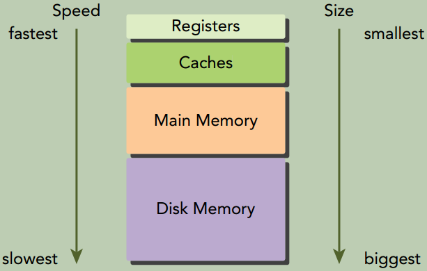
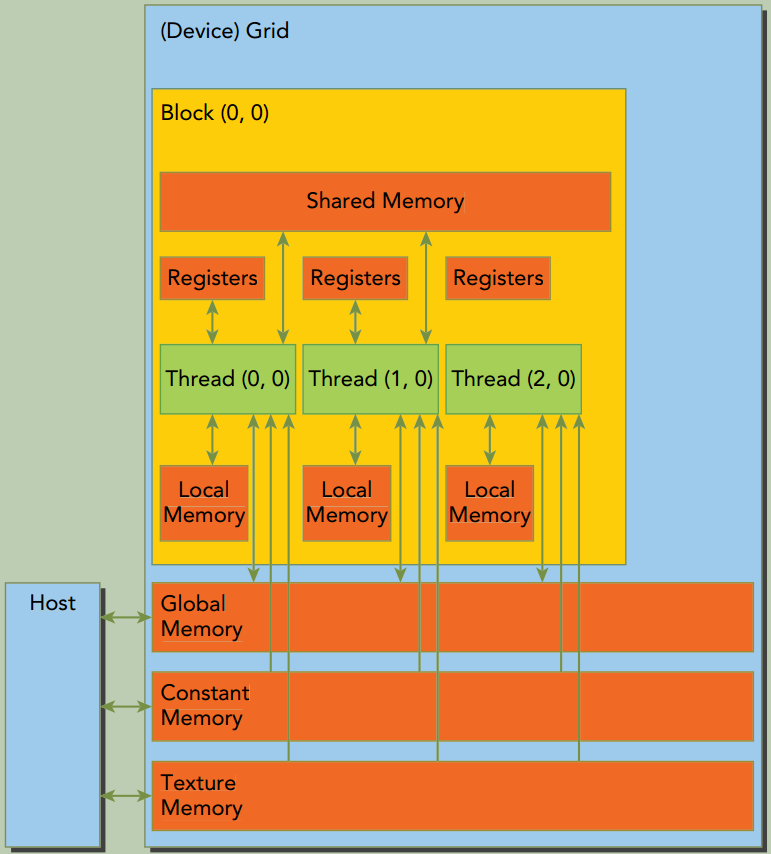
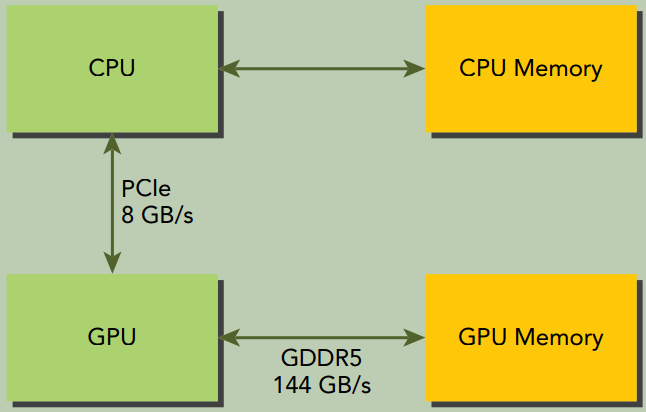
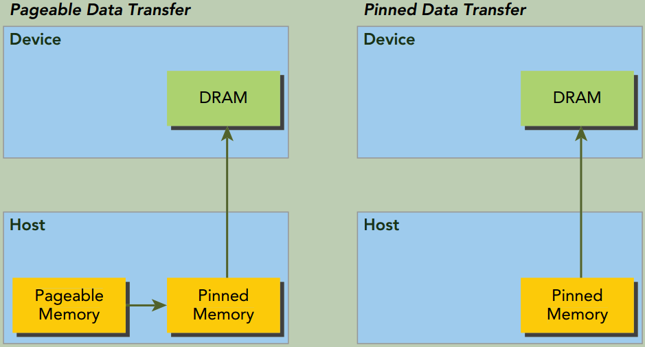
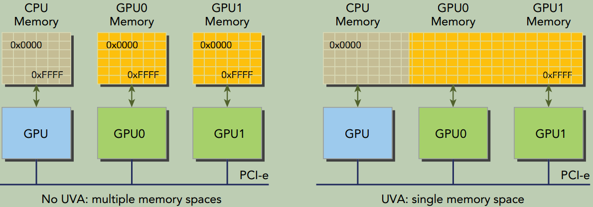
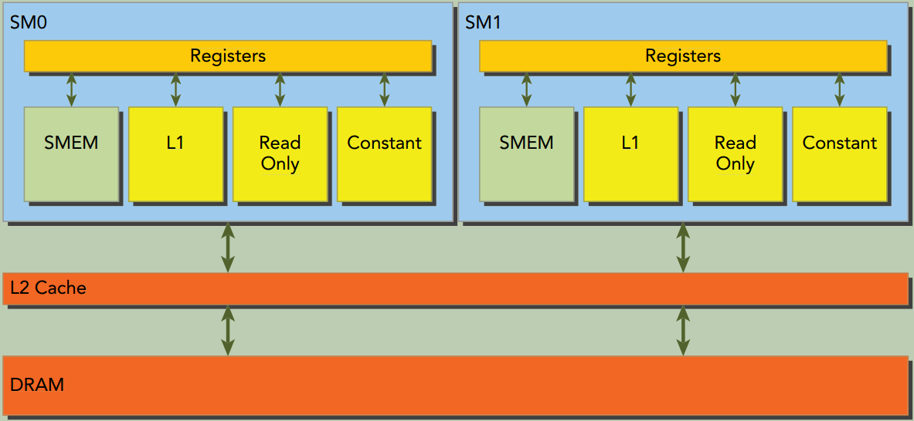
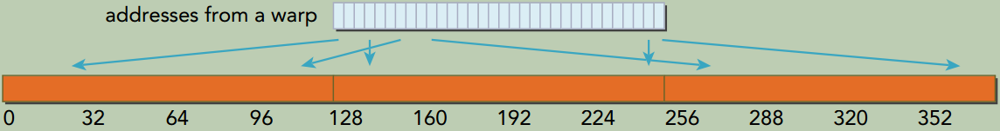
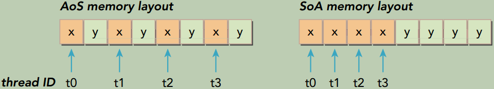

# 四、全局内存

本章将剖析核函数与全局内存的联系及其对性能的影响。本章将介绍CUDA内存模型， 并通过分析不同的全局内存访问模式来介绍如何通过核函数高效地利用全局内存。

## CUDA内存模型概述

在现有的硬件存储子系统下，必须依靠**内存模型**获得最佳的延迟和带宽。**CUDA内存模型**结合了主机和设备的内存系统，展现了完整的内存层次结构，使你能显式地控制数据布局以优化性能。

### 内存层次结构的优点

一般来说，应用程序不会在某一时间点访问任意数据或运行任意代码。应用程序往往遵循**局部性原则**。有两种不同类型的局部性：

- 时间局部性：若一个数据被引用，那该数据在较短时间内很可能会再次被引用，随着时间流逝，该数据被引用的可能性逐渐降低。 
- 空间局部性：若一个内存位置被引用，则附近的位置也可能会被引用。


一个内存层次结构由具有不同延迟、带宽和容量的多级内存组成。

{: width="1086" height="542"}

GPU与CPU在内存层次结构设计中都使用相似的准则和模型。GPU和CPU内存模型的主要区别是：CUDA编程模型能将内存层次结构更好地呈现给用户，能让我们显式地控制它的行为。

### CUDA内存模型

CUDA内存模型提出了多种可编程内存的类型：

- 寄存器
- 共享内存
- 本地内存
- 全局内存
- 常量内存
- 纹理内存

{: width="1086" height="542"}

#### 寄存器

核函数中没有修饰符的变量，通常存储在寄存器中。在核函数声明的数组中，若用于该数组的索引是常量或能在编译时确定， 那么该数组也存储在寄存器中。

寄存器变量对于每个线程来说都是私有的，一个核函数通常使用寄存器来保存需要频繁访问的线程私有变量。 寄存器变量与核函数的生命周期相同。一旦核函数执行完毕，就不能对寄存器变量进行访问了。

通过下面的命令会输出`xxx.cu`中每个核函数里**寄存器数量**、**共享内存的字节数**以及每个线程所使用的**常量内存的字节数**。

```shell
nvcc -Xptxas -v xxx.cu
```

如果一个核函数使用了超过硬件限制数量的寄存器，则会用**本地内存**替代多占用的寄存器。这种**寄存器溢出**会给性能带来不利影响。

`-maxrregcount`选项可以用来限制寄存器的使用数量。

```shell
nvcc -maxrregcount=32 xxx.cu
```


#### 本地内存

编译器可能存放到本地内存中的变量有：

- 在编译时使用未知索引引用的本地数组
- 可能会占用大量寄存器空间的较大本地结构体或数组
- 任何不满足核函数寄存器限定条件的变量

溢出到本地内存中的变量本质上与全局内存在同一块存储区域，本地内存数据也是存储在每个SM的一级缓存和每个设备的二级缓存中。

#### 共享内存

在核函数中使用`__shared__`修饰的变量存放在共享内存中。因为共享内存是片上内存，所以与本地内存或全局内存相比， 它具有更高的带宽和更低的延迟。它的使用类似于CPU一级缓存，但它是可编程的。

每个SM都有一定数量的由线程块分配的共享内存。因此要注意**不要过度使用共享内存**，否则将在不经意间限制活跃线程束的数量。

共享内存在核函数的范围内声明，其生命周期伴随着整个线程块。当一个线程块执行结束后，其分配的共享内存将被释放并重新分配给其他线程块。

共享内存是线程之间相互通信的基本方式。访问共享内存必须使用`__syncthreads()`来防止数据冲突。`__syncthreads()`设立了一个执行障碍点，即同一个线程块中的所有线程必须在其他线程被允许执行前达到该处。为线程块里所有线程设立障碍点， 这样可以避免潜在的数据冲突。 

SM中的一级缓存和共享内存都使用64KB的片上内存，它通过静态划分，但在运行时可以通过如下指令进行动态配置：

```cpp
/* 
  这个函数在每个核函数的基础上配置了片上内存划分， 为func指定的核函数设置了配置。 支持的缓存配置如下：
  cudaFuncCachePreferNone:   no preference (default)
  cudaFuncCachePreferShared: prefer 48KB shared memory and 16KB L1 cache
  cudaFuncCachePreferL1:     prefer 48KB L1 cache and 16KB shared memory
  cudaFuncCachePreferEqual:  Prefer equal size of L1 cache and shared memory, both 32KB
*/
cudaError_t cudaFuncSetCacheConfig(const void* func, enum cudaFuncCache cacheConfig);
```


#### 常量内存

常量内存驻留在设备内存中，并在每个SM专用的常量缓存中缓存。常量变量用`__const__`修饰符来修饰。

常量变量必须**在全局空间内和所有核函数之外**进行声明。常量内存是静态声明的，并对同一编译单元中的所有核函数可见。核函数从常量内存中只能读取数据。

因此，常量内存必须在主机端使用`cudaError_t cudaMemcpyToSymbol(const void* symbol, const void* src, size_t count);`来初始化。该函数将`count`个字节从`src`指向的内存复制到`symbol`指向的内存，`symbol`指向的内存放在设备全局内存或常量内存中。 在大多数情况下这个函数是**同步的**。

> 线程束中的所有线程从相同的内存地址中读取数据时，常量内存表现最好。

举个例子，数学公式中的系数就是一个很好的用常量内存的例子，因为一个线程束中所有线程使用相同系数来对不同数据进行相同计算。 

如果线程束里每个线程都从不同的地址读取数据且只读一次， 那常量内存就不是最佳选择， 因为每从常量内存中读取一次数据， 都会广播给线程束的所有线程。

#### 纹理内存(Texture Memory)

纹理内存驻留在设备内存中，并在每个SM的只读缓存中缓存。纹理内存是一种通过指定的只读缓存访问的全局内存。

只读缓存包括硬件滤波的支持，它可将**浮点插入**作为读过程的一部分来执行。

纹理内存是对二维空间局部性的优化，所以线程束里使用纹理内存访问二维数据的线程可以达到最优性能。

对于一些应用程序来说这是理想的内存，并由于缓存和滤波硬件的支持所以有较好的性能优势。然而对于另一些应用程序来说，与全局内存相比， 使用纹理内存更慢。

#### 全局内存

全局内存是GPU中最大、延迟最高且最常用的内存。`global`指的是其**作用域**和**生命周期**。它的声明可在任何SM设备上被访问到，且贯穿应用程序的整个生命周期。

全局内存有两种声明方式：

- 静态声明。使用`__device__`修饰符。
- 动态声明。使用`cudaMalloc`申请全局内存，`cudaFree`释放全局内存。

全局内存常驻于设备内存中，可通过`32`字节、`64`字节或`128`字节的内存事务进行访问。这些内存事务必须自然对齐，也就是说首地址必须是`32`字节、`64`字节或`128`字节的倍数。

优化内存事务对于获得最优性能来说至关重要。当一个线程束执行内存加载/存储时，需要满足的传输数量通常取决于以下两个因素：

- 跨线程的内存地址分布
- 每个事务内存地址的对齐方式

在一般情况下，用来满足内存请求的事务越多，未使用的字节被传输回的可能性就越高，这就造成了数据吞吐率的降低。

#### GPU缓存

GPU缓存是不可编程的内存。在GPU上有4种缓存：

- 一级缓存
- 只读常量缓存
- 只读纹理缓存
- 二级缓存

每个SM都有一个一级缓存、只读常量缓存和只读纹理缓存，所有的SM**共享**一个**二级缓存**。 

一级和二级缓存都被用来存储本地内存和全局内存中的数据，包括寄存器溢出的部分。CUDA允许配置读的数据是使用一级和二级缓存，还是只使用二级缓存。

只读常量缓存和只读纹理缓存用于在设备内存中提高来自于各自内存空间内的读取性能。

在CPU上，内存的加载和存储都可以被缓存。但是在GPU上只有内存加载操作可以被缓存，内存存储操作不能被缓存。

#### CUDA变量声明总结

​																				     **CUDA变量和类型修饰符**

|     修饰符     |             变量名称              |  存储器  | 作用域 | 生命周期 |
| :------------: | :-------------------------------: | :------: | :----: | :------: |
|       \        |           `float var;`            |  寄存器  |  线程  |   线程   |
|       \        |         `float var[100];`         | 本地内存 |  线程  |   线程   |
|  `__shared__`  | `float var;` or `float var[100];` | 共享内存 | 线程块 |  线程块  |
|  `__device__`  | `float var;` or `float var[100];` | 全局内存 |  全局  | 应用程序 |
| `__constant__` | `float var;` or `float var[100];` | 常量内存 |  全局  | 应用程序 |

​                                                            							**设备存储器主要特征**

|  存储器  | 片上/片外 | 缓存 | 存取 |     范围      | 生命周期 |
| :------: | :-------: | :--: | :--: | :-----------: | :------: |
|  寄存器  | **片上**  |  NA  | R/W  |   一个线程    |   线程   |
| 本地内存 |   片外    | Yes  | R/W  |   一个线程    |   线程   |
| 共享内存 | **片上**  |  NA  | R/W  | 块内所有线程  |  线程块  |
| 全局内存 |   片外    | Yes  | R/W  | 所有线程+主机 | 主机配置 |
| 常量内存 |   片外    | Yes  |  R   | 所有线程+主机 | 主机配置 |
| 纹理内存 |   片外    | Yes  |  R   | 所有线程+主机 | 主机配置 |

 一般情况下，设备核函数不能访问主机变量，且主机函数也不能访问设备变量，即使这些变量在同一文件作用域内被声明。
CUDA运行时API能访问主机和设备变量，但这取决于你是否给正确的函数提供了正确参数，这样的话才能对正确的变量进行恰当的操作。


## 内存管理

随着CUDA版本的升级， `NVIDIA`正系统地实现主机和设备内存空间的统一，但对于大多数应用程序来说，仍需要手动移动数据。下面重点介绍如何使用CUDA函数来显式地管理内存和数据移动。

### 内存分配和释放

```cpp
// 分配出的全局内存中的值不会被清除。需用cudaMemcpy主机上的数据来填充分配的全局内存，或用cudaMemset将其初始化。
cudaError_t cudaMalloc(void **devPtr, size_t count); 
/*
  cudaMemcpyKind的取值: 
  cudaMemcpyHostToHost, cudaMemcpyHostToDevice, cudaMemcpyDeviceToHost, cudaMemcpyDeviceToDevice
  若指针dst和src与kind指定的复制方向不一致，则cudaMemcpy的行为是未定义的。这个函数在大多数情况下都是同步的。
*/
cudaError_t cudaMemcpy(void *dst, const void *src, size_t count, enum cudaMemcpyKind kind);
cudaError_t cudaMemset(void *devPtr, int value, size_t count);

cudaError_t cudaFree(void *devPtr);
```

设备内存的分配和释放操作成本较高，所以应用程序应重利用设备内存，以减少对整体性能的影响。

### 内存传输

从下面的内存传输图可以看出：

- GPU芯片和板载GDDR5 GPU内存之间的理论峰值带宽非常高，对于Fermi C2050来说为`144GB/s`。
- CPU和GPU之间通过PCIe Gen2总线相连，这种连接的理论带宽要低得多，为`8GB/s`(PCIeGen3总线最大理论限制值是`16GB/s`) 。

{: width="1086" height="542"}

这种差距意味着如果设计不当，主机和设备间的数据传输会降低应用程序的整体性能。

因此CUDA编程的一个基本原则是**尽可能减少主机与设备之间的传输**。

### 固定内存

GPU不能在**可分页(`pageable`)主机内存**上安全地访问数据，因为当主机操作系统在物理位置上移动该数据时，它无法控制。

当从可分页主机内存传输数据到设备内存时，CUDA驱动程序首先分配临时页面锁定的或固定的主机内存，将主机源数据复制到固定内存中，然后从固定内存传输数据给设备内存。如下图所示:

{: width="1086" height="542"}

CUDA运行时允许你使用下列函数分配/释放固定主机内存：

```cpp
/* 
  这个函数分配了count字节的主机内存，这些内存是页面锁定的且对设备来说是可访问的。
  由于固定内存能被设备直接访问，所以它能用比可分页内存高得多的带宽进行读写。
  然而分配过多的固定内存可能会降低主机系统的性能，因为它减少了用于存储虚拟内存数据的可分页内存的数量，
  其中分页内存对主机系统是可用的。
*/
cudaError_t cudaMallocHost(void **devPtr, size_t count);
cudaError_t cudaFreeHost(void *ptr);
```


### 零拷贝内存

通常来说，主机不能直接访问设备变量，同时设备也不能直接访问主机变量。但有个例外:**零拷贝内存**。 

**主机和设备都可以访问零拷贝内存**。

GPU线程可直接访问零拷贝内存。在CUDA核函数中使用零拷贝内存有以下几个优势：

- 当设备内存不足时可利用主机内存
- 避免主机和设备间的显式数据传输
- 提高PCIe传输率

当使用零拷贝内存来共享主机和设备间的数据时，必须**同步**主机和设备间的内存访问，需要额外的同步操作。同时更改主机和设备的零拷贝内存中的数据将导致不可预知的后果。

零拷贝内存是一种特殊的固定(不可分页)内存，它做了到设备地址空间的映射。

```cpp
/*
  创建一个到固定内存的映射。
  分配了count字节的主机内存，该内存是页面锁定的且设备可访问的
  flags参数取值：
    cudaHostAllocDefault: 使cudaHostAlloc与cudaMallocHost行为一致。
    cudaHostAllocPortable: 返回能被所有CUDA上下文使用的固定内存，而不仅是执行内存分配的那一个。
    cudaHostAllocWriteCombined: 
      返回写结合内存，该内存可在某些系统配置上通过PCIe总线上更快地传输，但它在大多数主机上不能被有效地读取。
      因此，写结合内存对缓冲区来说是一个很好的选择，该内存通过设备使用映射的固定内存或主机到设备的传输。
    cudaHostAllocMapped: 该标志返回可以实现主机写入和设备读取被映射到设备地址空间中的主机内存。
*/
cudaError_t cudaHostAlloc(void **pHost, size_t count, unsigned int flags);

cudaError_t cudaFreeHost(void* ptr);

/* 
  获取映射到固定内存的设备指针。
  该函数返回了一个在pDevice中的设备指针，该指针可以在设备上被引用以访问映射得到的固定主机内存.
  如果设备不支持映射得到的固定内存，该函数将失效。
*/
cudaError_t cudaHostGetDevicePointer(void **pDevice, void *pHost, unsigned int flags);
```

进行**频繁读写**操作时，使用零拷贝内存作为设备内存的补充将显著降低性能。 因为每次映射到内存的传输必须经过PCIe总线。比起全局内存，延迟也显著增加。

如果想共享主机和设备端的**少量数据**，零拷贝内存可能会是一个不错的选择，因为它简化了编程且有较好的性能。对于由PCIe总线连接的离散GPU上的更大数据集来说，零拷贝内存不是一个好的选择，它会导致性能的显著下降。

有两种常见的异构计算系统架构： 

- 集成架构，CPU和GPU集成在一个芯片上，且在物理地址上共享主存。这种架构中，由于无须在PCIe总线上备份，零拷贝内存在性能和可编程性方面可能更佳。
- 离散架构，通过PCIe总线将设备连接到主机，零拷贝内存只在特殊情况下有优势。

### 统一虚拟寻址

有了UVA(Unified Virtual Addressing)，主机内存和设备内存可以共享同一个虚拟地址空间，如下图所示：

{: width="1086" height="542"}

在`UVA`之前，你需要管理哪些指针指向主机内存和哪些指针指向设备内存。

有了`UVA`，由指针指向的内存空间对应用程序代码来说是透明的。

通过`UVA`，由`cudaHostAlloc`分配的固定主机内存具有相同的主机和设备指针。所以可以将返回的指针直接传递给核函数。

### 统一内存

在CUDA 6.0中，引入了**统一内存**这一新特性。统一内存中创建了一个托管内存池(a pool of managed memory)，内存池中已分配的空间可以用相同的内存地址（即指针）在CPU和GPU上进行访问。**底层系统在统一内存空间中自动在主机和设备之间进行数据传输**。这种数据传输对应用程序是透明的，这大大简化了程序代码。

> 统一内存 vs. 统一虚拟寻址

- 统一内存寻址依赖于`UVA`的支持，但它们是完全不同的技术。 

- `UVA`为系统中的所有处理器提供了一个单一的虚拟内存地址空间。 

- 但`UVA`不会自动将数据从一个物理位置转移到另一个位置，这是统一内存寻址的一个特有功能。

> 统一内存 vs. 零拷贝内存

- 统一内存提供了一个“单指针到数据”模型，在概念上它类似于零拷贝内存。 

- 但零拷贝内存在主机内存中进行分配，因此，由于受到在PCIe总线上访问零拷贝内存的影响，核函数的性能将具有较高的延迟。
- 另一方面，统一内存将内存和执行空间分离，因此可以根据需要将数据透明地传输到主机或设备上，以提升局部性和性能。

**托管内存**指的是由底层系统自动分配的统一内存，它的创建也是使用cudaMalloc。你可以在核函数中使用两种类型的内存：由系统控制的托管内存， 以及由应用程序明确分配和调用的未托管内存。所有在设备内存上有效的CUDA操作也同样适用于托管内存。其主要区别是主机也能够引用和访问托管内存。

托管内存可以被静态分配，也可以被动态分配：

- 静态分配。通过添加`__managed__`修饰符， 静态声明一个设备变量作为托管变量。 但这个操作只能在文件范围和全局范围内进行。 该变量可以从主机或设备代码中直接被引用：

  ```cpp
  __device__ __managed__ int y;
  ```

- 动态分配

  `cudaError_t cudaMallocManaged(void **devPtr, size_t size, unsigned int flags=0);`

  这个函数分配size字节的托管内存，并用devPtr返回一个指针。该指针在所有设备和主机上都是有效的。使用托管内存的程序行为与使用未托管内存的程序副本行为在功能上是一致的。 但使用托管内存的程序可以利用自动数据传输和重复指针消除功能。

  在CUDA 6.0中， 设备代码不能调用`cudaMallocManaged`函数。 所有的托管内存必须在主机端动态声明或者在全局范围内静态声明。


## 内存访问模式

为了在读写数据时达到最佳性能，内存访问操作必须满足一定的条件。CUDA执行模型的显著特征之一就是**指令必须以线程束为单位进行发布和执行**。存储操作也是同样。在执行内存指令时，线程束中的每个线程都提供了一个正在加载或存储的内存地址。在线程束的32个线程中，每个线程都提出了一个包含请求地址的单一内存访问请求，它并由一个或多个设备内存传输提供服务。根据**线程束中内存地址的分布**，内存访问可以被分成不同的模式。

### 对齐与合并访问

如下图所示，全局内存通过缓存来实现加载/存储。

所有对全局内存的访问都会通过**二级缓存**， 也有许多访问会通过**一级缓存**， 这取决于访问类型和GPU架构。 如果这两级缓存都被用到， 那么内存访问是由一个**128字节的内存事务**实现的。 如果只使用了二级缓存， 那么这个内存访问是由一个**32字节的内存事务**实现的。 

{: width="1086" height="542"}

一行**一级缓存**是128个字节，它映射到设备内存中一个128字节的对齐段。如果线程束中的每个线程请求一个4字节的值，那么每次请求就会获取128字节的数据，这恰好与缓存行和设备内存段的大小相契合。

如果设备内存事务的首地址是被用到的缓存（32字节的L2 Cache或者128字节的L1 Cache）的粒度的偶数倍，就是**对齐内存访问**。非对齐的内存访问会浪费带宽。

当一个线程束中全部的32个线程访问一块连续内存时， 就会出现**合并内存访问**。

**对齐合并内存访问**的理想状态是线程束从对齐内存地址开始访问一个连续的内存块。

### 全局内存读取

在SM中，数据通过以下3种路径进行传输：

- 一级和二级缓存。默认路径
- 常量缓存
- 只读缓存

想要通过一级和二级缓存外的其他两种路径传递数据需要应用程序显式地说明。

一级缓存可以通过编译选项来启用或者禁用。

- 禁用（对应非缓存加载模式）。所有对全局内存的加载请求将直接进入到二级缓存； 如果二级缓存缺失， 则由DRAM完成请求。 每一次内存事务可由一个、 两个或四个部分执行， 每个部分有32个字节。 
- 启用（对应缓存加载模式）。全局内存加载请求首先尝试通过一级缓存。 如果一级缓存缺失， 该请求转向二级缓存。 如果二级缓存缺失， 则请求由DRAM完成。 在这种模式下， 一个内存加载请求由一个128字节的设备内存事务实现。

#### 缓存加载

缓存加载操作经过一级缓存， 在粒度为128字节的一级缓存行上由设备内存事务进行传输。 缓存加载可以分为对齐/非对齐及合并/非合并。 aligned/misaligned
and coalesced/uncoalesced

组合起来有4种情况：

- 对齐合并（aligned-coalesced）, 最理想的情况。

  线程束中所有线程请求的地址都在128字节的缓存行范围内。 完成内存加载操作只需要一个128字节的事务。 总线的使用率为100%， 在这个事务中没有未使用的数据

  {: width="1086" height="542"}

- 对齐非合并（aligned-uncoalesced）,

  访问是对齐的， 引用的地址不是连续的线程ID， 而是128字节范围内的随机值。 由于线程束中线程请求的地址仍然在一个缓存行范围内， 所以只需要一个128字节的事务来完成这一内存加载操作。 总线利用率仍然是100%，

  {: width="1086" height="542"}

- 非对齐合并（misaligned-coalesced）,

  线程束请求32个连续4个字节的非对齐数据元素。 在全局内存中线程束的线程请求的地址落在两个128字节段范围内。 因为当启用一级缓存时， 由SM执行的物理加载操作必须在128个字节的界线上对齐， 所以要求有两个128字节的事务来执行这段内存加载操作。 总线利用率为50%， 并且在这两个事务中加载的字节有一半是未使用的。

  {: width="1086" height="542"}

  线程束中所有线程请求相同的地址。 因为被引用的字节落在一个缓存行范围内， 所以只需请求一个内存事务， 但总线利用率非常低。 如果加载的值是4字节的， 则总线利用率是4字节请求/128字节加载＝3.125%。

  {: width="1086" height="542"}

- 非对齐非合并（misaligned-uncoalesced）, 最差的情况。

  线程束中线程请求分散于全局内存中的32个4字节地址。尽管线程束请求的字节总数仅为128个字节， 但地址要占用N个缓存行（0＜N≤32） 。 完成一次内存加载操作需要申请N次内存事务。

  {: width="1086" height="542"}


>  CPU一级缓存和GPU一级缓存之间的差异

CPU一级缓存优化了时间和空间局部性。GPU一级缓存专为空间局部性而非时间局部性设计。频繁访问一个一级缓存的内存位置不会增加数据留在缓存中的概率。

#### 没有缓存的加载

没有缓存的加载不经过一级缓存，它在内存段的粒度上（32个字节） 而非缓存池的粒度（128个字节） 执行。这是更细粒度的加载，可以为非对齐或非合并的内存访问带来更好的总线利用率。

#### 只读缓存

只读缓存最初是预留给纹理内存加载使用的。对计算能力为3.5及以上的GPU来说，只读缓存也支持使用全局内存加载代替一级缓存。只读缓存的加载粒度是32个字节。通常，对分散读取来说，这些更细粒度的加载要优于一级缓存。

有两种方式可以指导内存通过只读缓存进行读取：

- 使用函数__ldg

  ```cpp
  // 使用内部函数__ldg来通过只读缓存直接对数组进行读取访问
  __global__ void copyKernel(int *out, int *in) {
  	int idx = blockIdx.x * blockDim.x + threadIdx.x;
  	out[idx] = __ldg(&in[idx]);  // 原始方式：out[idx] = in[idx];
  }
  ```

- 在间接引用的指针上使用修饰符

  你也可以将`__restrict__`修饰符应用到指针上。该修饰符帮助nvcc识别无别名指针（即专门用来访问特定数组的指针）。nvcc将自动通过只读缓存指导无别名指针的加载。

  ```cpp
  __global__ void copyKernel(int * __restrict__ out, const int * __restrict__ in) {
  	int idx = blockIdx.x * blockDim.x + threadIdx.x;
  	out[idx] = in[idx];
  }
  ```

### 全局内存写入

GPU的内存的存储操作相对简单。一级缓存不能用在Fermi或Kepler GPU上进行存储操作，在发送到设备内存之前**存储操作只通过二级缓存**。 存储操作在32个字节段的粒度上被执行。 内存事务可以同时被分为**一段**、 **两段**或**四段**。 例如， 两个地址同属于一个128个字节的区域， 但不属于一个对齐的64个字节区域， 则会执行一个四段事务。也就是说， 执行一个四段事务比执行两个一段事务效果更好。

### 结构体数组与数组结构体

```cpp
struct innerStruct {
	float x;
	float y;
};
```

- 结构体数组(`AoS`)，an Array of Structures

  ```cpp
  struct innerStruct myAoS[N];
  ```

  它存储的是空间上相邻的数据(例如x和y)， 这在CPU上会**有良好的缓存局部性**。

- 数组结构体(`SoA`)，a Structure of Arrays

  ```cpp
  struct innerArray {
  	float x[N];
  	float y[N];
  };
  ```

  在原结构体中每个字段的所有值都被分到各自的数组中。 这不仅能将相邻数据点紧密存储起来， 也能将跨数组的独立数据点存储起来。


下图说明了AoS和SoA方法的内存布局

{: width="1086" height="542"}

- AoS模式在GPU上存储示例数据并执行一个只有x字段的应用程序，将导致50%的带宽损失，因为y值在每32个字节段或128个字节缓存行上隐式地被加载。AoS格式也在不需要的y值上浪费了二级缓存空间。

- SoA模式存储数据充分利用了GPU内存带宽。由于没有相同字段元素的交叉存取，SoA布局提供了合并内存访问，且可对全局内存实现更高效的利用。

> AoS vs. SoA

许多并行编程范式，尤其是SIMD型范式，更**倾向于使用SoA**。在CUDA C编程中**也普遍倾向于使用SoA**，因为数据元素是为全局内存的有效合并访问而预先准备好的， 而被相同内存操作引用的同字段数据元素在存储时是彼此相邻的。

### 性能调整

优化设备内存带宽利用率有两个目标：

- 对齐及合并内存访问， 以减少带宽的浪费
- 足够的并发内存操作， 以隐藏内存延迟

#### 展开技术

内存操作的循环展开增加了更独立的内存操作。 展开并不影响执行内存操作的数量（只影响并发执行的数量）。

#### 增大并行性

为了充分体现并行性， 你应该用一个核函数启动的网格和线程块大小进行试验， 以找到该核函数最佳的执行配置。 


>  最大化带宽利用率

影响设备内存操作性能的因素主要有两个：

- 有效利用设备DRAM和SM片上内存之间的字节移动： 为了避免设备内存带宽的浪费， 内存访问模式应是对齐和合并的

- 当前的并发内存操作数： 可通过以下两点实现最大化当前存储器操作数。
  - 展开，每个线程产生更多的独立内存访问。
  - 修改核函数启动的执行配置来使每个SM有更多的并行性。


### 核函数可达到的带宽

#### 内存带宽

理论带宽是当前硬件可以实现的绝对最大带宽。

有效带宽是核函数实际达到的带宽， 是测量出来的。公式：`有效带宽(GB/s) = (读字节数+写字节数)×10^(−9) / 运行时间`

例如， 对于从设备上传入或传出数据的拷贝来说（包含4个字节整数的2048×2048矩阵）， 有效带宽根据公式计算如下：

`有效带宽(GB/s) = (2048*2048*4*2)×10^(−9) / 运行时间`

#### 矩阵转置问题

对角坐标


### 使用统一内存的矩阵加法

为了简化主机和设备内存空间的管理， 提高这个CUDA程序的可读性和易维护性， 可以使用统一内存。


## 习题

