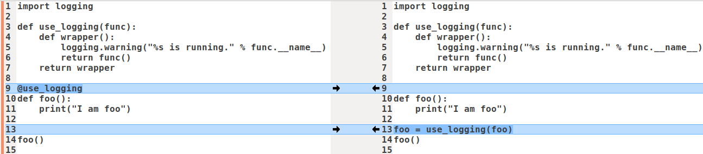

# `is`和`==`区别

Python中，**万物皆对象**。每个对象有3个属性：

- `id`：对象的地址，可通过内置函数`id()`查看对象引用的地址。
- `type：`对象的类型，可通过内置函数`type()`查看对象的类型。
- `value`：对象的值。

`a is b` 实际上是比较`id(a) == id(b)`。

`a == b`就是比较对象`a`的值和对象`b`的值是否相等。


# python的set()底层是什么数据结构

hash表


# `__all__`属性

Python中的`__all__`属性，可用于**模块导入时限制**。

```python
from module import *
```

上面的模块导入语句，在没有定义`__all__`属性的情况下，会导入`module`内的所有公共属性，方法和类。

如果定义了`__all__`属性，则只有`__all__`内指定的属性、方法和类会被导入。


### 注意事项

- `__all__`只能是`list`类型的。
- `__all__`的内容不该动态生成，比如通过列表解析式。`__all__`的作用就是定义公开接口，若不以字面量的形式显式写出来，就失去了意义。
- 即使有了`__all__`，也不应该在正式代码中使用`from module import *`。


# 装饰器

装饰器本质上是个Python函数/类，它可让其他函数/类代码在无需修改的前提下增加额外功能，装饰器的返回值也是个函数/类对象。

装饰器经常用于有切面需求的场景，比如：插入日志、性能测试、事务处理、权限校验等场景，装饰器是解决这类问题的绝佳设计。

## 函数装饰器

{: width="1086" height="542"}

上面左右两边效果一样。

- 右边。`use_logging`是一个装饰器，其实就是一个普通函数，它把执行真正业务逻辑的函数`func`包裹在其中，看起来像`foo`被`use_logging`装饰了一样，`use_logging`返回的也是个函数，这个函数名叫`wrapper`。在这个例子中，函数进入和退出，被称为一个**横切面**，这种编程方式被称为**面向切面编程**。
- 左边。通过增加第10行的`@use_logging`，就可以省去右边第14行的`foo = use_logging(foo)`。左边直接调用被装饰后的`foo`即可得到想要的结果。如果有其他类似函数，可以继续使用该装饰器修饰，而不用修改函数或增加新的封装，提高了代码的可复用性和可读性。

## 类装饰器

使用类装饰器主要依靠类的`__ca__`方法，当使用@形式将装饰器附加到函数上时，就会调用此方法。

```python
import logging

class Foo(object):
    def __init__(self, func):
        self.func = func

    def __call__(self):
        print('class decorator running.')
        self.func()
        print('class decorator ending.')

@Foo
def bar():
    print ('bar')

bar()

'''
输出：
class decorator running.
bar
class decorator ending.
'''
```

## 装饰器顺序

如果有多个装饰器，执行顺序是**从里到外**，最先调用最里层的装饰器，最后调用最外层的。

```python
@a
@b
@c
def func():
    pass

# 等价于 func = a(b(c(func)))
```


# pythonic

## 尽量使用generator comprehension代替list comprehension

### list comprehension

`[expr for iter_var in iterable ] or [expr for iter_ in iterable if cond_expr]`

```python
>>> a=[12,3,4,6,7,13,21] 
>>> newList =[x for x in a]
>>> newList
[12,3,4,6,7,13,21]
>>> newList2 =[x for x in a if x%2==0]
>>> newList2 
[12,4,6] 
```


### generator comprehension

`(expr for iter_var in iterable) or (expr for iter_var in interable if cond_expr)`

```python
>>> multiples_of_6 = (not (i % 6) for i in range(1, 10))
>>> list(multiples_of_6)
[False, False, False]
```

通过列表生成式，我们可以直接创建一个列表。但是，**受到内存限制，列表容量肯定是有限的**。而且，创建一个包含100万个元素的列表，不仅占用很大的存储空间，如果仅仅需要访问前面几个元素，那后面绝大多数元素占用的空间都浪费了。所以应当考虑使用生成器表达式而不是列表解析。

生成器表达式并不真正创建数字列表， 而是返回一个生成器generator，generator保存的是算法，每次调用next(g)，就计算出g的下一个元素的值，直到计算到最后一个元素，没有更多的元素时，抛出StopIteration的错误。但是我们一般通过for循环来迭代它，并且不需要关心StopIteration的错误。

于这个生成器在每次计算出一个条目后，把这个条目“产生”(yield)出来。 生成器表达式使用了“**惰性计算**”(lazy evaluation，也有翻译为“延迟求值”，我以为这种按需调用call by need的方式翻译为惰性更好一些)，只有在检索时才被赋值（ evaluated），所以在列表比较长的情况下使用内存上更有效.A generator object in python is something like a lazy list. The elements are only evaluated as soon as you iterate over them. 


## 三元运算符

也就是条件表达式，使用例子

```python
is_fat
state = 'fat' if is_fat else 'not fat'
```


# 多线程

```python
# form https://github.com/open-mmlab/mmdetection/mmdet/core/evaluation/mean_ap.py

from multiprocessing import Pool

def tpfp_default(det_bboxes,
                 gt_bboxes,
                 gt_bboxes_ignore=None,
                 iou_thr=0.5,
                 area_ranges=None,
                 use_legacy_coordinate=False):
    # bala bala
    return tp, fp

tpfp = pool.starmap(tpfp_default,
                    zip(cls_dets, cls_gts, cls_gts_ignore,
                        [iou_thr for _ in range(num_imgs)],
                        [area_ranges for _ in range(num_imgs)],
                        [use_legacy_coordinate for _ in range(num_imgs)]))

tp, fp = tuple(zip(*tpfp))
```


# 字节码转换

```python
int.from_bytes(b"\010\000\000", 'little')

import struct

struct.pack('f', 3.14)
struct.unpack('3f', 1.0, 2.0, 3.0)
```


# 覆盖率统计

```shell
pip install coverage

coverage run xxx.py  # 当前目录下会生成.coverage文件
coverage report -m
coverage html
```

